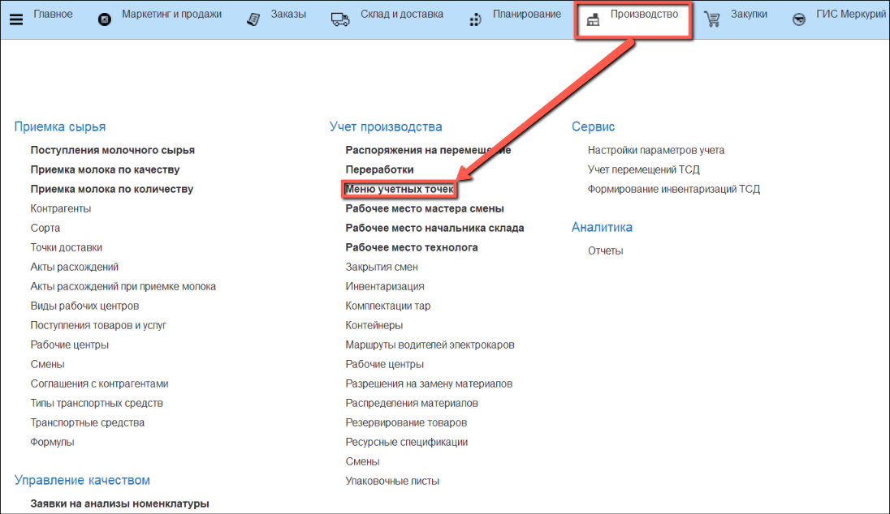

# Учет бракованных туш

Учет бракованных туш осуществляется через киоск, производственное задание для данной операции не требуется.

- В подсистеме **"Производство"** открываем **"Меню учетных точек"**:

- Указываем дату смены, смену и учетную точку, на которой производится учет. Нажимаем на кнопку **"Учет бракованных туш"**:

- Открывается список партий сырья, которые на данный момент находятся на участке убоя.

- Выбираем в списке  партию сырья, по которой планируется выпуск брака:

- В левом верхнем углу находится информация о номенклатуре выпуска.

Справа указаны рабочий центр, склад-отправитель и склад-получатель по умолчанию. При желании, можно изменить рабочий центр и склад-получатель вручную.

Выбираем из списка причину возникновения брака.

С помощью калькулятора тары подбираем тару, в которой производится взвешивание брака.

- Получаем вес брутто с весов, вес нетто рассчитается автоматически, нажимаем кнопку **"Подтвердить"**:

- Распечатывается этикетка партии брака.

