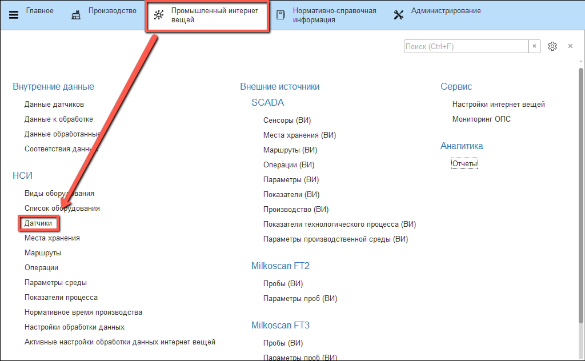
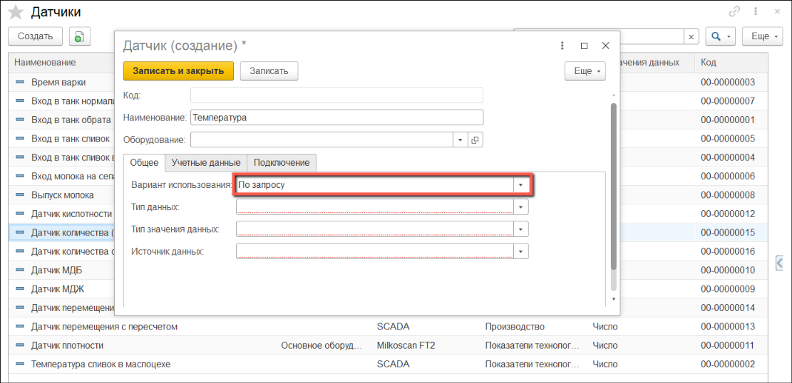
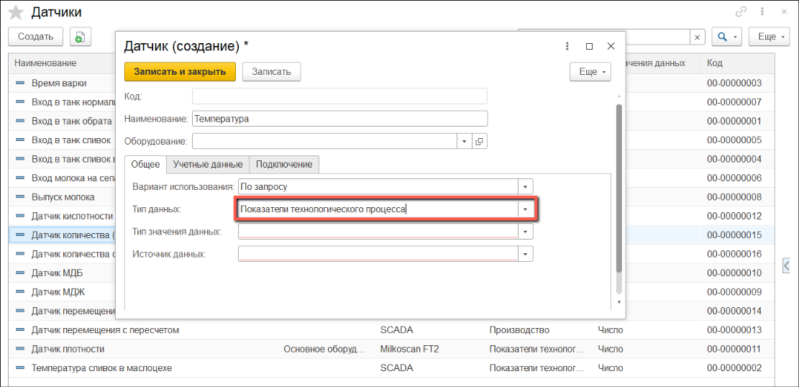
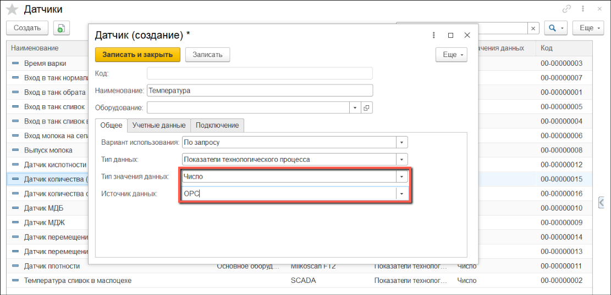
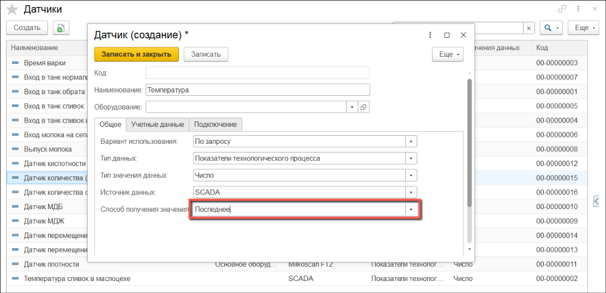
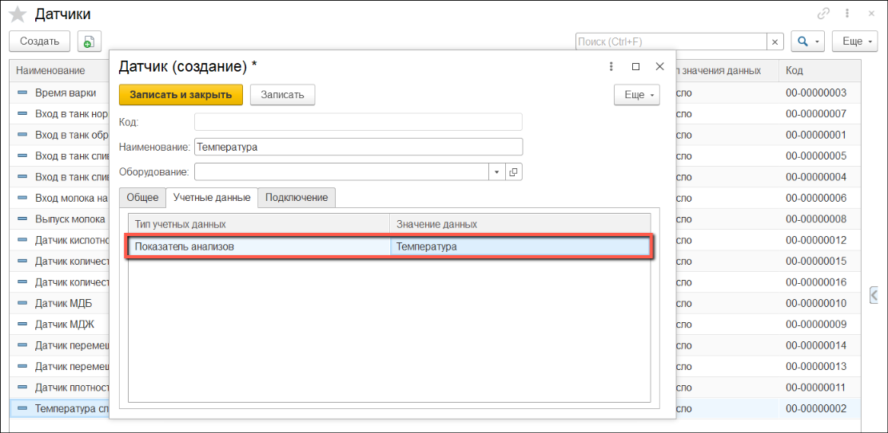
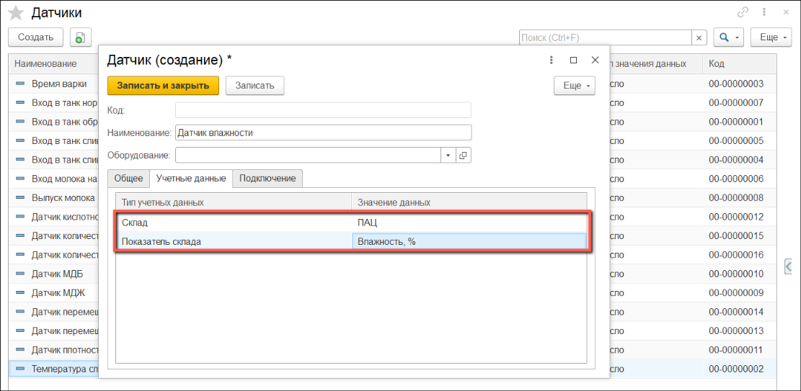
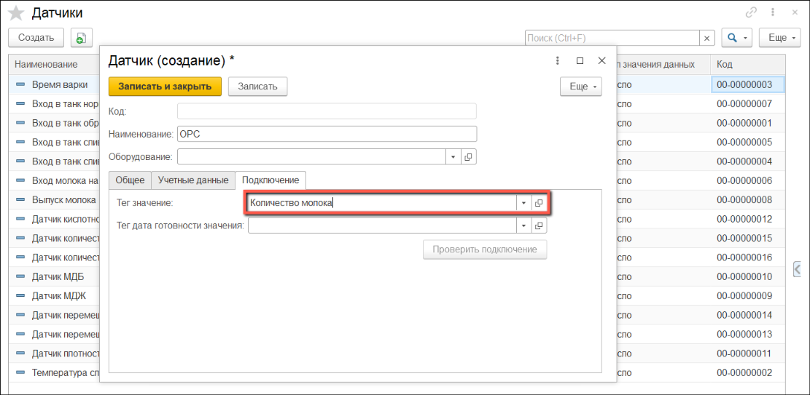
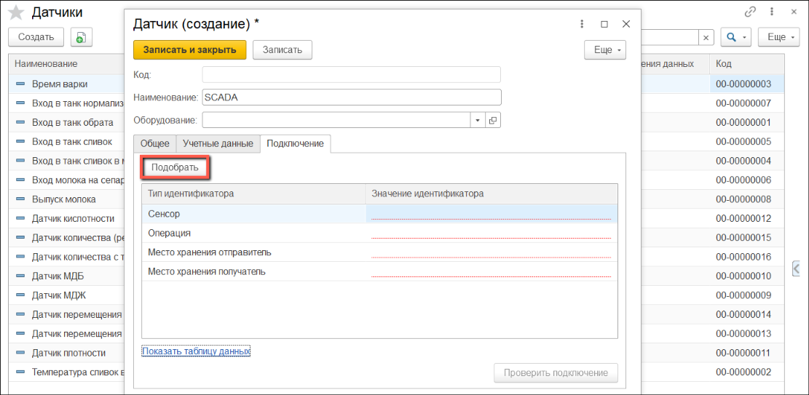
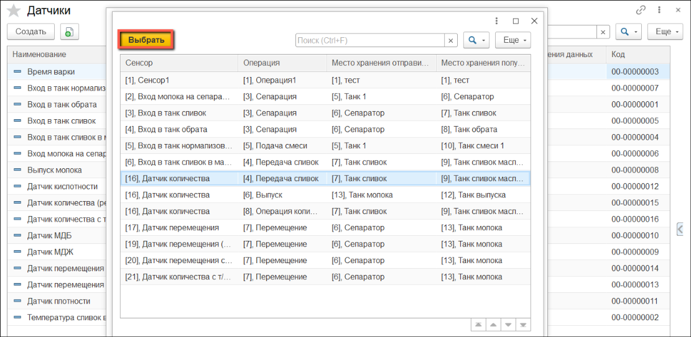

# Датчики

Каждый физический датчик в системе должен соответствовать одному элементу справочника "Датчики". Элемент содержит информацию о том, как обрабатывать данные, получаемые с датчика.

## Вкладка Общее

- Открыть справочник "**Датчики**":

- Перейти к созданию нового элемента. Указать "**Наименование**":

- Указать "**Вариант использования**" - "**По запросу**" (обращение к датчику происходит по запросу сотрудника, по нажатию настроенной кнопки):

- Выбрать "**Тип данных**" - "**Показатели технологического процесса**" или "**Параметры производственной среды**":
 

- Выбрать "**Тип значения данных**" и "**Источник данных**":
 

- Для источников данных "**SCADA**" также нужно указать "**Способ получения значения**":
 

## Вкладка Учетные данные

На вкладке "Учетные данные" заполняются индивидуальные параметры для каждого типа данных.

- Для **"Показателей технологического процесса"** необходимо заполнить показатель анализов:

- Для **"Параметров производственной среды"** необходимо заполнить склад и показатель склада:

## Вкладка Подключение

### OPC

- Указать "**Тег значение**":

### SCADA

- Нажать **"Подобрать"**. Выбрать строку, соответствующую нужному датчику (сенсор, операции, места хранения).

- Нажимаем на кнопку **"Выбрать"**

- Значения идентификаторов заполнятся автоматически:

## Запись и проверка подключения

- Когда все поля заполнены нужно нажать кнопку "**Записать**". После записи появляется возможность проверить датчик, нажав на кнопку "**Проверить подключение**":

