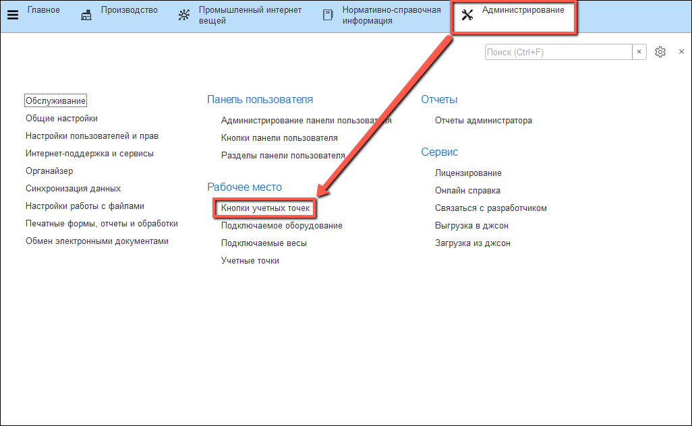
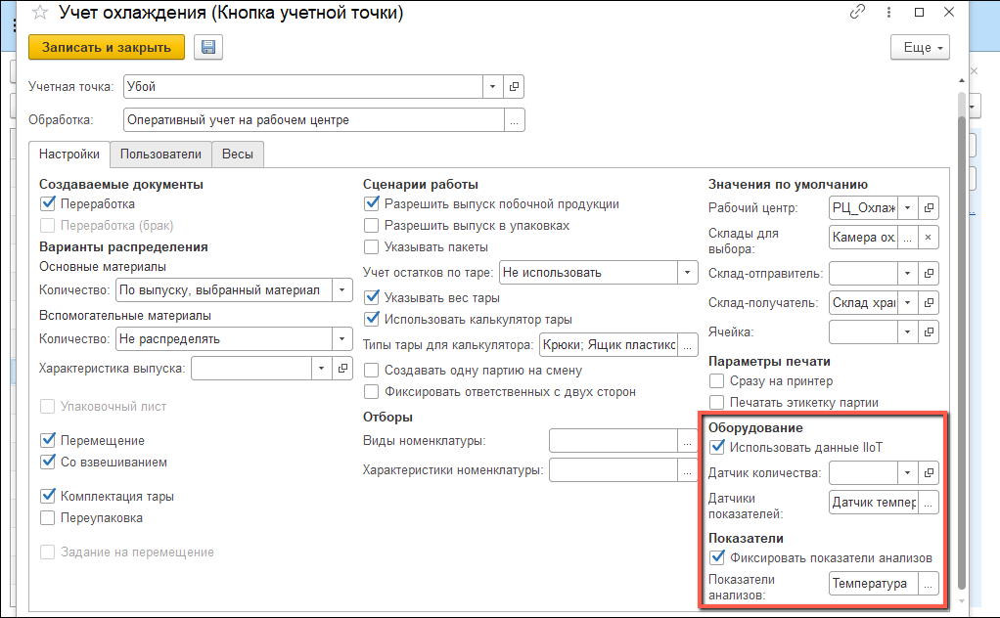

# Настройка кнопок учетных точек

Чтобы при работе через киоски можно было получить значение определенного датчика, а не вводить его значение вручную, нужно настроить соответствующую кнопку.

- Открыть справочник "**Кнопки учетных точек**":

- Найти в списке нужную учетную точку или создать новую, в форме для редактирования  установить флаг "**Использование данных IIoT**", выбрать "**Датчики показателей**". Установить флаг "**Фиксировать показатели анализов**" и выбрать нужные "**Показатели анализов**":
- 

- Нажать "**Записать и закрыть**".