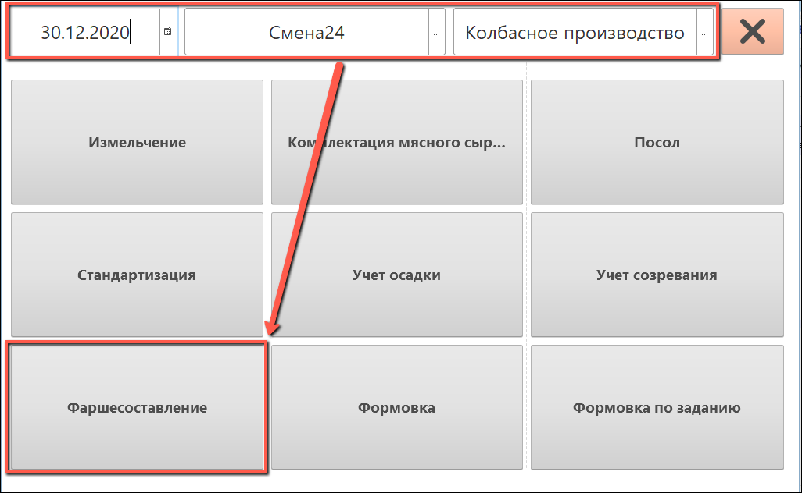
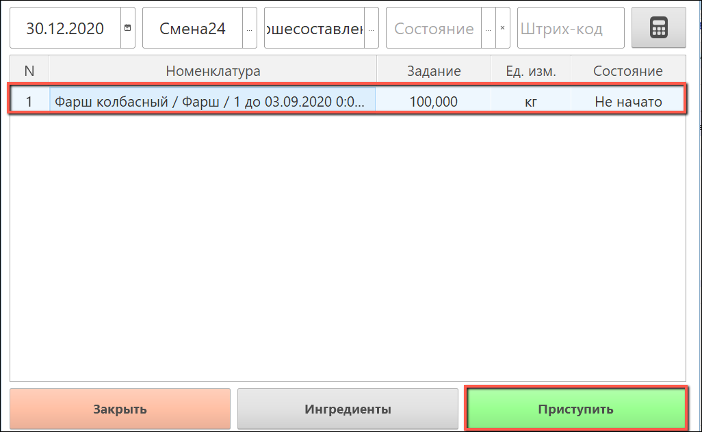
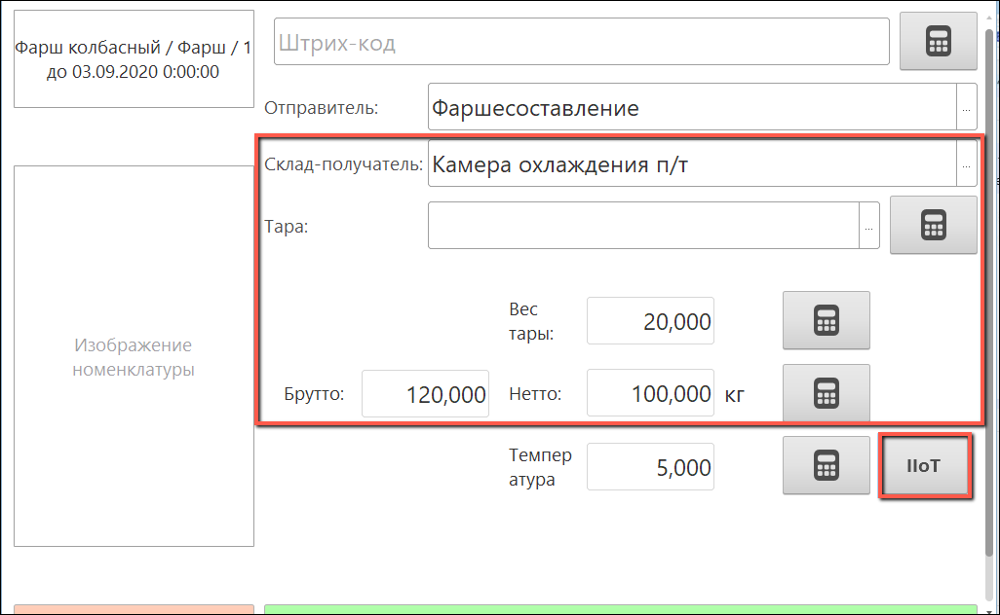
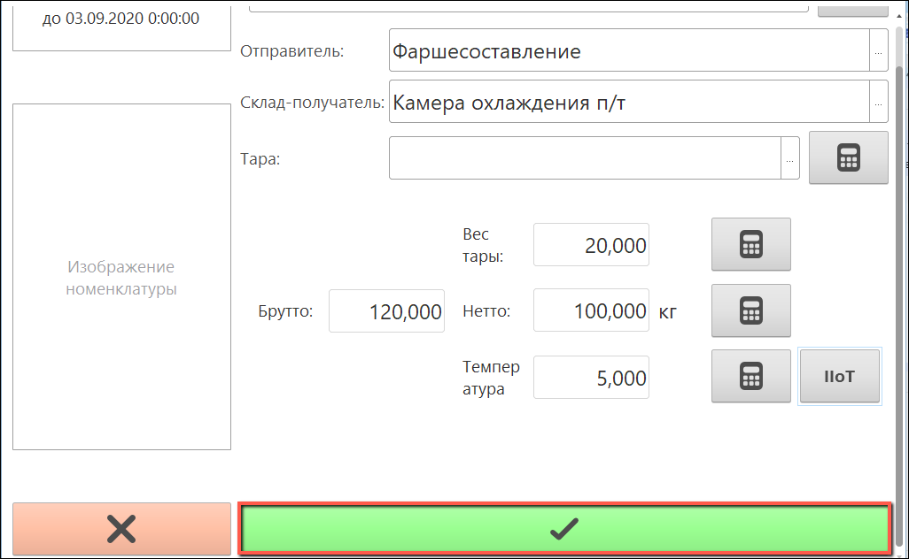

# Получение значений с датчиков на киоске

Если для кнопки учетной точки выполнена соответствующая [настройка](SystemSetting/SettingButtonsOfAccountPoint.md), то на киоске становится возможным получить значения с датчиков производства.

- Для этого нужно зайти в нужную кнопку:

- Выбрать строку задания:

- Заполнить поля "**Вес тары**", "**Брутто**" и  поле "**Склад-получатель**" (поле "**Нетто**" рассчитывается автоматически). Нажать на кнопку "**IIoT**" рядом с полем значения показателя:

- Поле значения выбранного показателя заполнится значением с датчика. Далее подтвердить приемку: 

