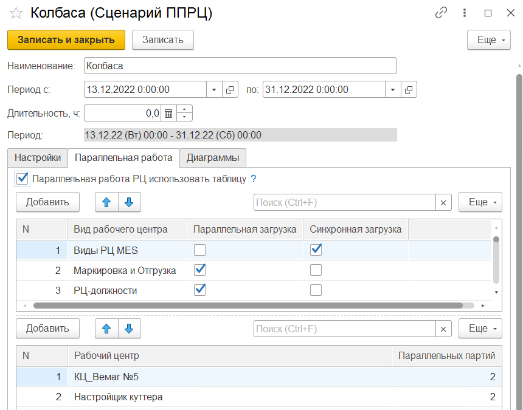
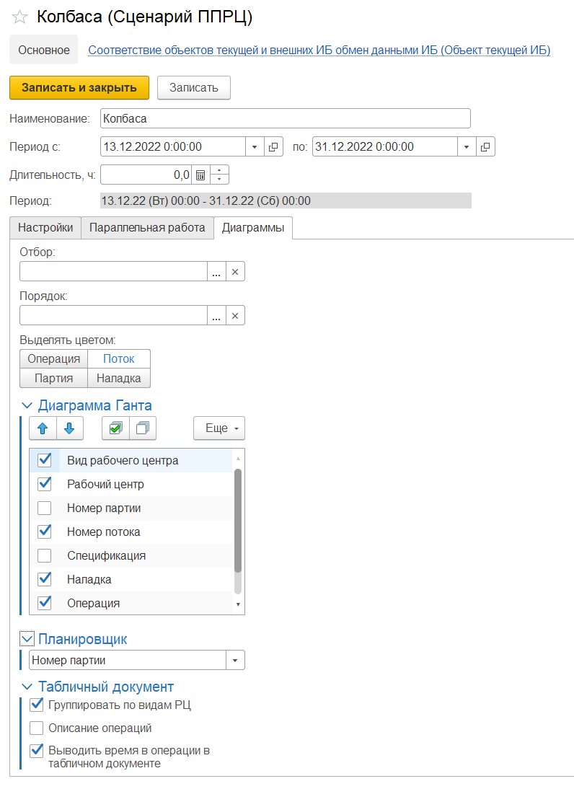

# Сценарии ППРЦ

**Сценарий ППРЦ** используются для заполнения настроек в [**АРМе «Пооперационное планирование»**](OperationalPlanning.md).

Для сценария ППРЦ заполняются данные:

Основные:

- Наименование сценария

- Период планирования

- Длительность

Вкладка **"Настройки"**:

- Этап для чтения - данные в АРМ будут заполняться только по документам **"Заявки на производство"** в выбранном в настройках этапе документа.

- Этап для записи - документы **"Заявки на производство"** будут записываться из АРМ в выбранном в настройках этапе документа.

- Переналадка (перед операцией или после операции) - время переналадки при планировании будет устанавливаться перед выполнением операции или после.

- Использовать кеш дат - ускоряет процесс планирования за счет кеширования дат у удачных размещений операций, но иногда это может приводить к ухудшению плана.

- Оптимизировать по продолжительности - После размещения задания в расписании в нем могут оказаться большие промежутки по ожиданию. Оптимизация по продолжительности перепланирует это задание "с конца", тем самым уменьшая продолжительность задания.

- Условия создания производственных заданий. 
  Существующие документы: 

    - **Оставлять** - существующие документы останутся, будут созданы новые. **Удалять** - существующие документы будут помечены на удаление и созданы новые. **Перезаписывать** - будут помечены на удаление все документы, кроме последнего. Последние будут перезаполнены.

    - Создавать сразу - при активном флаге будут создаваться "Производственные задания" без открытия предварительной формы создания документов.

Вкладка **"Параллельная работа"**:

- **"Паралельная работа РЦ использовать таблицу"** - при активном флаге используются условия параллельной работы РЦ из таблиц ниже. Иначе будут использованы данные со справочника **"Виды рабочих центров"**.

- В верхней табличной части отражаются условия выполнения параллельной работы по **"Видам рабочих центров"**: 

    - **Параллельная загрузка** - выполнение нескольких операций в один промежуток времени.

    - **Синхронная загрузка** - совпадают начала и окончания операций. Например, печь, когда разные партии одновременно ставят и одновременно вынимают.

- В нижней табличной части отражется количество параллельных партий по **"Рабочим центрам"**:

    - **Параллельные партии** - количество допустимых партий при параллельной загрузке. 0 - не ограничено.

  

Вкладка **"Диаграммы"**: 

- Заполняются предварительные настройки формирования диаграмм. Отборы и параметры формирования диаграмм по умолчанию.

