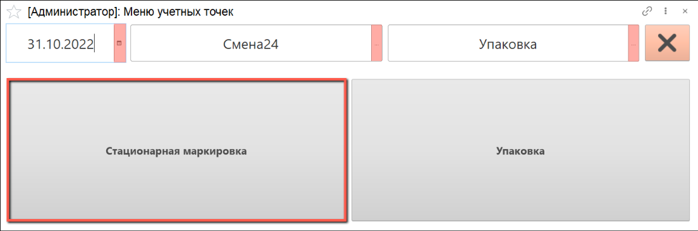
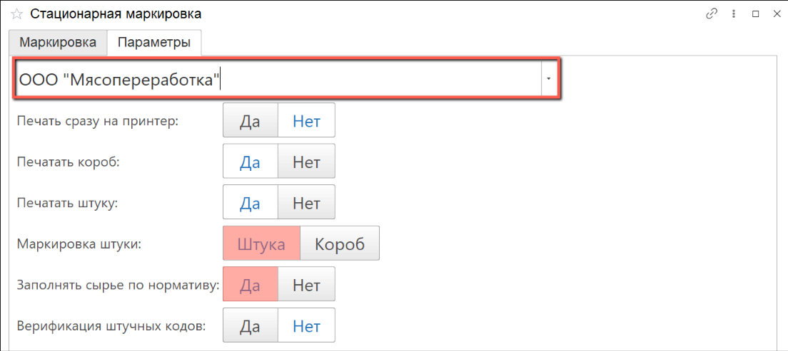
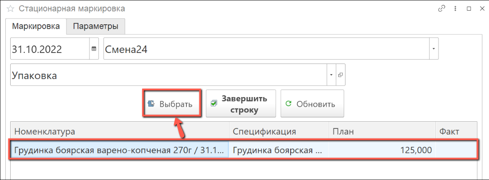
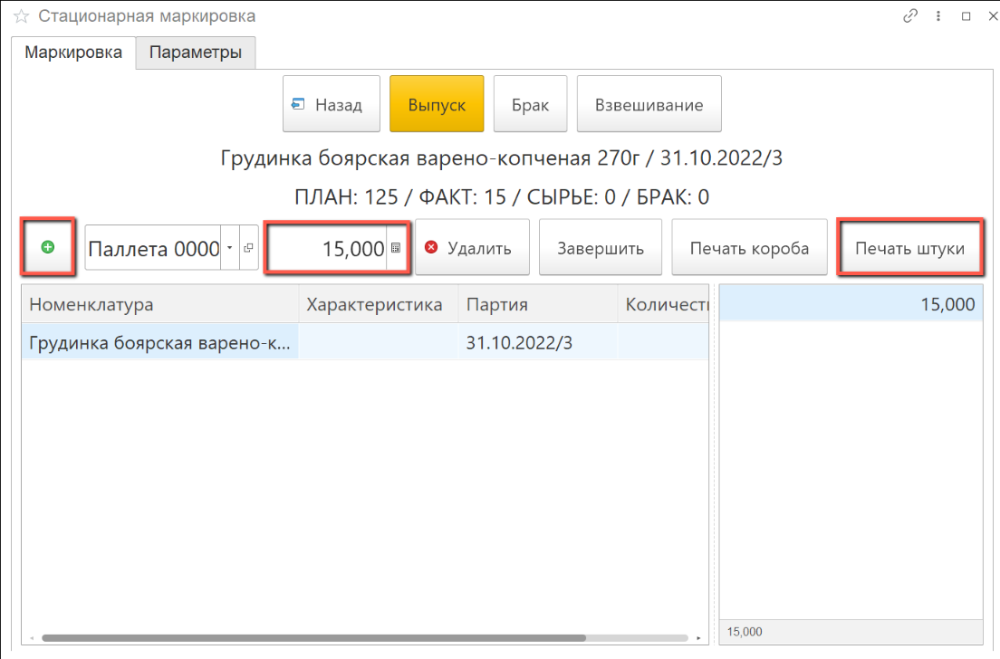
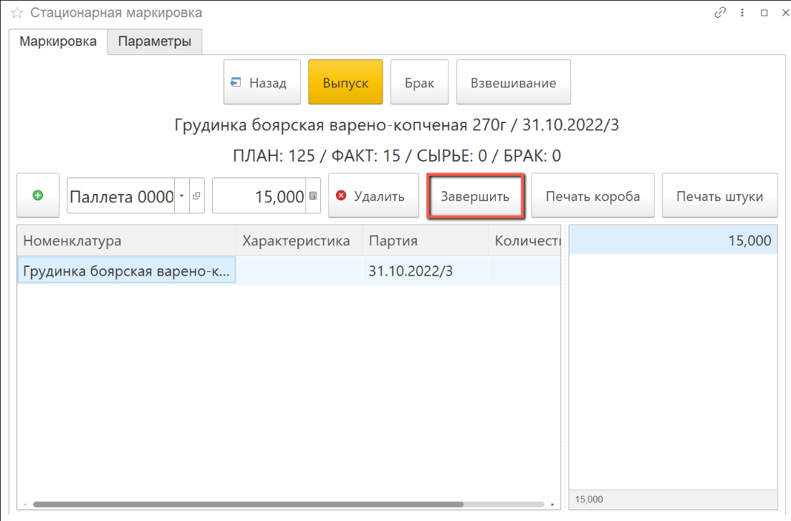

# Упаковка и маркировка

- В подсистеме **"Производство"** открываем **"Меню учетных точек"**:

- Указываем дату смены, смену и рабочий участок, на котором будет выполняться упаковка и маркировка продукции.

  Нажимаем на кнопку **"Стационарная маркировка"**:

- В открывшемся окне переходим на вкладку **"Параметры"**, указываем настройки для маркировки:

  - Заполняем организацию;
  - Устанавливаем параметры печати на принтер;
  - Выбираем маркировку штук или коробов;
  - Выбираем параметры заполнения расхода сырья по нормативу или по фактическому весу:

- Возвращаемся на вкладку **"Маркировка"**, выбираем номенклатуру, которую планируем маркировать и нажимаем на кнопку **"Выбрать"**:

- В открывшейся форме добавляем паллету по кнопке **"+"**.

  Указываем вес маркируемой продукции.

  Нажимаем на кнопку **"Печать штуки"** если нужно распечатать этикетку

- При необходимости добавляем новые отвесы продукции, указываем вес для каждой и распечатываем штрихкоды.

  По окончании печати штрихкодов нажимаем кнопку **"Завершить"**:
  

