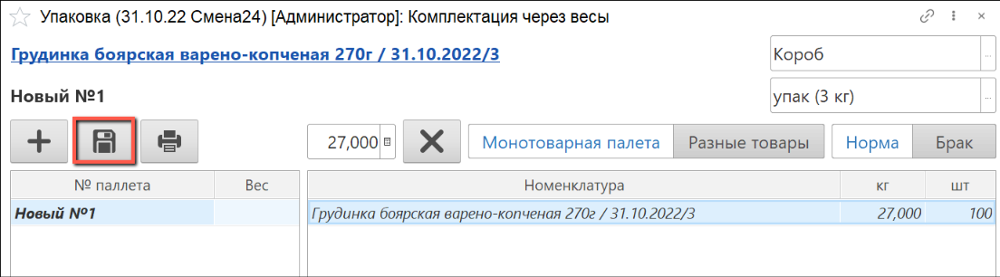

# Упаковка и складывание в ящики

Для упаковки готовой продукции необходимо создать производственное задание, как это описано в разделе ["Создание производственного задания на упаковку"](./PackingTask.md).

- В подсистеме **"Производство"** открываем **"Меню учетных точек"**:

- Указываем дату смены, смену и рабочий участок, на котором будет выполняться упаковка продукции.

  Нажимаем кнопку **"Упаковка"**:

- В списке заданий выбираем строку производственного задания, по которому будет осуществляться упаковка готовой продукции и нажимаем на кнопку **"Приступить"**:

- Выбираем упаковку, в которую будем складывать продукцию.

  Добавляем новую паллету:

- Устанавливаем на весы короб с продукцией. Распечатается этикетка короба:

- По завершении взвешивания всех коробов на одной паллете нажимаем на кнопку **"Сохранить"**.

  При необходимости добавляем новые паллеты и повторяем операции:

- При сохранении паллет необходимо указать общий вес паллеты, после чего для каждой паллеты будет сформирован комплект документов.

  В форме можно выбрать, какие документы необходимо распечатать. Затем нажимаем на кнопку **"Печать"**:

