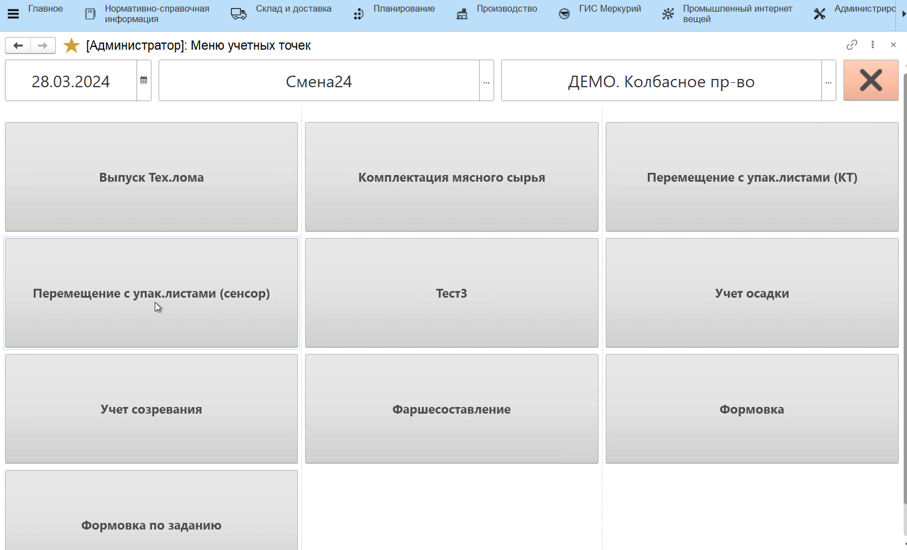
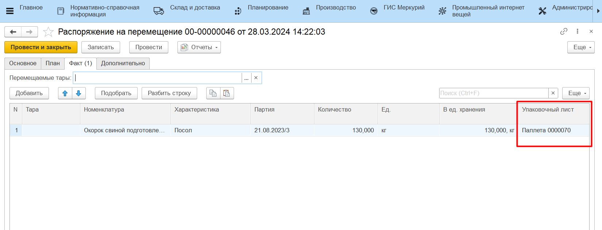
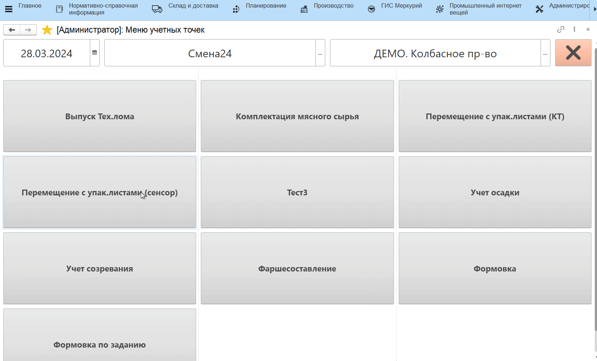
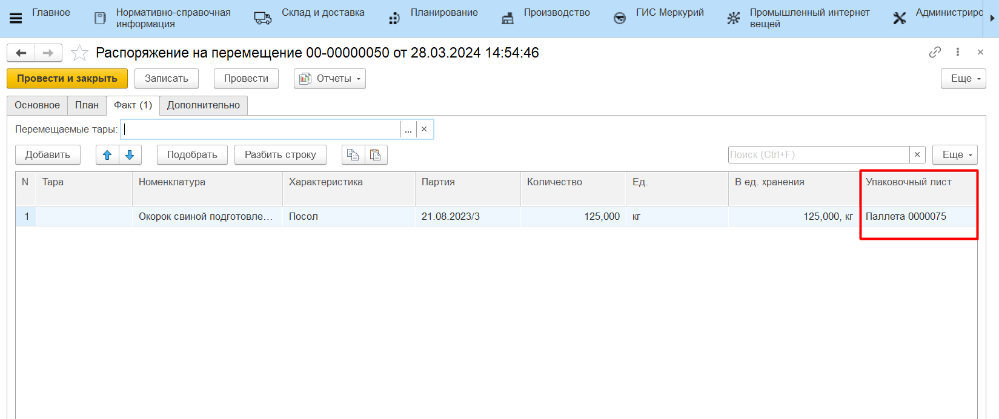

# Полное перемещение

Если на какую-либо продукцию, находящуюся на таре (паллете), уже сформирован упаковочный лист, и теперь её **целиком** нужно переместить на другой склад производства, предлагается воспользоваться полным перемещением. 

Для этого необходимо:

- Открыть **"Меню учетных точек"**, выбрать дату смены, смену и рабочий центр;
- Нажать кнопку **"Перемещение"**;
- В открывшейся форме отсканировать упаковочный лист тары (паллеты), которую нужно переместить. Откроется форма приемки и передачи;
- Из предложенных вариантов выбрать **"Полное перемещение"**.

Если перевзвешивание не проводится, то нажать кнопку **"Подтвердить"**. По итогу будет сформирован документ **"Распоряжение на перемещение"** той же самой паллеты, а тара (паллета) перемещена на склад-получатель;

Если перевзвешивание (актуализация веса) проводится, то:

- Разместить тару (паллету) на весах и зафиксировать вес;
- Нажать **"Подтвердить"**.

По итогу будет сформирован новый упаковочный лист, содержащий информацию об актуальном весе тары, а также документ **"Распоряжение на перемещение"** для перемещения тары (паллеты) на склад-получатель.

Если в системе ведется [Детальный учет по упаковочным листам](../../../../Warehouse/LocationOfContainers/LocationPackageLists.md), то в случае с перевзвешиванием паллеты будут сформированы документы:

- **"Комплектация упаковочного листа"** с типом "Пересобрать", который актуализирует остаток на старом упаковочном листе, новый упаковочный лист создаваться не будет;
- документ **"Распоряжение на перемещение"** для перемещения тары (паллеты) на склад-получатель.

!!! info "Важно"
    - Если необходимо переместить несколько паллет, содержащих одну и ту же партию остатка, каждый новый упаковочный лист можно сканировать из Приемки и передачи, не выходя в меню Оперативного учета;
    - Нельзя перемещать политоварные паллеты;
    - Нельзя перемещать сырье, которое лежит на многооборотной таре. 