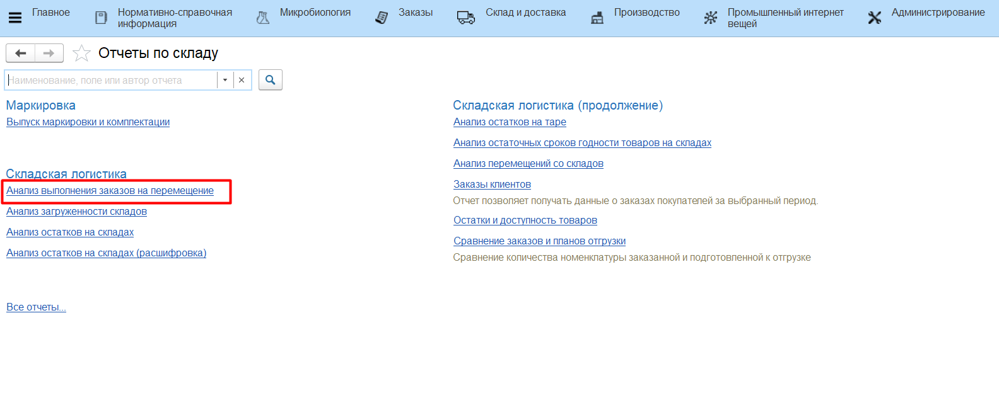
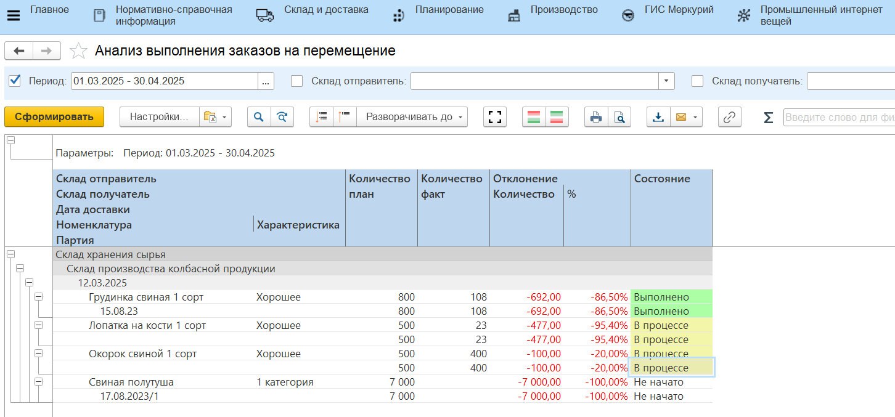
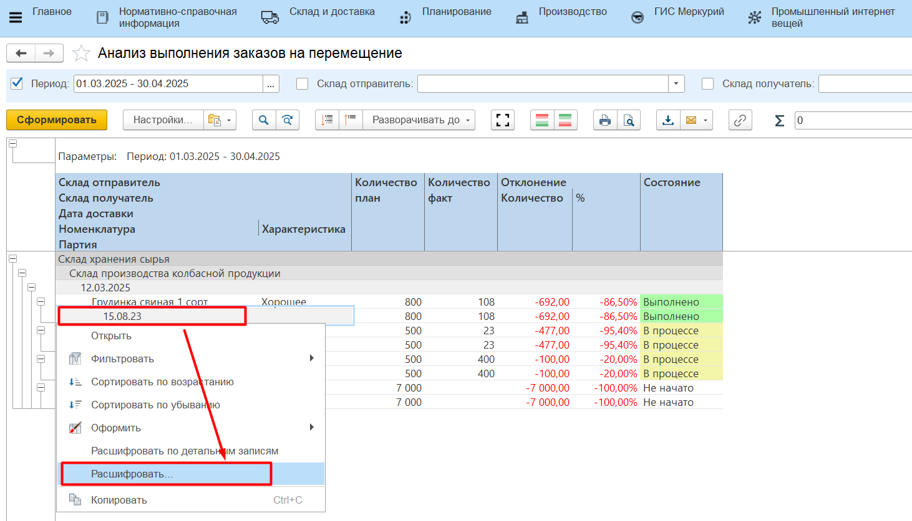
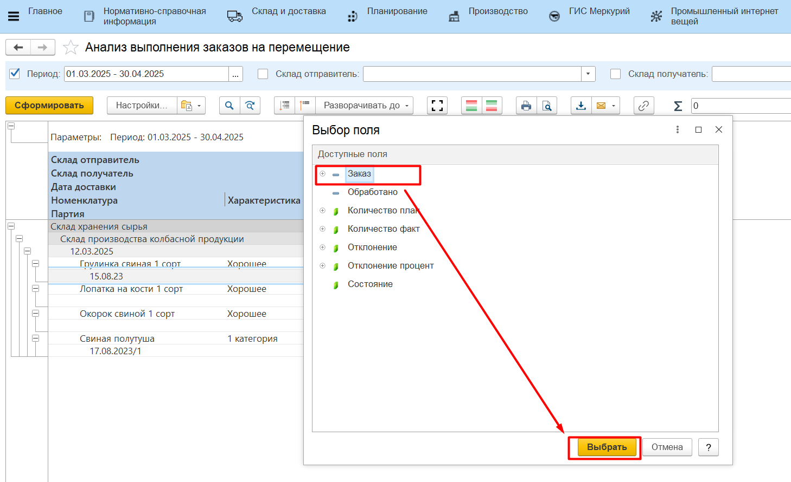
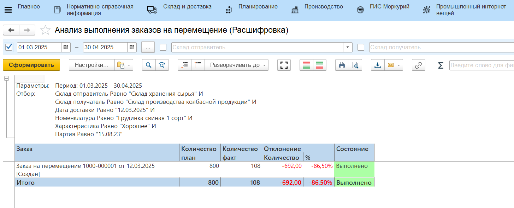

# Анализ выполнения заказов на перемещение

Для анализа выполнения заказов предусмотрен отчет **"Анализ выполнения заказов на перемещение"**. Отчет расположен в разделе **"Складская логистика"** в подсистеме **"Аналитика"** - **"Отчеты"**.

Отчет показывает процент выполнения заказов на перемещение в разрезе складов, даты перемещения и перемещаемых номенклатур/партий.

Для формирования отчета:

- указать дату начала периода аналитики;
- указать дату окончания периода;
- указать склад-отправитель материалов;
- указать склад-получатель;
- нажать **"Сформировать"**.

Если не выбраны отборы, будут выведены данные по всем имеющимся в системе заказам за весь период.

Отчет так же можно расшифровать по документу **"Заказ на перемещение"** и посмотреть, какими документами было выполнено перемещение партии.

