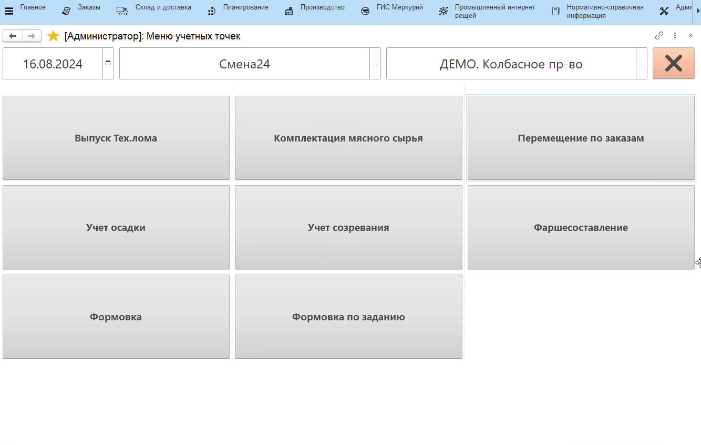
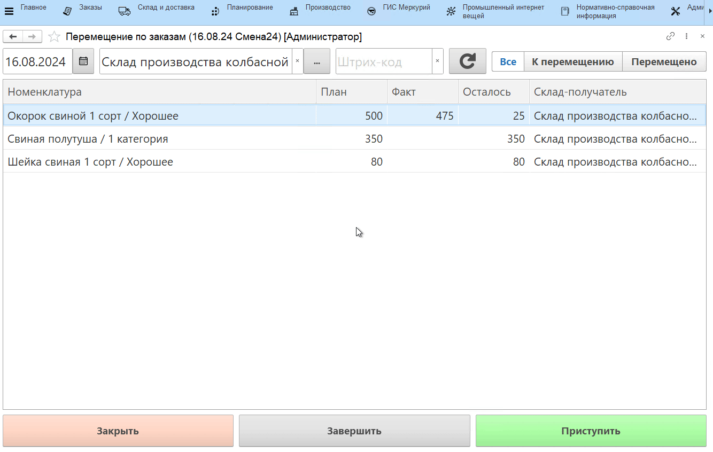
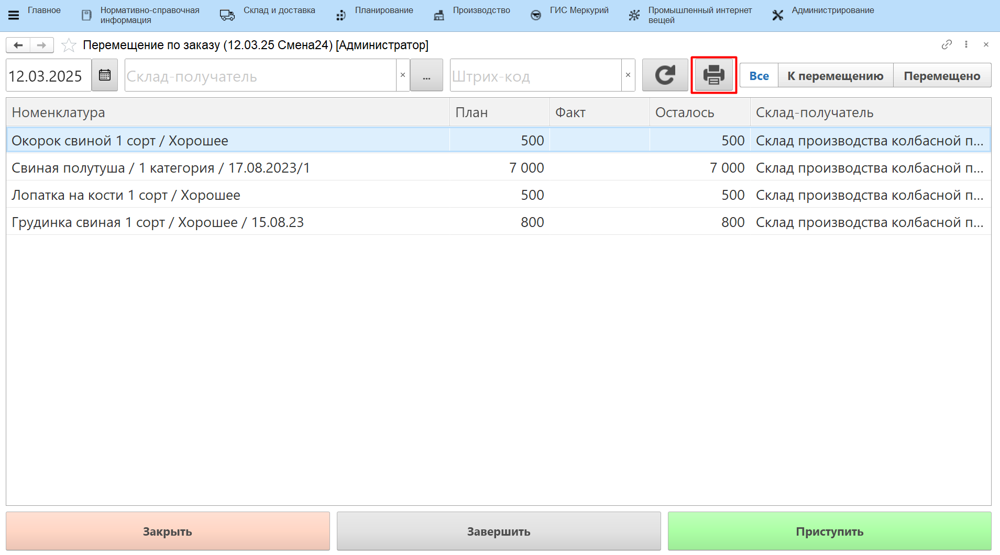
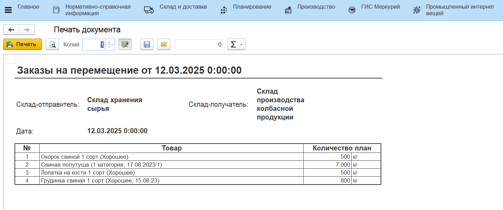

# Перемещение по заказу на перемещение

Для отражения передачи со склада сырья на склад производства необходимо:

- Открыть **"Меню учетных точек"**, выбрать дату смены, смену и рабочий центр;
- Нажать кнопку **"Перемещение по заказам"**;
- В открывшейся форме выбрать склад-получатель, на который необходимо осуществить перемещение;

В табличной части будет выведен список номенклатур, которые необходимо переместить к указанной дате смены, а так же плановое количество к перемещению. Если часть сырья уже была перемещена, то будут так же указаны "факт" и "остаток". 

Номенклатуру можно выбрать вручную либо отсканировать упаковочный лист, затем нажать на кнопку **"Приступить"**, будет осуществлен переход на форму выбора остатков. Если в **"Заказе на перемещение"** не указана партия номенклатуры, то на форме будут показаны остатки всех партий выбранной номенклатуры на складе-отправителе, выбрать нужную партию можно сканированием штрихкода партии или упаковочного листа. Если в заказе указана конкретная партия, то после нажатия кнопки **"Приступить"** будет осуществлен переход к форме подтверждения перемещения.

Далее перемещение на киоске выполняется стандартным образом.

Если в [настройках учетной точки](SettingAccountingPointOrder.md) включено *"Выбирать тип перемещения"*, то перемещение можно делать:

- с формированием нового упаковочного листа (подробнее в разделе ["Перемещение сырья"](../../PeremKiosk/Moving.md));
- с делением существующего упаковочного листа (подробнее в разделах ["Частичное перемещение"](../../PeremKiosk/PartMoving.md) и ["Полное перемещение"](../../PeremKiosk/FullMoving.md)).

После того, как перемещение по строке заказа выполнено, можно завершить строку, нажав на кнопку **"Завершить"**, тогда она будет отражаться только с фильтром *"Перемещено"* и по ней больше нельзя будет выполнить перемещение.

Также есть возможность распечатать список позиций, которые необходимо подготовить к перемещению (план перемещений), по кнопке **"Печать"**:

