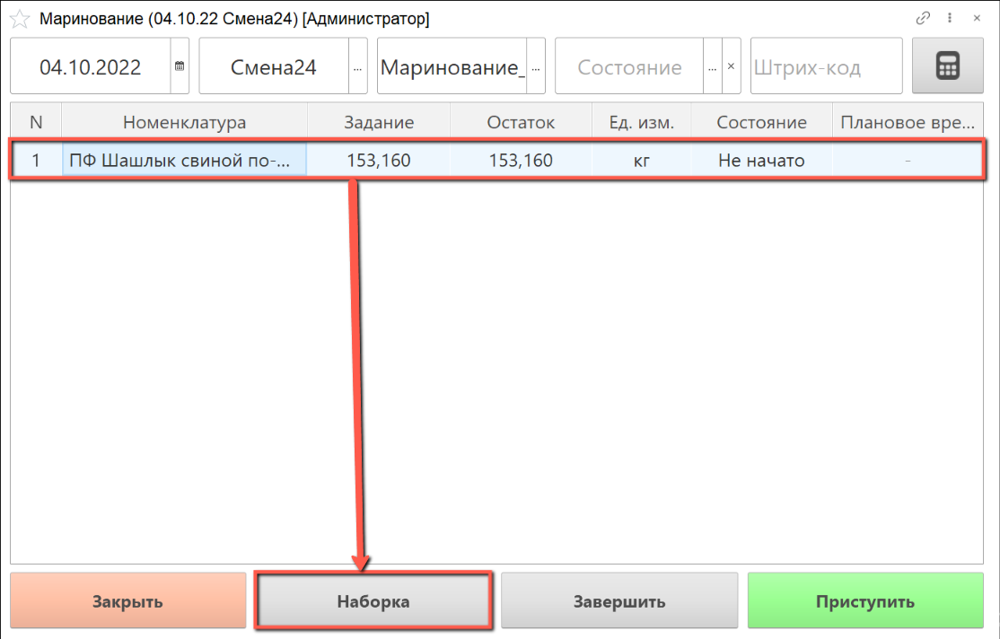

# Маринование

Для выпуска маринованного полуфабриката необходимо создать производственное задание, как это описано в разделе ["Создание производственного задания на маринование"](./CreateTaskForAPickling.md).

- В подсистеме **"Производство"** открываем **"Меню учетных точек"**:

- Указываем дату смены, смену и рабочий участок, на котором будет выполняться маринование полуфабриката.

  Нажимаем на кнопку **"Маринование"**:

- В списке заданий выбираем строку производственного задания, по которому будет осуществляться наборка по рецептуре и нажимаем на кнопку **"Наборка"**.

- Открылось окно наборки: слева находится информация о партии производимого полуфабриката и рецептура для наборки с указанием планового веса ингредиентов.

В таблице рецептуры указан плановый вес, который необходимо набрать.

- Сканируем штрихкод тары, в которой будет взвешиваться полуфабрикат, или выбираем номер тары из списка. Вес тары указывается автоматически:

- Сканируем штрихкод номенклатуры материала, который планируем мариновать, или выбираем серию материала вручную.

- Получаем вес брутто с весов, вес нетто рассчитается автоматически. Когда вес по рецептуре набран полностью, в ячейке "Всего" набранное количество выделяется зеленым цветом.

- По завершении наборки ингредиентов нажимаем на кнопку **"Завершить"**:

Набранные материалы смешиваются на оборудовании или вручную, полученный полуфабрикат также необходимо взвесить.

- Выбираем строку задания, по которому выполнено смешивание ингредиентов, нажимаем на кнопку **"Приступить"**:

- Номенклатура маринованного полуфабриката уже выбрана в АРМ.

Склад-получатель указывается автоматически, при необходимости его можно изменить, выбрав из списка.

Сканируем штрихкод тары, в которой будет взвешиваться полуфабрикат, или выбираем номер тары из списка.

Получаем вес брутто с весов или вводим вручную. Вес нетто рассчитается автоматически.

- По завершении взвешивания маринованного сырья нажимаем кнопку **"Завершить"**:

- Выполненное задание в  АРМ выделяется зеленым цветом, состояние задания переходит в статус **"Выполнено"**:

