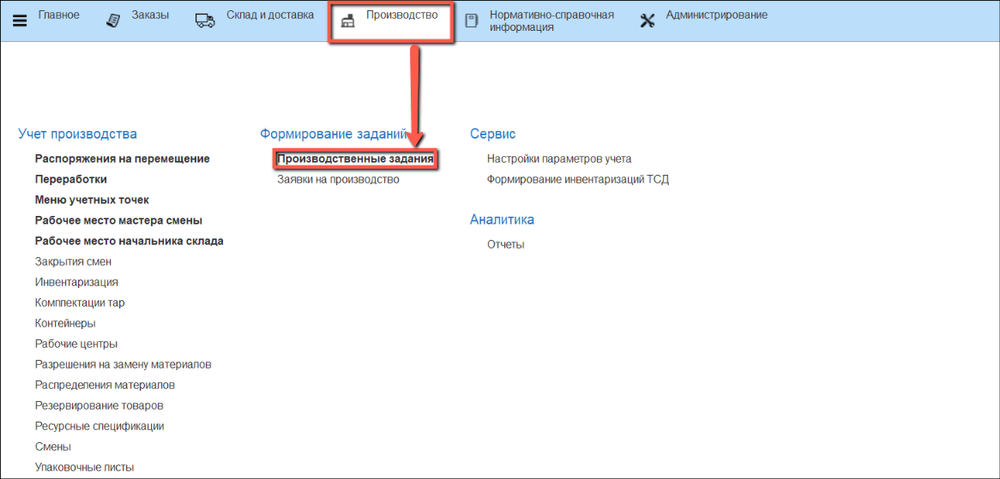
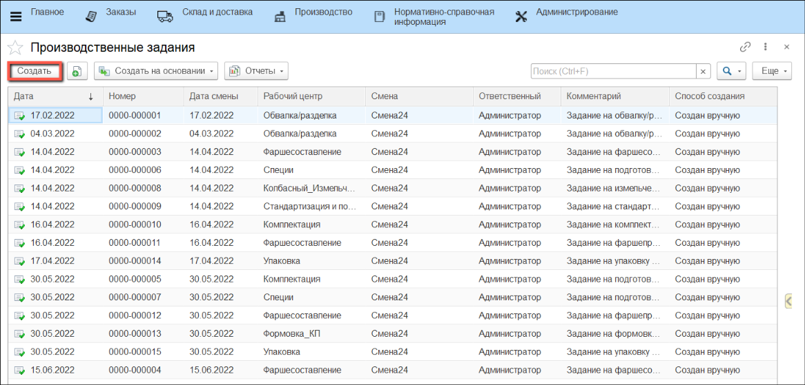
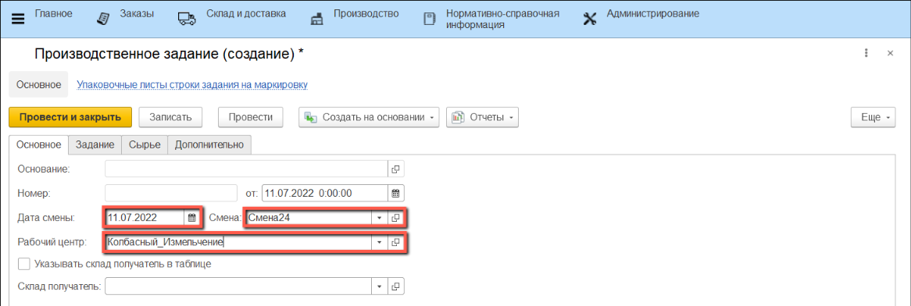
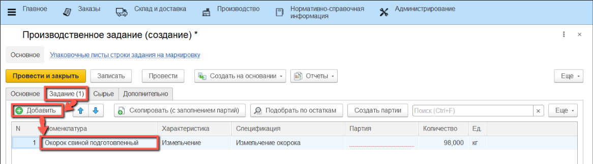
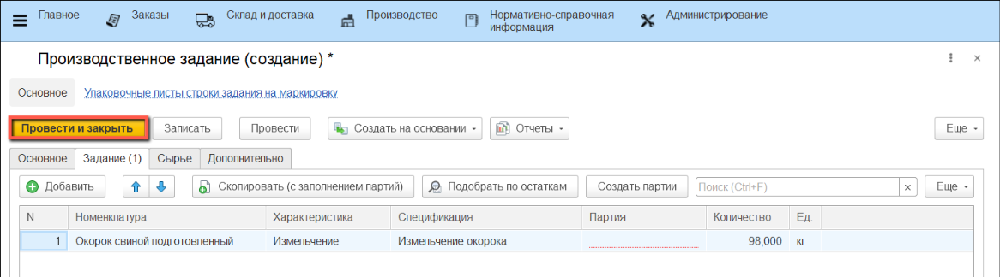

# Создание производственного задания на измельчение мясного сырья

Для создания производственного задания на измельчение мясного сырья в системе создаются документы **"Производственное задание"**.

- В подсистеме **"Производство"** в разделе **"Формирование заданий"** выбираем **"Производственные задания"**:

- Нажимаем кнопку **"Создать"**:

Заполняем сведения на вкладке **"Основное"**:

- Дата смены
- Смена
- Рабочий центр, на котором будет производиться измельчение
  
Поле **"Склад получатель"** не является обязательным для заполнения.

Если для разной номенклатуры выпуска необходимо перемещение на разные склады, необходимо установить флаг **"Указывать склад получатель в таблице"**.

*Если в настройках кнопки учетной точки установлен склад получатель, то он будет автоматически указываться при выпуске номенклатуры, независимо от склада, указанного в производственном задании.*

- Заполняем сведения на вкладке **"Задание"**:

- Чтобы добавить номенклатуру измельченного сырья, нажимаем на кнопку **"Добавить"**: в табличной части появится строка для заполнения номенклатуры.
- Заполняем поле **"Номенклатура"** выбором из списка.
- "**Спецификация"** будет указана автоматически. Если она не появилась в соответствующем поле, значит в системе существует несколько действующих ресурсных спецификаций для производства данного продукта, либо нет ни одной. В этом случае необходимо выбрать ее из списка, либо создать новую.
- **"Количество"** полуфабриката будет введено автоматически по спецификации. При желании его можно изменить вручную.
- Поле **"Партия"** нужно оставить пустым.

- Нажимаем на кнопку **"Провести и закрыть"**.

