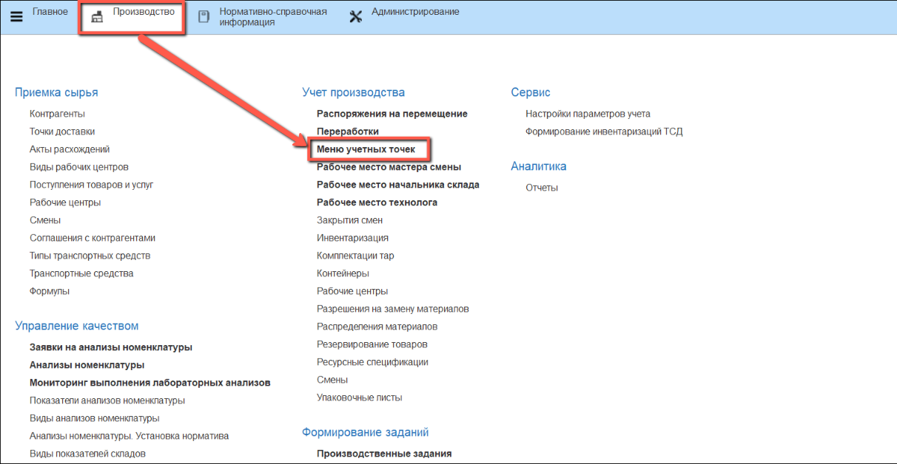
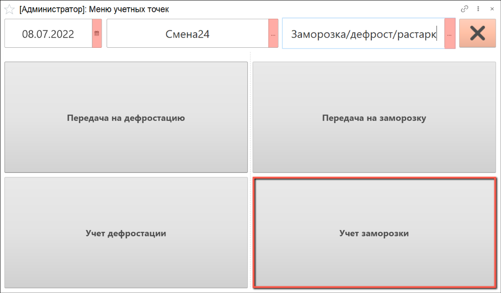
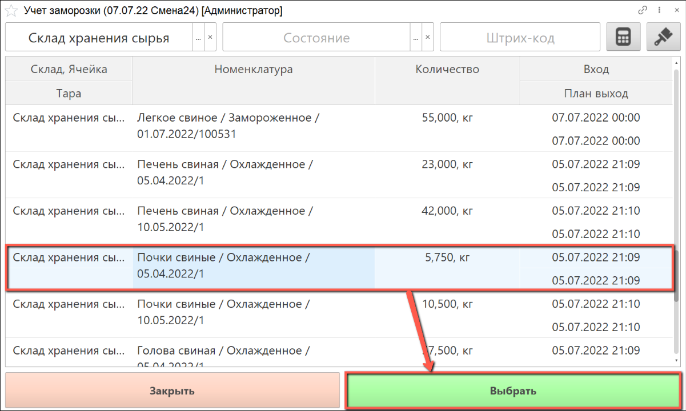
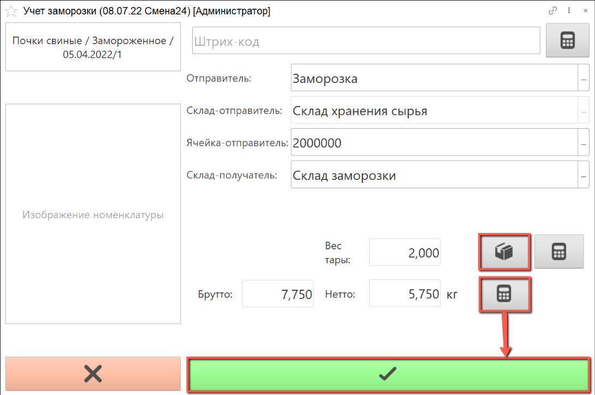
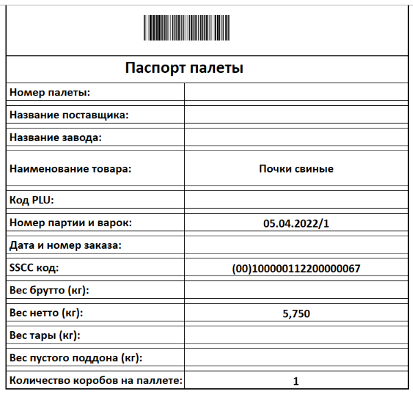

# Учет заморозки

Учет заморозки сырья производится оператором через киоски, производственное задание для данной операции не требуется.

- Открываем **"Меню учетных точек"**:

- Указываем дату смены, смену и рабочий участок, на котором производится заморозка. Нажимаем на кнопку **"Учет заморозки"**:

Открываются партии сырья, которые на данный момент находятся на выбранном рабочем участке.

- Выбираем склад и партию сырья для заморозки

В левом верхнем углу находится информация о номенклатуре выпуска.

Также на форме присутствуют поля, заполненные автоматически:

- **"Отправитель"** - рабочий центр
- **"Склад-отправитель"** - склад, который осуществляет передачу сырья на заморозку
- **"Ячейка-отправитель"** - конкретная ячейка склада-отправителя, с которой отправляется сырье
- **"Склад-получатель"** - склад, который осуществляет приемку сырья на заморозку

При желании можно изменить значения этих полей вручную.

- С помощью калькулятора тары подбираем тару для взвешивания замораживаемого сырья.

- Получаем вес брутто с весов, вес нетто рассчитается автоматически, нажимаем на кнопку **"Подтвердить"**:

- По окончании взвешивания сырья распечатывается паспорт паллеты:

