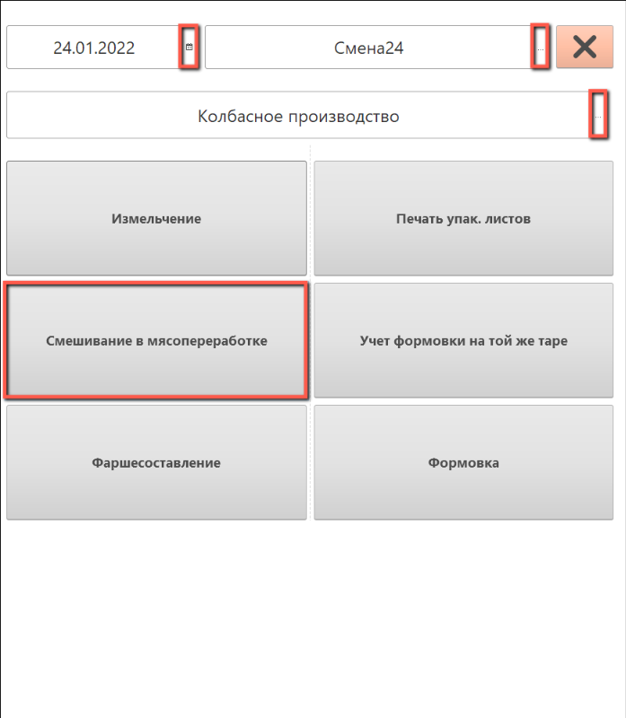
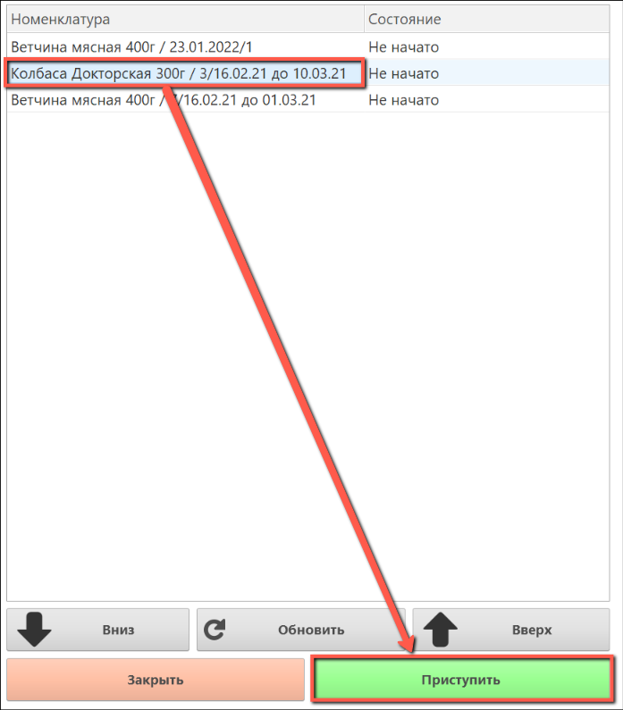
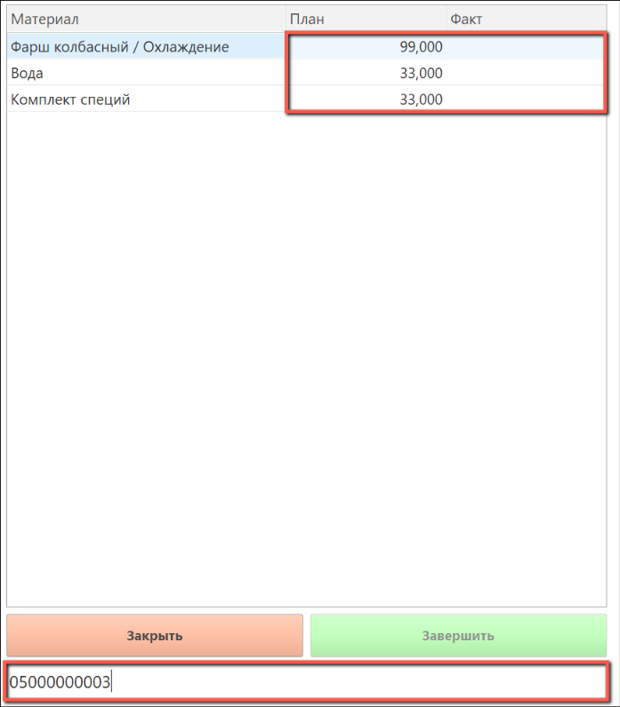
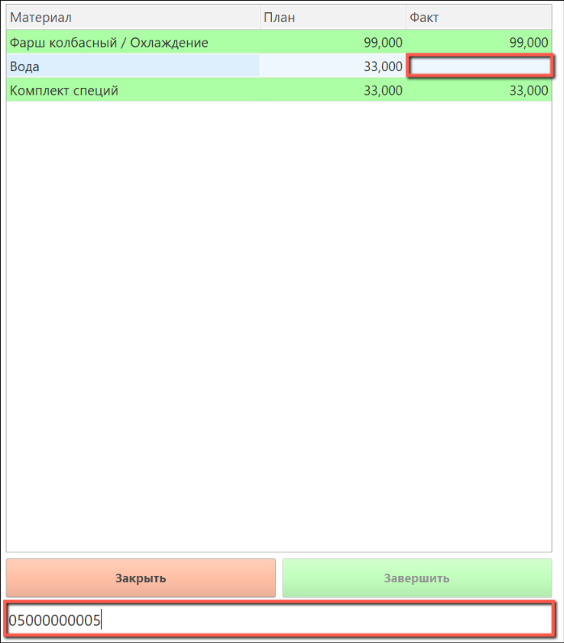
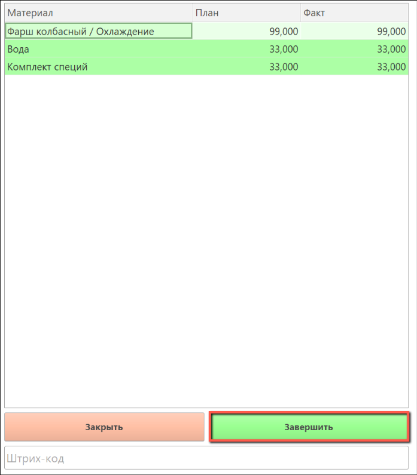
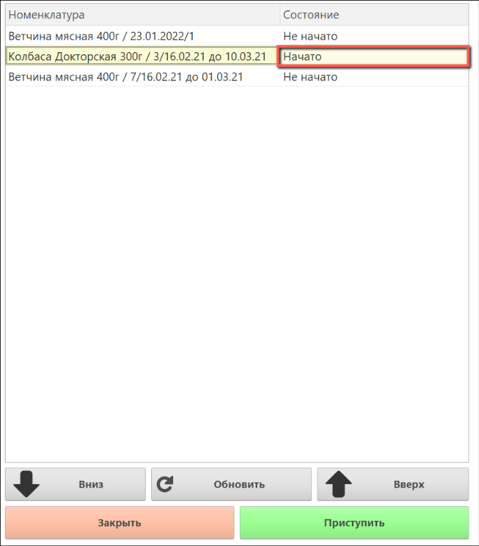

# Смешивание в мясопереработке ТСД

Работа со смешиванием в мясопереработке ТСД происходит через меню учетных точек.

Для того, чтобы приступить к смешиванию, нужно заполнить поля:

- Дата

- Смена

- Учетная точка

После выбора всех параметров появятся кнопки учетных точек. Выбираем **"Смешивание в мясопереработке"**.

Открылось окно с номенклатурой из производственного задания по выбранной дате.

- Выбираем нужную строчку с номенклатурой

- Нажимаем на кнопку **"Приступить"**

Далее откроется окно, где будет указан список нужной номенклатуры, необходимой для смешивания по спецификации.
Для смешивания, необходимо заполнить колонку факт нужным количеством сырья.

- Сканируем штрих-код

Набранные материалы будут выделены зеленым цветом.

Если окажется так, что на отсканированной таре не окажется достаточного количества материалов, для завершения смешивания, можно их дозаполнить с другой тары. Для этого сканируем новый штрих-код.

После того, как все материалы будут выделены зеленым цветом (то есть выбраны), будет доступна кнопка **"Завершить"**.

- Нажимаем на кнопку **"Завершить"**

В строке, по которой была выполнена наборка, состояние изменится на "Начато".

В результате смешивания будет создан документ **"Переработка"**.