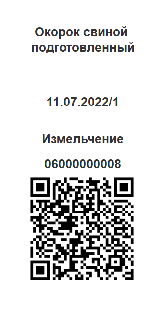

# Измельчение

Для выпуска измельченного сырья необходимо создать производственное задание, как это описано в разделе ["Создание производственного задания на измельчение сырья"](./CreateTaskForAShredding.md).

- Открываем **"Меню учетных точек"**:

- Указываем дату смены, смену и рабочий участок, на котором производится измельчение. Нажимаем на кнопку **"Измельчение"**:

- В списке заданий выбираем строку производственного задания, по которому будет осуществляться измельчение сырья.

- Нажимаем на кнопку **"Наборка"**:

Открылось окно **"Измельчение"**.

В левом верхнем углу находится информация о партии измельченного сырья.

- Нажимаем **"Подобрать партию"**.

Открылось окно подбора партии.

- Выбираем нужную партию и нажимаем **"Подтвердить"**.

- Сканируем штрихкод тары, в которой будет взвешиваться сырье, или выбираем номер тары из списка. Вес тары указывается автоматически.

- С помощью калькулятора заполняем вес номенклатуры выпуска.

- Получаем вес брутто с весов, вес нетто рассчитается автоматически.

- По окончании взвешивания сырья на одной таре нажимаем кнопку **"Завершить"**. При необходимости можно выбрать несколько партий используемого материала. Для этого после взвешивания первой партии необходимо повторно открыть форму подбора и выбрать вторую партию, далее произвести ее взвешивание. При этом на форме подбора партии будет видно, какие партии и в каком количестве (колонка "Набрано") были использованы в данной наборке. 

- По завершении операции печатается этикетка партии измельченного сырья:

- Выполненное задание в  АРМ выделяется оранжевым цветом, состояние задания переходит в статус "В процессе".
- По результатам переработки можно завершить задание. Для этого выделяем нужную строку и нажимаем **"Завершить"**.

