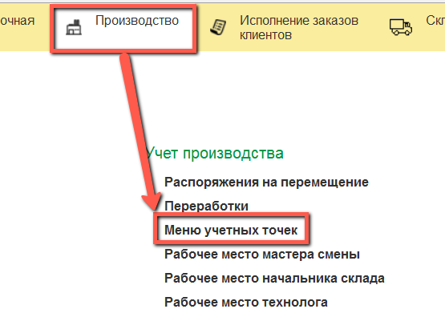
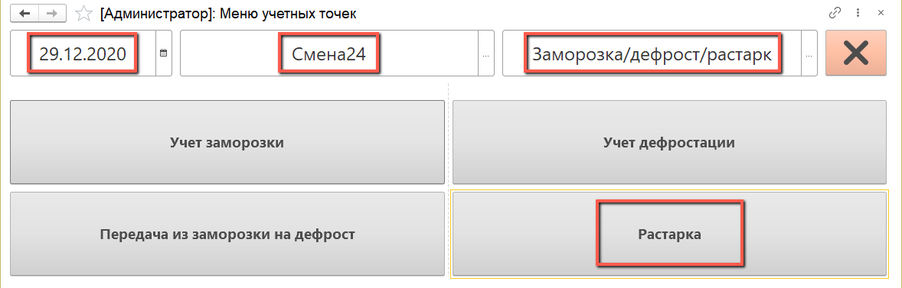
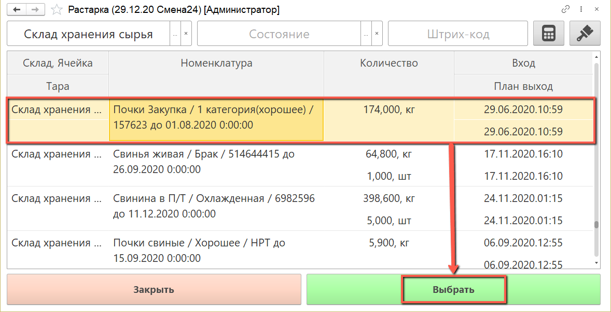
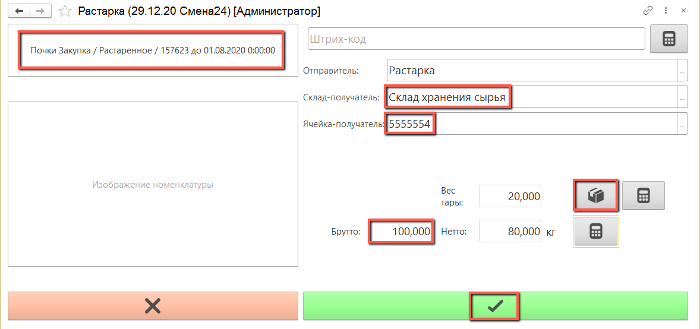
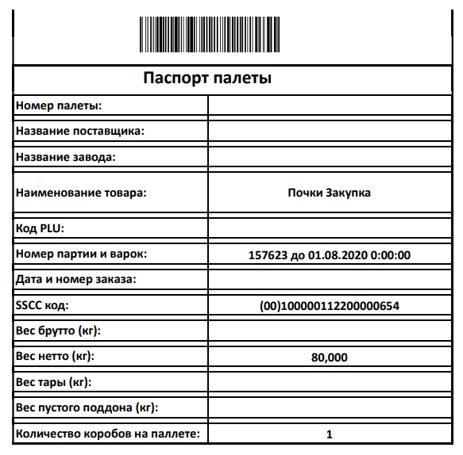

# Растарка

Учет растарки сырья производится оператором через киоски, производственное задание для данной операции не требуется.

- Открываем "Меню учетных точек":

- Указываем дату смены, смену и рабочий участок, на котором производится растарка. Нажимаем кнопку "Растарка":

  

- Открывается список партий сырья, которые на данный момент находятся на данном рабочем участке.

  Выбираем в списке  партию сырья, которую собираемся растарить:

  

- В верхнем левом углу видим информацию о номенклатуре выпуска. Номенклатуре выпуска присваивается характеристика "Растаренное".

  Справа указан рабочий центр по умолчанию. Склад-получатель следует указать вручную, выбрав его из списка. Также заполняем вручную ячейку на складе-получателе, выбрав ее из списка.

  С помощью калькулятора тары подбираем тару, в которой производится взвешивание растаренного сырья.

  Получаем вес брутто с весов, вес нетто рассчитается автоматически, нажимаем кнопку "Подтвердить":

  

- По окончании взвешивания сырья распечатывается паспорт паллеты:

  