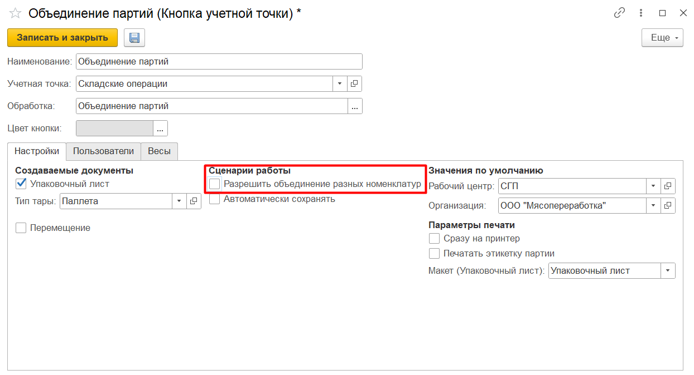
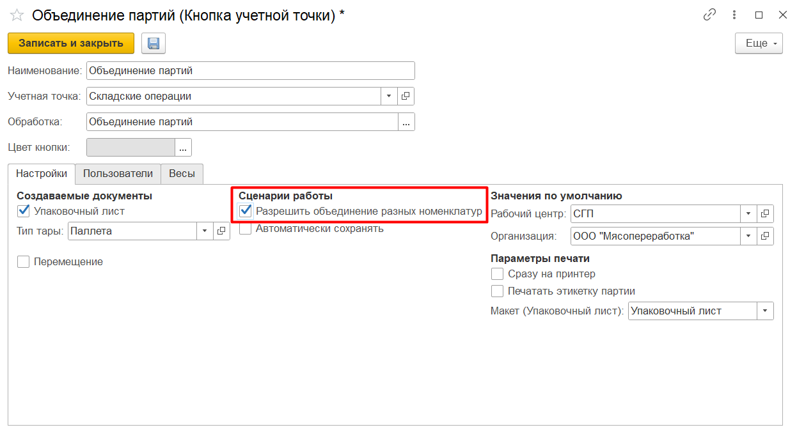

# Oбъединение партий сырья/полуфабрикатов

## Объединение партий одной номенклатуры

Для объединения партий номенклатуры при помощи киоска, необхожимо настроить соответствующую "**Кнопку учетной точки**".

### Настройка:

Создаем новый элемент справочника "**Кнопки учетных точек**".

Указываем:

- Наименование;
- Учетная точка;
- Создание нового упаковочного листа;
- Перемещение (создание распоряжения на перемещение);
- Сценарии работы ("Разрешить объединение разных номенклатур") - параметр не установлен;
- Автоматическое сохранение;
- Рабочий центр;
- Склад-отправитель;
- Склад-получатель;
- Организация;
- Параметры печати;

В "**Меню учетных точек**" выбрать ранее созданную кнопку учетной точки. В открывшейся форме в ручную, либо сканированием этикетки подобрать партии для объединения. Завершить операцию. В результате сформируется документ "**Переработка**".

<video source src="../СonsolidationOfBatches.assets/Pictures_03.mp4" width="1024" controls="controls"> </video>

## Объединение партий разных номенклатур

Для объединения партий номенклатуры при помощи киоска, необхожимо настроить соответствующую "**Кнопку учетной точки**".

В настройках кнопки учетной точки необходимо изменить параметр:

- Сценарии работы ("Разрешить объединение разных номенклатур") - параметр установлен;

В "**Меню учетных точек**" выбрать ранее созданную "Кнопку учетной точки". В открывшейся форме в ручную, либо сканированием этикетки подобрать партии для объединения. Завершить операцию. В результате сформируется документ "**Переработка**".

<video source src="../СonsolidationOfBatches.assets/Pictures_04.mp4" width="1024" controls="controls"> </video>

Данная обработка также поддерживает сценарий объединения разных паллет в одну (как для разных партий, так и для разных номенклатур). По итогу объединения кроме документа **"Переработка"** будет сформирован новый упаковочный лист. 

Если при этом в системе ведется [Детальный учет по упаковочным листам](../../../Warehouse/LocationOfContainers/LocationPackageLists.md), то расход с объединенных паллет и приход на новую паллету будет так же отражен документом **"Переработка"** без создания новых "Комплектация упаковочного листа".