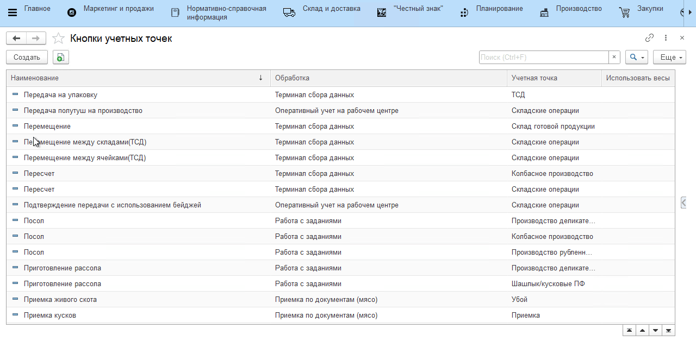

# Oбъединение партий сырья/полуфабрикатов

## Объединение партий одной номенклатуры

Для объединения партий номенклатуры при помощи киоска, необхожимо настроить соответствующую "**Кнопку учетной точки**".

### Настройка:

Создаем новый элемент справочника "**Кнопки учетных точек**".

Указываем:

- "**Наименование**"
- "**Учетная точка**"
- "**Обработка**" ("Объединение партий")
- "**Сценарии работы**" ("Разрешить объединение разных номенклатур") - параметр не устанавлен
- "**Рабочий центр**"
- "**Склад-отправитель**"
- "**Склад-получатель**"
- "**Организация**"
- "**Параметры печати**"

В "**Меню учетных точек**" выбрать ранее созданную "**Кнопку учетной точки**". В открывшейся форме в ручную, либо сканированием этикетки подобрать партии для объединения.
Завершить операцию. В результате сформируется документ "**Переработка**".

<video source src="../СonsolidationOfBatches.assets/Pictures_03.mp4" width="1024" controls="controls"> </video>

## Объединение партий разных номенклатур

Для объединения партий номенклатуры при помощи киоска, необхожимо настроить соответствующую "**Кнопку учетной точки**".

### Настройка:

Создаем новый элемент справочника "**Кнопки учетных точек**".

Указываем:

- "**Наименование**"
- "**Учетная точка**"
- "**Обработка**" ("Объединение партий")
- "**Сценарии работы**" ("Разрешить объединение разных номенклатур") - параметр устанавлен
- "**Рабочий центр**"
- "**Склад-отправитель**"
- "**Склад-получатель**"
- "**Организация**"
- "**Параметры печати**"

В "**Меню учетных точек**" выбрать ранее созданную "**Кнопку учетной точки**". В открывшейся форме в ручную, либо сканированием этикетки подобрать партии для объединения.
Завершить операцию. В результате сформируется документ "**Переработка**".

<video source src="../СonsolidationOfBatches.assets/Pictures_04.mp4" width="1024" controls="controls"> </video>