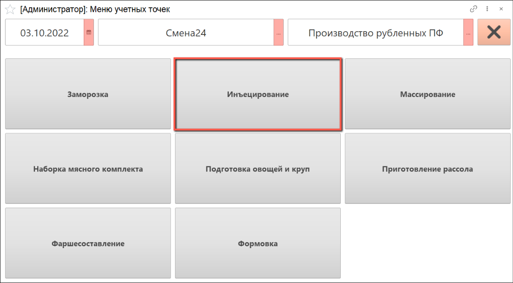
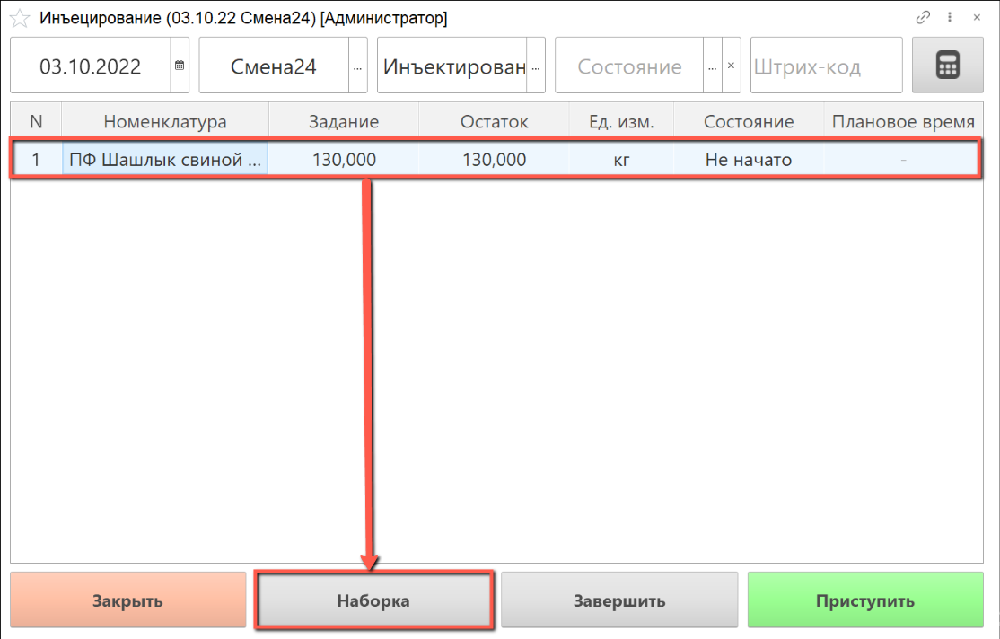
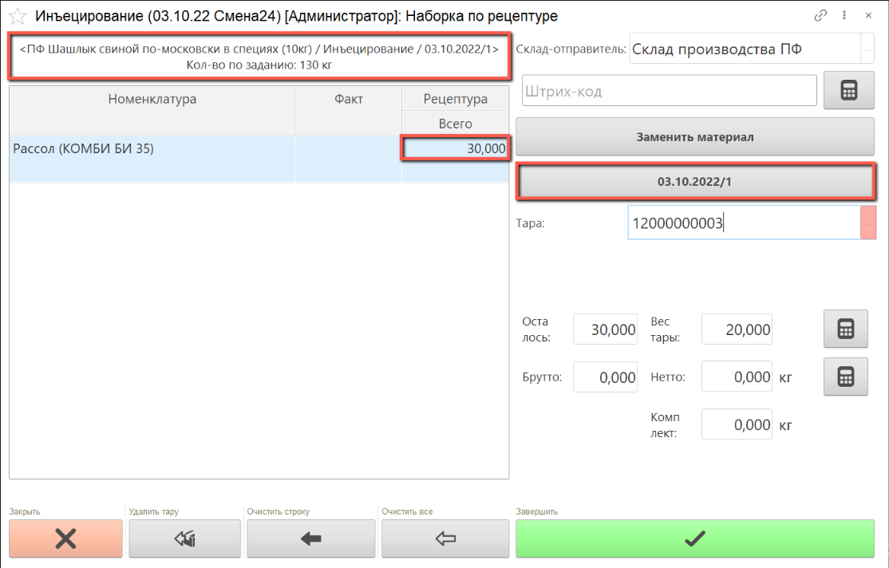
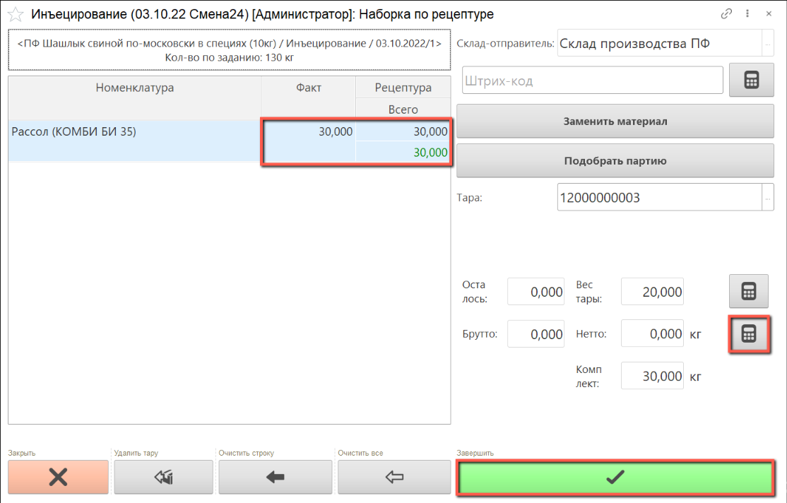
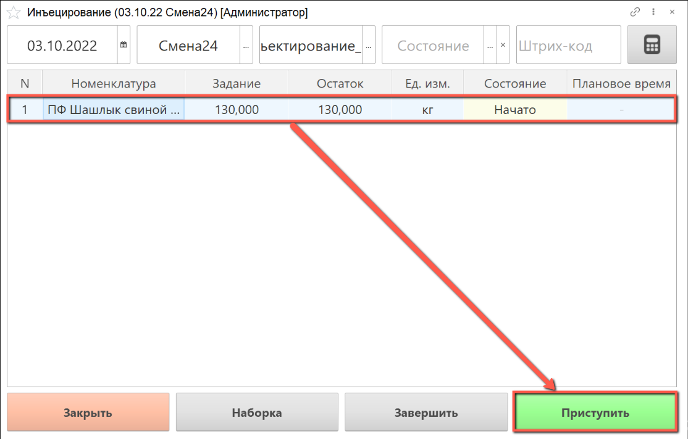
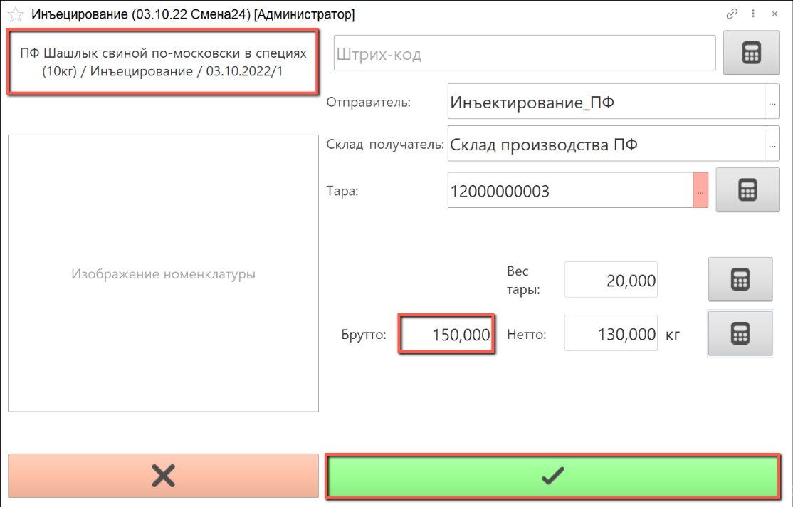
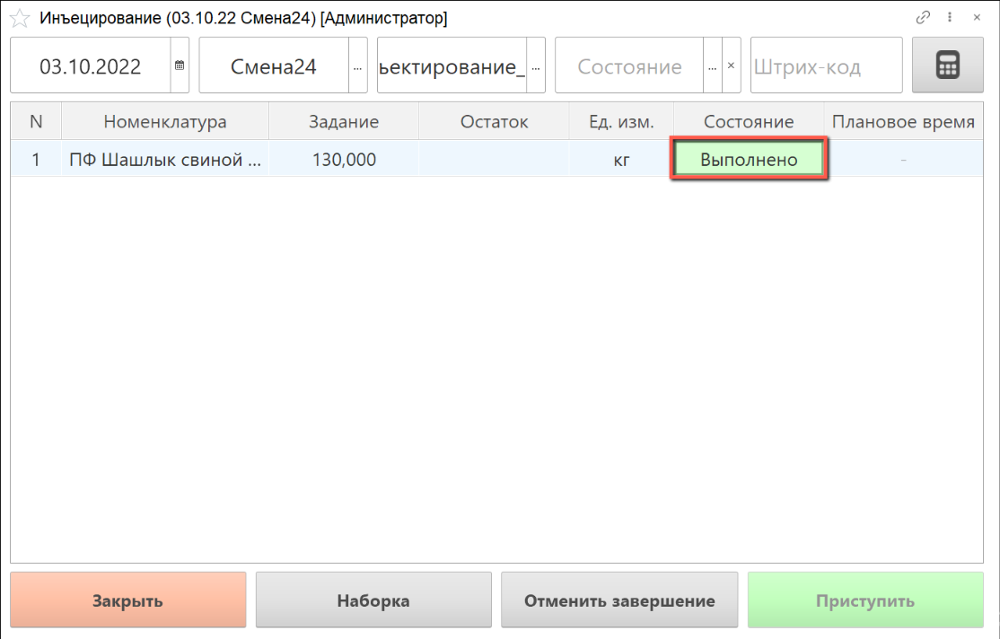

# Инъецирование

Для выпуска инъецированного сырья необходимо создать производственное задание, как это описано в разделе ["Создание производственного задания на инъецирование"](./CreateTaskForAnInjection.md).

- В подсистеме **"Производство"** открываем **"Меню учетных точек"**:

- Указываем дату смены, смену и учетную точку, на которой будет выполняться инъецирование сырья.

- Нажимаем на кнопку **"Инъецирование"**:

- В списке заданий выбираем строку производственного задания, по которому будет осуществляться наборка по рецептуре и нажимаем на кнопку **"Наборка"**.

- Открылось окно наборки: слева находится информация о партии производимого полуфабриката и рецептура для наборки с указанием планового веса ингредиентов.

В таблице рецептуры указан плановый вес, который необходимо набрать.

Сканируем штрихкод партии готового рассола, с помощью которого будет производиться инъецирование сырья, или выбираем партию материала вручную.

Сканируем штрихкод тары, в которой будет взвешиваться полуфабрикат, или выбираем номер тары из списка. Вес тары указывается автоматически:

- Получаем вес брутто с весов или выбираем вручную. Вес нетто рассчитается автоматически. Когда вес по рецептуре набран полностью, в ячейке "Всего" набранное количество выделяется зеленым цветом.

- По завершении наборки ингредиентов нажимаем на кнопку **"Завершить"**:

Рассол добавляется к сырью с помощью инъектора, полученный полуфабрикат также необходимо взвесить.

- Выбираем строку задания, по которому выполнено инъецирование, нажимаем на кнопку **"Приступить"**:

- Номенклатура инъецированного сырья уже выбрана в АРМ.

Склад-получатель указывается автоматически, при необходимости его можно изменить, выбрав из списка.

Сканируем штрихкод тары, в которой будет взвешиваться полуфабрикат, или выбираем номер тары из списка.

Получаем вес брутто с весов, вес нетто рассчитается автоматически.

- По завершении взвешивания инъецированного сырья нажимаем кнопку **"Завершить"**:

- Выполненное задание в  АРМ выделяется зеленым цветом, состояние задания переходит в статус **"Выполнено"**:

