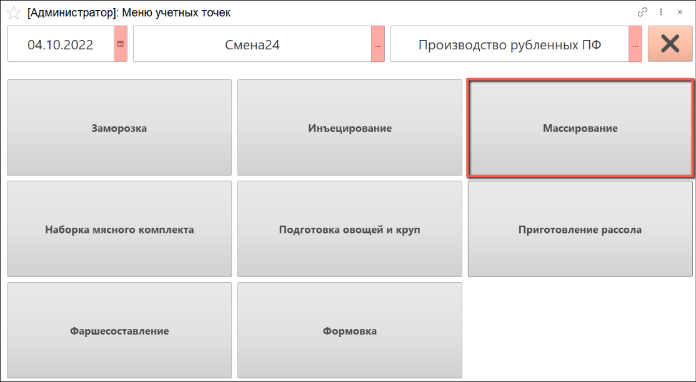
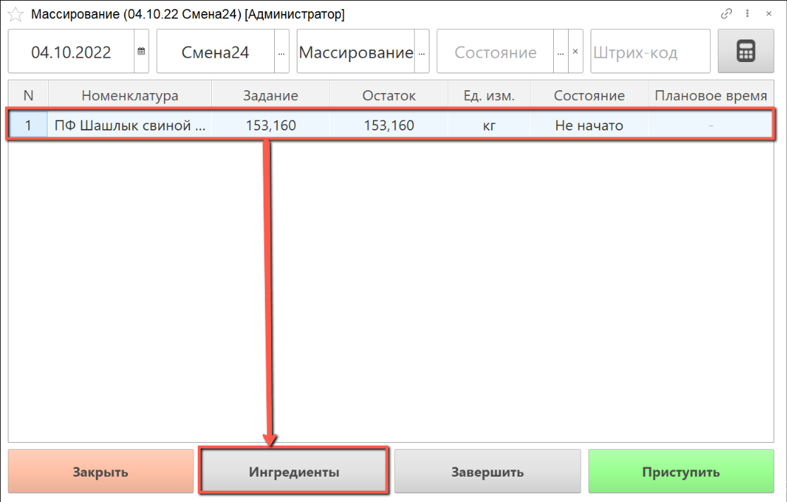
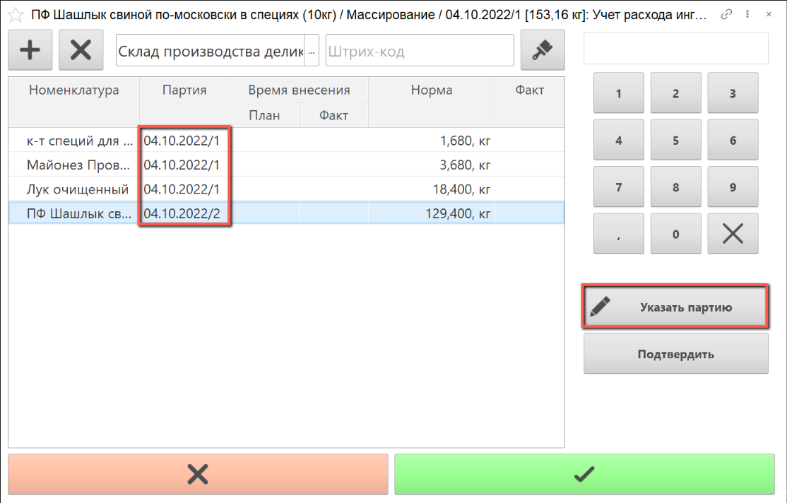
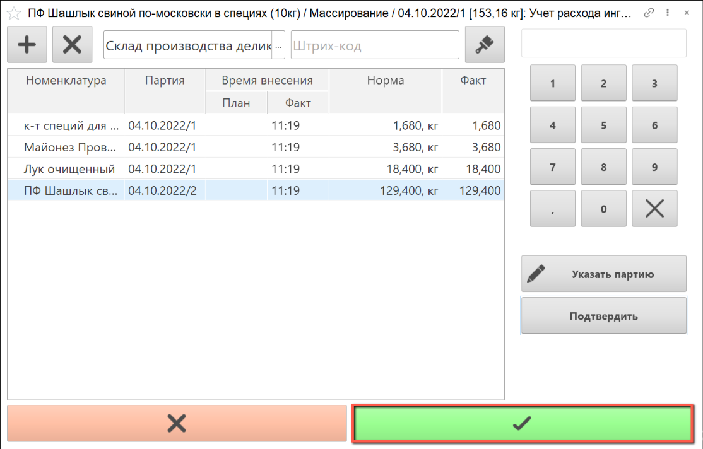
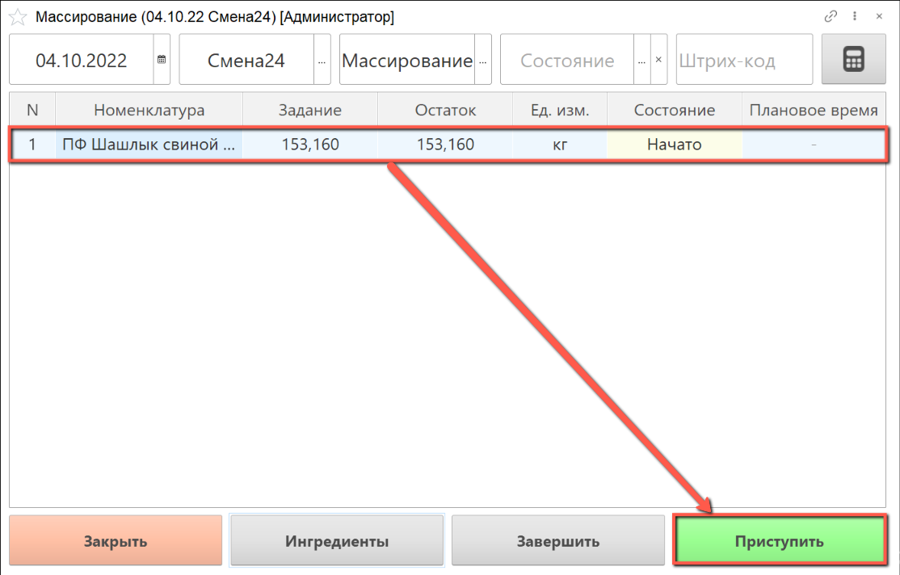
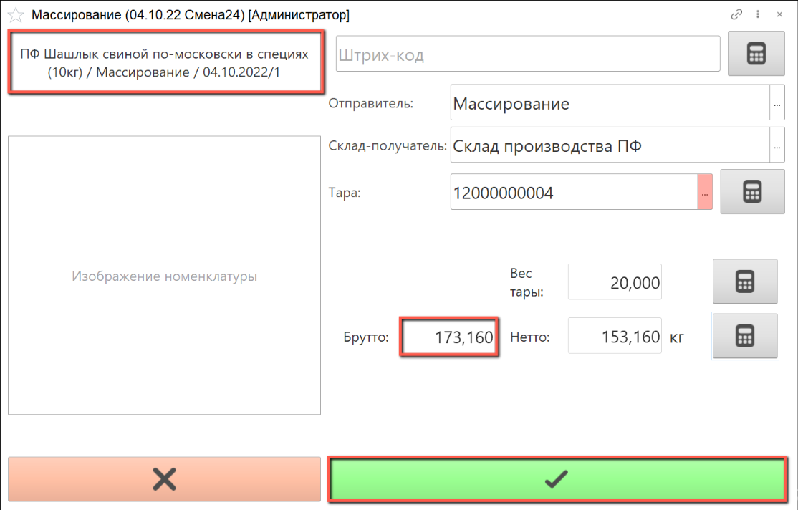
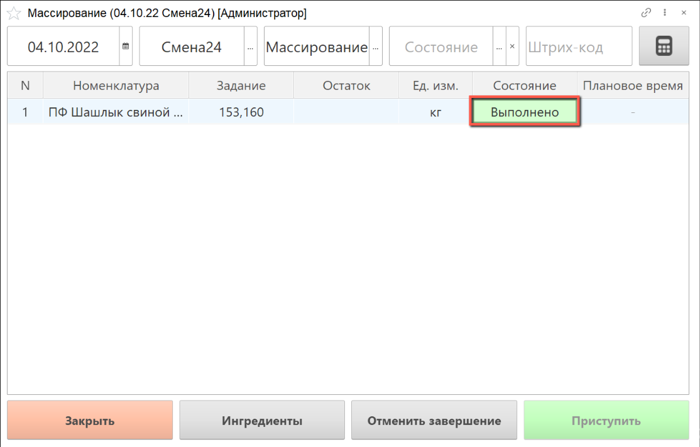

# Массирование

Для выпуска массированного сырья необходимо создать производственное задание, как это описано в разделе ["Создание производственного задания на Массирование"](./CreateTaskForAMassaging.md).

- В подсистеме **"Производство"** открываем **"Меню учетных точек"**:

- Указываем дату смены, смену и рабочий участок, на котором будет выполняться массирование сырья.

  Нажимаем на кнопку **"Массирование"**:

- В списке заданий выбираем строку производственного задания, по которому будет осуществляться наборка ингредиентов и нажимаем на кнопку **"Ингредиенты"**.

Открывается окно учета расхода ингредиентов

В таблице указан плановый вес, который необходимо набрать.

- Сканируем штрихкод партии сырья, или выбираем ее вручную.

- Набираем нужное количество ингредиентов для массирования

- По завершении наборки ингредиентов нажимаем на кнопку **"Завершить"**:

Сырье массируется на оборудовании, после чего полученный полуфабрикат также необходимо взвесить.

- Выбираем строку задания, по которому выполнено массирование, нажимаем на кнопку **"Приступить"**:

- Номенклатура массированного сырья уже выбрана в АРМ.

Склад-получатель указывается автоматически, при необходимости его можно изменить, выбрав из списка.

Сканируем штрихкод тары, в которой будет взвешиваться полуфабрикат, или выбираем номер тары из списка.

Получаем вес брутто с весов, вес нетто рассчитается автоматически.

  По завершении взвешивания массированного сырья нажимаем на кнопку **"Завершить"**:

- Выполненное задание в  АРМ выделяется зеленым цветом, состояние задания переходит в статус **"Выполнено"**:

