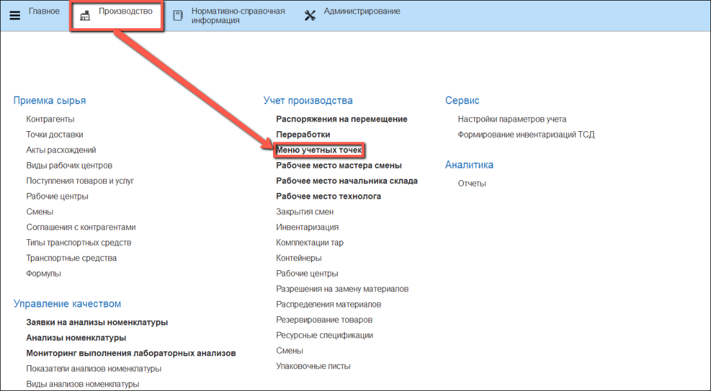

# Резка

- В подсистеме **"Производство"** открываем **"Меню учетных точек"**:

- Указываем дату смены, смену и учетную точку, на которой будет производиться резка сырья.

- Нажимаем на кнопку **"Резка"**:

В табличной части указаны учетные остатки на участке производства полуфабрикатов. Сканируем штрихкод тары, партии продукции или выбираем нужную строку вручную.

- Нажимаем на кнопку **"Выбрать"**:

Открывается окно для заполнения данных о номенклатуре выпуска. 

Слева указана номенклатура выходного изделия, которое предполагается взвесить.

Справа автоматически указываются рабочий центр, на котором производится взвешивание сырья и склад-получатель. Если склад-получатель содержит ячейки хранения, ячейку необходимо указать вручную.

- Сканируем этикетку тары или выбираем вручную из списка. Вес тары указывается автоматически

- Получаем вес брутто с весов, вес нетто рассчитается автоматически.

- Нажимаем кнопку "Выпуск":

- По окончании взвешивания распечатывается этикетка партии нарезанного комплекта:

