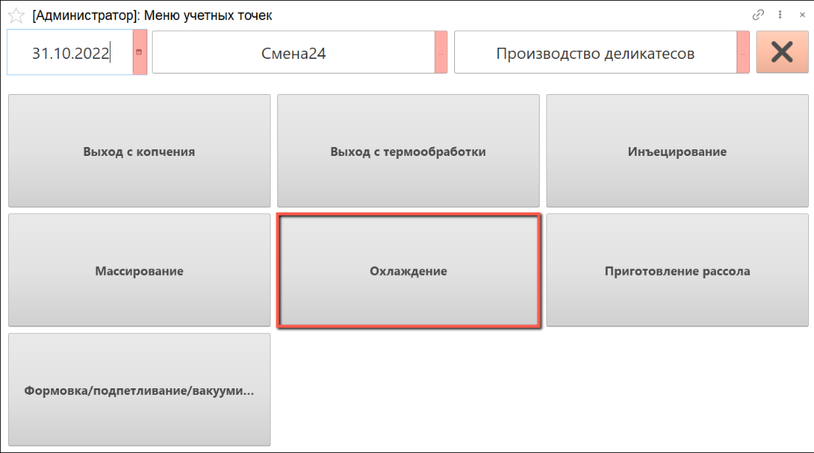
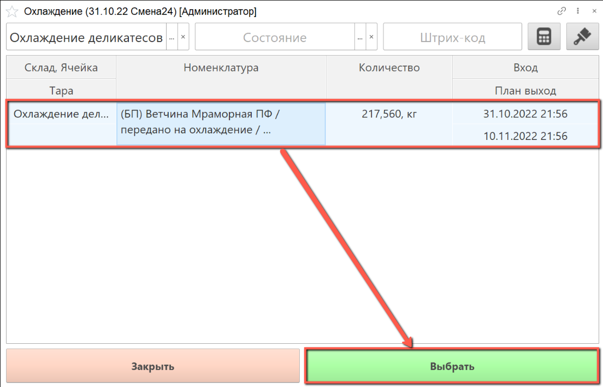
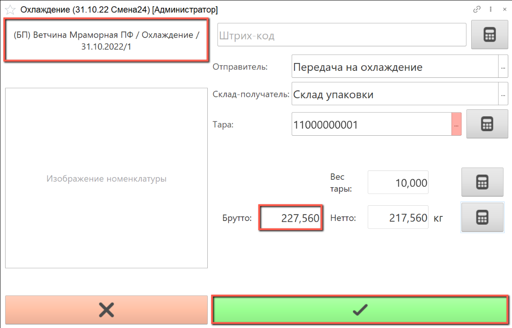
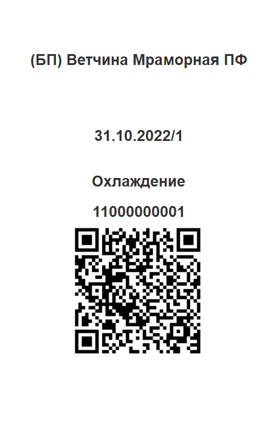

# Охлаждение

- В подсистеме **"Производство"** открываем **"Меню учетных точек"**:

- Указываем дату смены, смену и рабочий участок, на котором будет выполняться учет созревания.

- Нажимаем на кнопку **"Охлаждение"**:

- В табличной части указаны учетные остатки на участке охлаждения с их плановым временем выхода. Сканируем штрихкод тары, партии продукции или выбираем нужную строку вручную.

Нажимаем на кнопку **"Выбрать"**:

- Номенклатура сырья для охлаждения уже выбрана в АРМ.

Склад-получатель указывается автоматически, при необходимости его можно изменить, выбрав из списка.

Сканируем штрихкод тары, в которой будет взвешиваться полуфабрикат, или выбираем номер тары из списка.

Получаем вес брутто с весов, вес нетто рассчитается автоматически

- По завершении взвешивания сырья для комплектации нажимаем на кнопку **"Подтвердить"**:

- По окончании взвешивания распечатывается этикетка партии:

