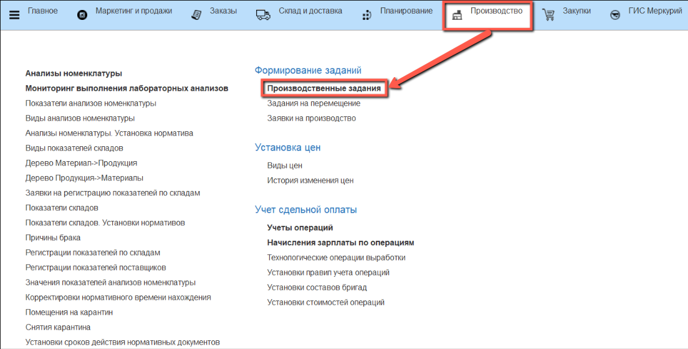
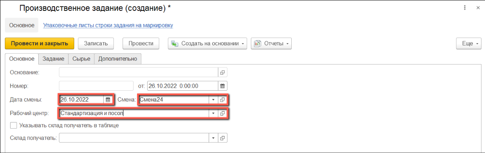
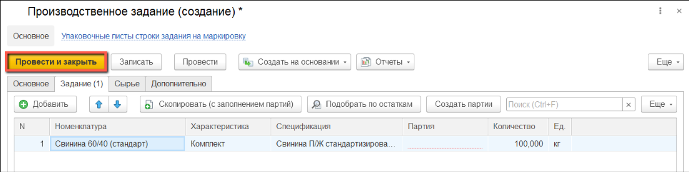

# Создание производственного задания на стандартизацию

Для работы по стандартизации мясного сырья в системе создаются документы **"Производственное задание"**.

- В подсистеме **"Производство"** открываем **"Производственные задания"**:

- Нажимаем на кнопку **"Создать"**:

Заполняем сведения на вкладке **"Основное"**:

1. Дата смены;
2. Смена;
3. Рабочий центр, на котором будет производиться стандартизация;

Поле **"Склад получатель"** не является обязательным для заполнения.
  
Если для разных строк  производственного задания предполагается перемещение выходного изделия на разные склады, следует установить флаг "Указывать склад получатель в таблице".

*В настройках кнопки учетной точки может быть установлен определенный склад получатель по умолчанию. В этом случае склад-получатель при выпуске будет указан по умолчанию из кнопки учетной точки.*

- Заполняем сведения на вкладке **"Задание"**:

  1. Нажимаем на кнопку **"Добавить"** и добавляем нужную номенклатуру в табличную часть;
  2. Спецификация для стандартизации будет указана автоматически. Если спецификация не появилась в соответствующем поле, значит в системе существует несколько действующих ресурсных спецификаций для производства данного продукта, либо нет ни одной. В этом случае спецификацию необходимо выбрать, открыв список, назначить действующей существующую, или создать новую.
  3. Поле **"Количество"** будет заполнено по спецификации;

Поле **"Партия"** можно заполнить или оставить пустым и тогда партия будет создана автоматически.

- Нажимаем на кнопку **"Провести и закрыть"**.

