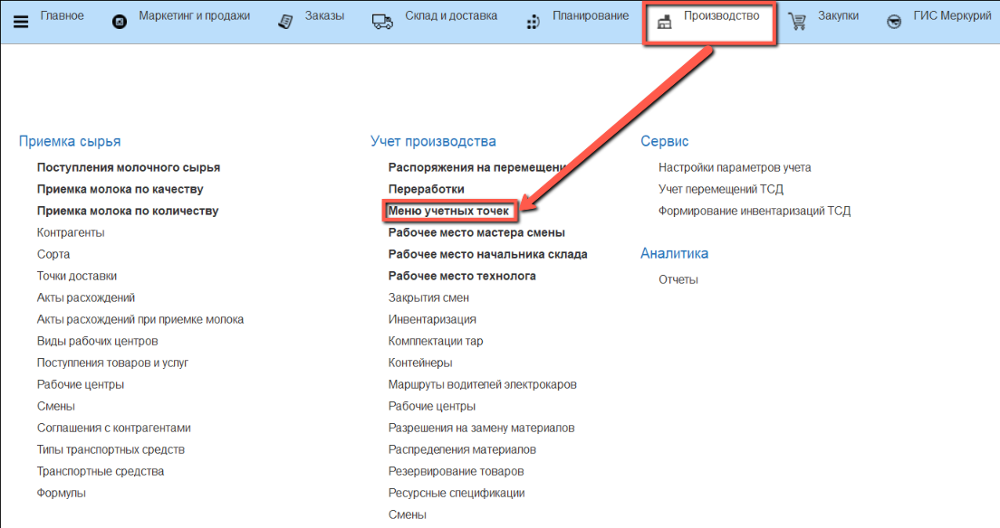

# Термообработка

Учет термообработки осуществляется через кнопку учетной точки **"Термообработка"**

- В подсистеме **"Производство"** открываем **"Меню учетных точек"**:

- Указываем дату смены, смену и рабочий участок, на котором будет производиться термообработка продукции.

- Нажимаем кнопку **"Термообработка"**:

Открылось окно АРМ'а термообработки

- Автоматически заполнены: рабочий центр, склад получатель и программа термообработки. При желании их можно изменить вручную.

- Сканируем штрихкод тары, либо нажимаем на кнопку **"Остатки склада"** чтобы подобрать тару вручную.

- Выбираем тару и нажимаем на кнопку **"Выбрать"**

- Строка пропала, нажимаем на кнопку **"Назад"**

- Выбираем нужную строку и нажимаем **"Подтвердить"**

По результатам этой термообработки будет сформировано распоряжение на перемещение на склад термообработки.