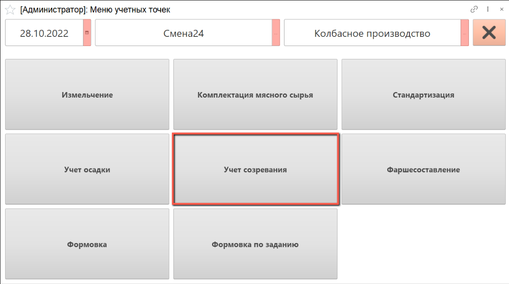
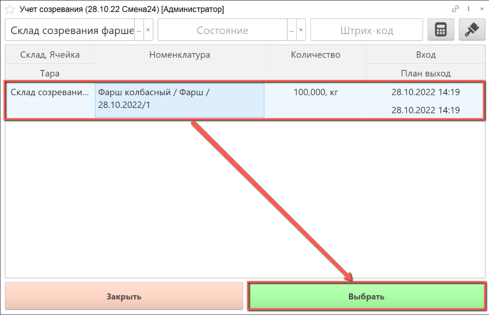
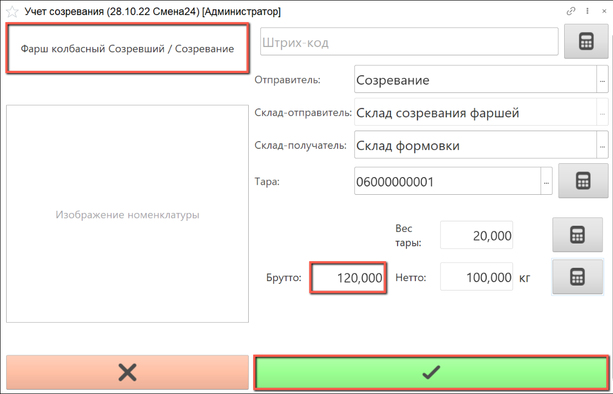

# Учет созревания

Учет созревания фарша и массированного сырья ведется аналогичным образом в камере созревания.

- В подсистеме **"Производство"** открываем **"Меню учетных точек"**:

- Указываем дату смены, смену и рабочий участок, на котором будет выполняться учет созревания.

- Нажимаем на кнопку **"Учет созревания"**:

В табличной части указаны учетные остатки в камере созревания с их плановым временем выхода. Сканируем штрихкод тары, партии продукции или выбираем нужную строку вручную.

- Нажимаем на кнопку **"Выбрать"**:

- Открывается окно для заполнения данных о номенклатуре выпуска. 

  Слева указана номенклатура выходного изделия, которое предполагается взвесить.

  Справа автоматически указываются рабочий центр, на котором производится взвешивание сырья, склад-отправитель и склад-получатель. Склад-получатель можно изменить вручную. Если склад-получатель содержит ячейки хранения, ячейку необходимо указать вручную.

  Если номенклатура выпуска была выбрана с помощью сканирования штрихкода этикетки партии или тары, поле **"Тара"** уже будет заполнено. Если ранее партия числилась на складе без указания тары, сканируем штрихкод тары или выбираем ее вручную из списка, вес тары указывается автоматически.

  Получаем вес брутто с весов, вес нетто рассчитается автоматически

- По окончании взвешивания нажимаем на кнопку **"Подтвердить"**:

