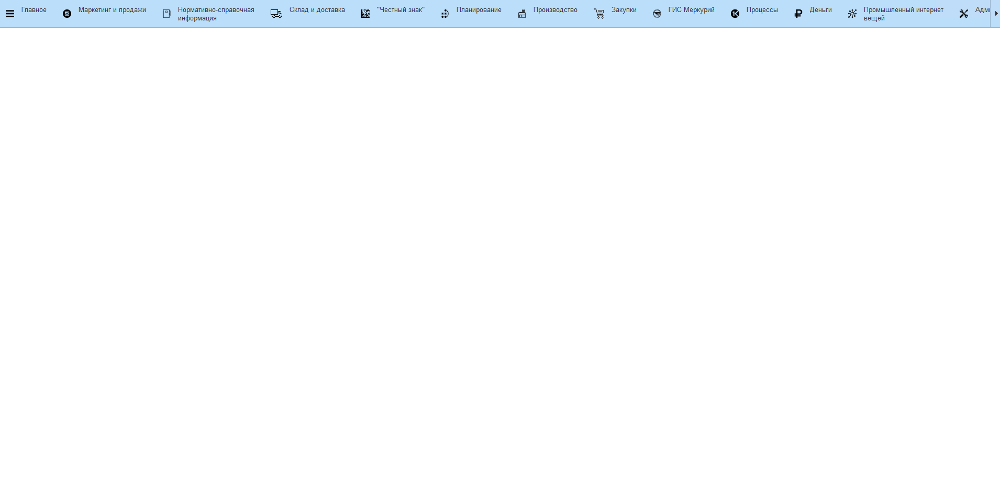
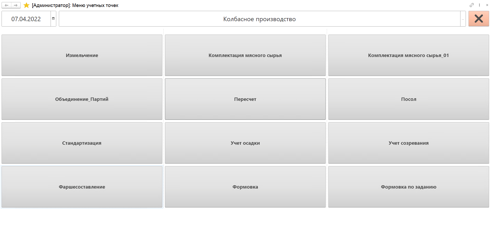
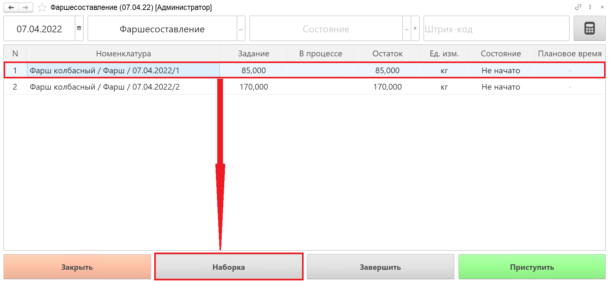
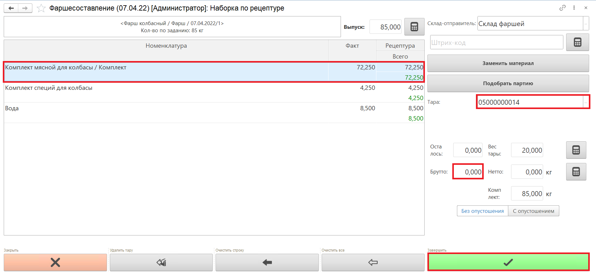
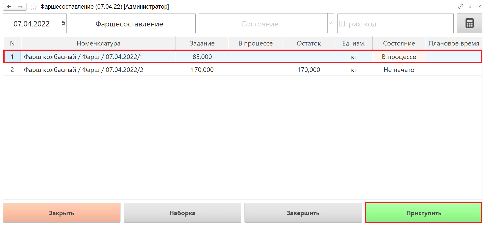
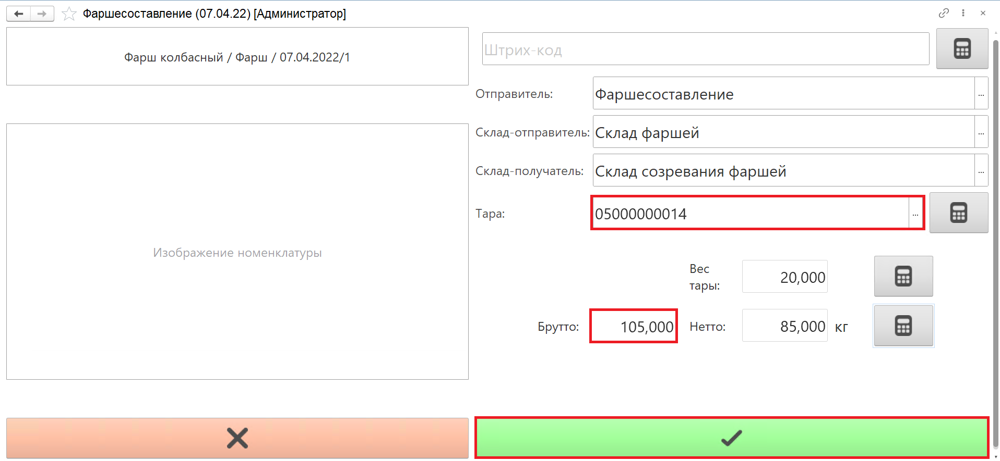
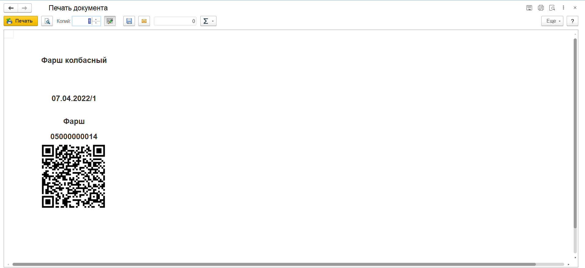
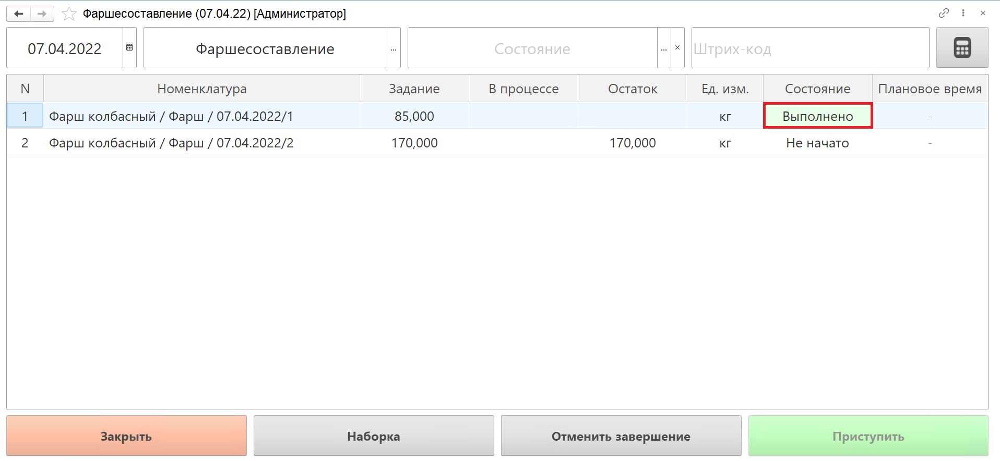

# Фаршесоставление (куттерование)

Для выпуска фарша необходимо создать производственное задание, как это описано в разделе ["Создание производственного задания на фаршесоставление"](./CreateTaskForAMinsedMeat.md).

- В подсистеме **"Производство"** открываем **"Меню учетных точек"**:

- Указываем дату смены и рабочий участок, на котором будет производиться фарш.

  Нажимаем на кнопку **"Фаршесоставление"**:

- В списке заданий выбираем строку производственного задания, по которому будет осуществляться наборка по рецептуре.

  Нажимаем на кнопку **"Наборка"**:

  

- Слева в открывшемся окне находится информация о партии производимого фарша и рецептура для наборки с указанием планового веса ингредиентов.

  Сканируем штрихкод номенклатуры материала, который планируем добавить в фарш. Номенклатуру воды необходимо выбрать вручную в таблице рецептуры.

  Сканируем штрихкод тары, в которой будет взвешиваться сырье, или выбираем номер тары из списка. Вес тары указывается автоматически.

  Получаем вес брутто с весов, вес нетто рассчитается автоматически.

  При взвешивание оператор имеет возможность управлять учетом веса ранее набранных ингредиентов:

- **С опустошением** - вес ранее набранных на таре ингредиентов не учитывается.
- **Без опустошения** - вес ранее набранных на таре ингредиентов учитывается.
  
  По завершении наборки ингредиентов нажимаем кнопку **"Завершить"**:

  

- Набранные материалы загружаются в куттер, на оборудовании выполняется замешивание фарша.

  Фарш, полученный при замешивании также необходимо взвесить.

  Выбираем строку задания, по которому выполнено замешивание фарша, нажимаем на кнопку **"Приступить"**:

  

- Номенклатура фарша уже выбрана в АРМ.

  Сканируем штрихкод тары, в которой будет взвешиваться сырье, или выбираем номер тары из списка.

  Вес брутто получаем с весов или выбираем вручную. Вес нетто рассчитается автоматически.

  По завершении взвешивания готового фарша нажимаем на кнопку **"Завершить"**:

  

- Печатается этикетка на партию фарша на каждую тару:

  

- Выполненное задание в  АРМ выделяется зеленым цветом, состояние задания переходит в статус **"Выполнено"**:

  