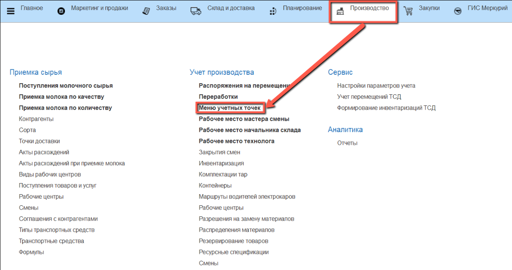
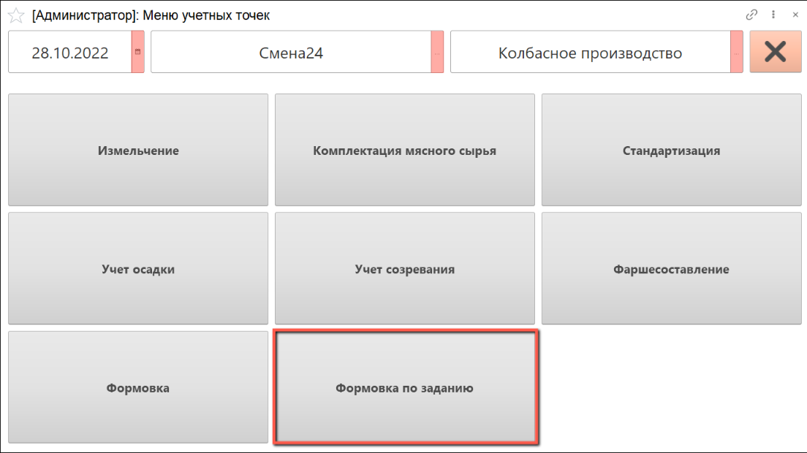
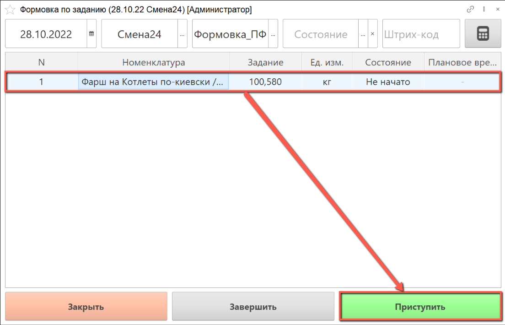
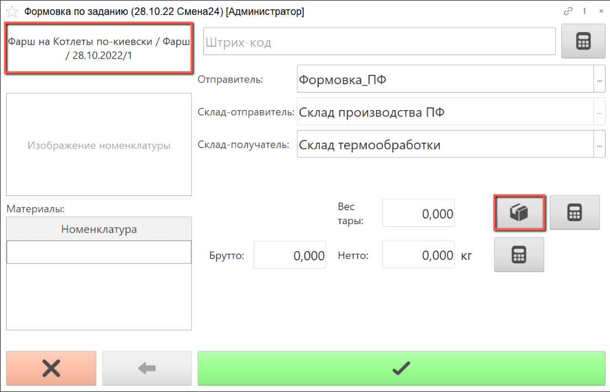
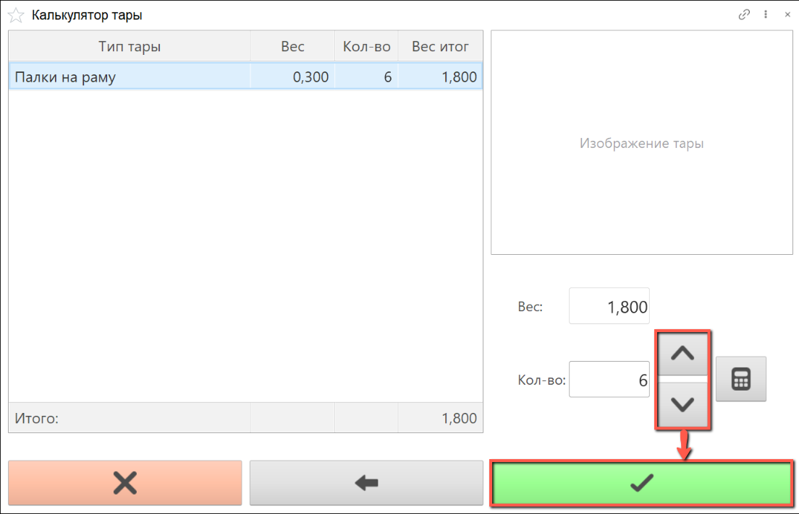
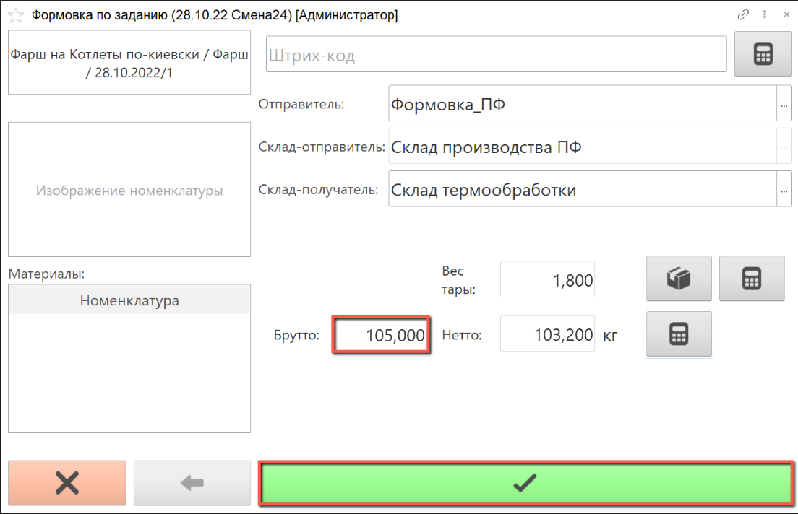
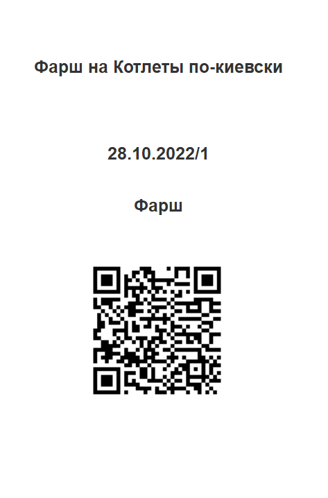
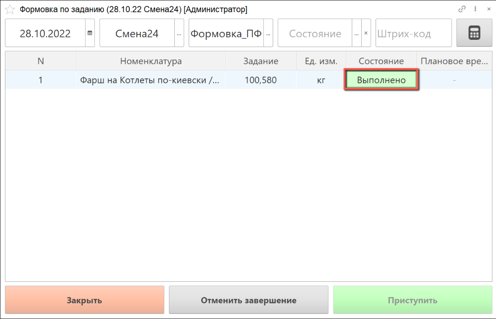

# Формовка по заданию

Для выпуска сформованной продукции необходимо создать производственное задание, как это описано в разделе ["Создание производственного задания на формовку колбасной продукции"](./CreateTaskForAMolding.md).

- В подсистеме **"Производство"** открываем **"Меню учетных точек"**:

- Указываем дату смены, смену и рабочий участок, на котором будет выполняться стандартизация сырья.

  Нажимаем на кнопку **"Формовка по заданию"**:

- Выбираем строку задания, по которому будет осуществляться формовка и нажимаем на кнопку **"Приступить"**:

- Слева в открывшемся окне находится информация о партии производимого сформованного продукта.

  Открываем калькулятор тары для полной укомплектовки рамы:

- С помощью калькулятора тары набираем нужное количество палок для рамы и нажимаем "Подтвердить":

- Сканируем штрихкод фарша, поступившего на формовку.

  Указываем вес брутто, вес нетто рассчитается автоматически.

  Нажимаем **"Подтвердить"**:

- Печатается этикетка на партию сформованной продукции:

- Если задание выработано полностью и вес сформованной продукции равен или превысил запланированный, задание автоматически перейдет в состояние "Выполнено", отменить его завершение невозможно:

