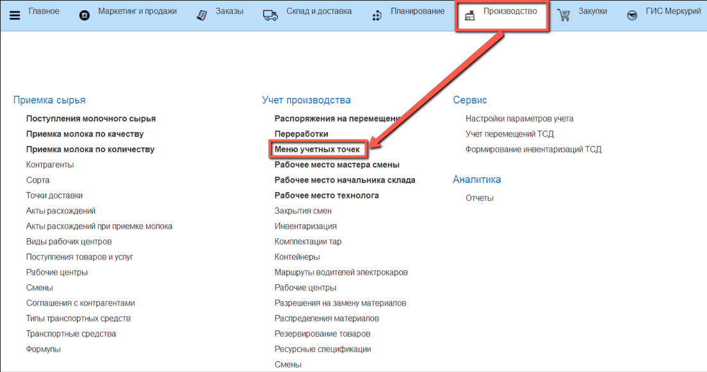
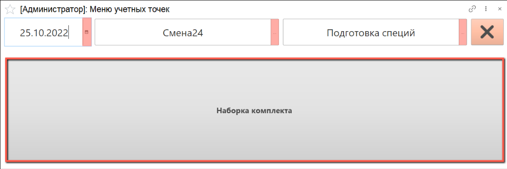
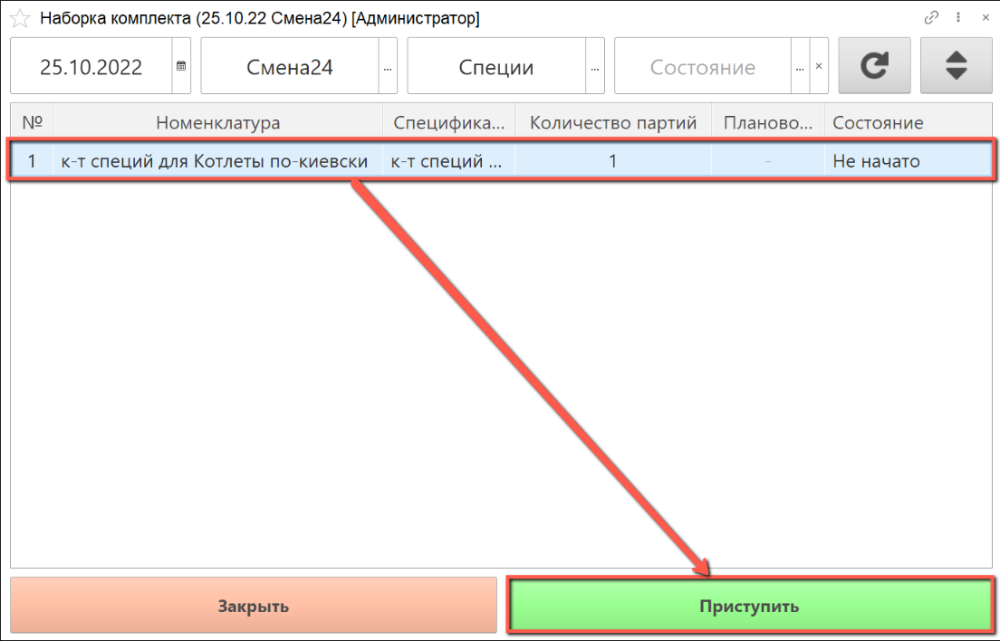
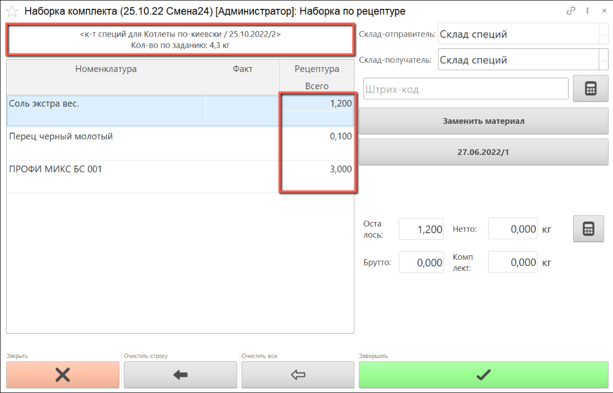
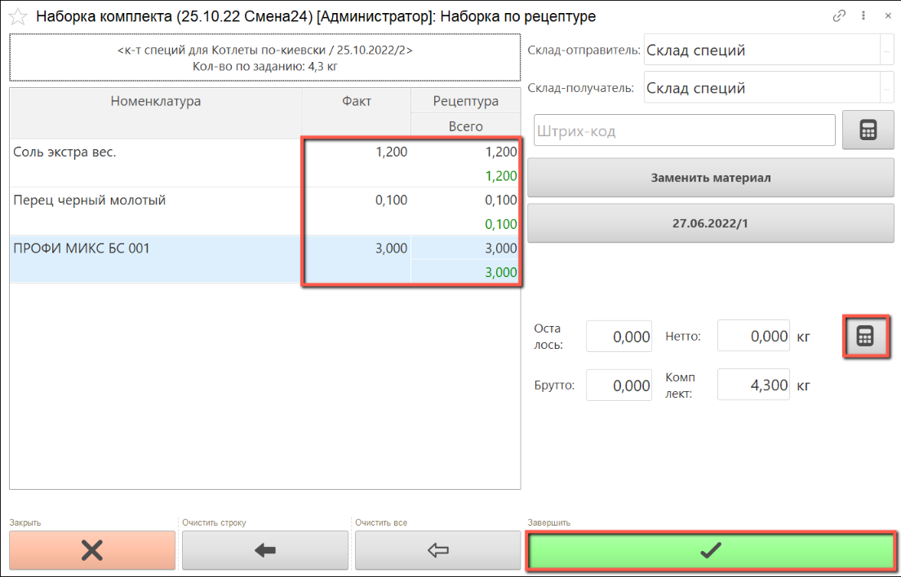
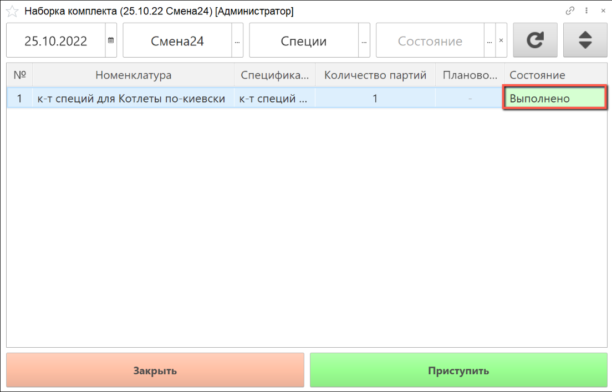

# Набор комплектов специй

Для работы по наборке комплектов специй необходимо создание производственного задания.

- В подсистеме **"Производство"** открываем **"Меню учетных точек"**:

- Указываем дату смены, смену и рабочий участок, на котором будет выполняться наборка комплекта специй.

- Нажимаем на кнопку **"Наборка комплекта"**:

- В списке заданий выбираем строку производственного задания, по которому будет осуществляться наборка комплекта специй и нажимаем на кнопку **"Приступить"**:

- Открылось окно наборки комплекта: слева находится информация о партии производимого полуфабриката и рецептура для наборки с указанием планового веса ингредиентов.

В таблице рецептуры указан плановый вес, который необходимо набрать.

- Получаем вес брутто с весов или выбираем вручную. При вводе вручную важно понимать, что вводимый вес - это сумма всех предыдущих и нового Вес нетто рассчитается автоматически. Когда вес по рецептуре набран полностью, в ячейке "Всего" набранное количество выделяется зеленым цветом.

- По завершении наборки ингредиентов нажимаем на кнопку **"Завершить"**:

- Печатается этикетка

- Выполненное задание в  АРМ выделяется зеленым цветом, состояние задания переходит в статус **"Выполнено"**:

