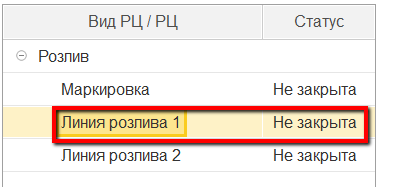
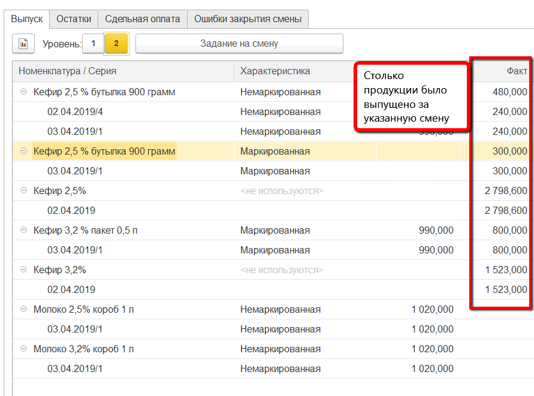
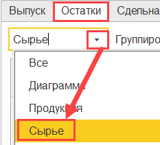
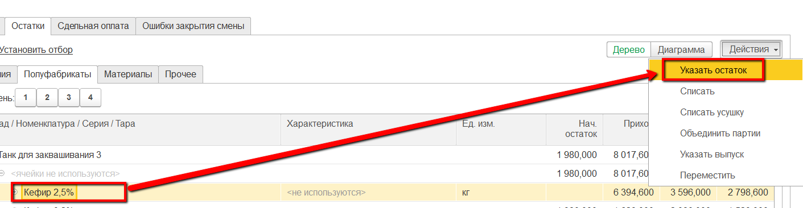
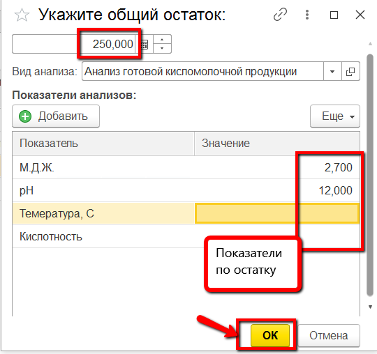
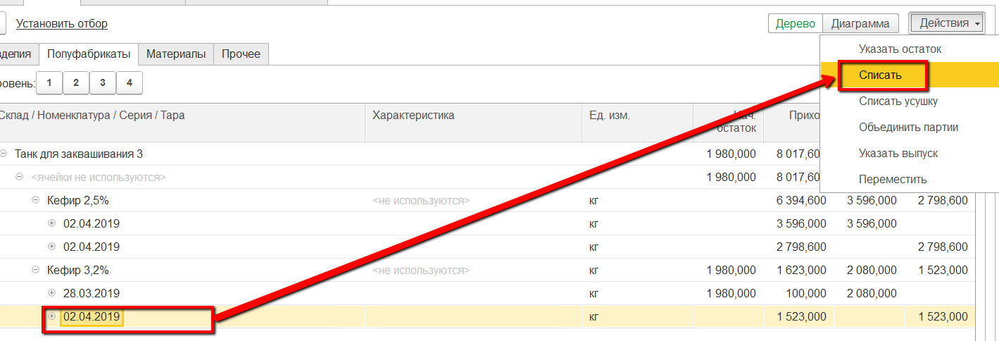
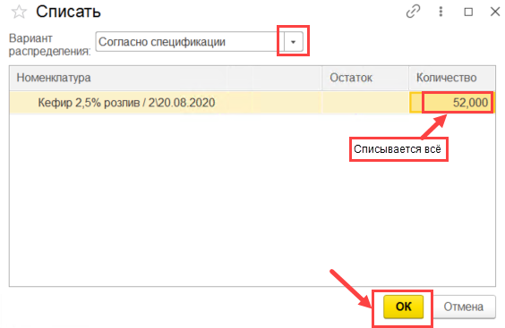
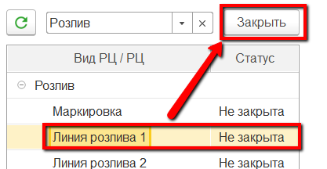

# Закрытие смены

Контроль всех введенных в систему данных за рабочую смену осуществляется
мастером смены через "Рабочее место мастера смены"

 

-   Открыть "Рабочее место мастера смены":      

-   Указать дату и смену:  

-   Указать участок, на котором идет розлив:  

-   Выбрать закрываемый участок в таблице ниже:  

-   Заполнится различная информация по вкладкам справа. Например, на
    вкладке "Выпуск" можно видеть все выпуски за указанную смену:  

-   На вкладке "Остатки"->"Сырье" нужно распределить полуфабрикаты, использованные при розливе. Перейти на вкладку:  

-   В таблице будут видны остатки полуфабрикатов. Сначала необходимо указать остатки на конец смены по каждому из них. Для этого выбрать полуфабрикат и нажать "Указать остаток":  

-   В открывшейся форме указать количество и показатели, которые были получены по этому остатку:  

-   Повторить так для всех полуфабрикатов. Всё, кроме остатков, нужно списать. Для этого выбрать нужные партии в таблице и нажать "Списать":  

-   В открывшемся окне указать, что списание идет согласно спецификации:  

-   После того, как все цифры проверены, смену необходимо
    закрыть, чтобы не было возможности "подправить" данные за неё. Для
    этого выбрать участок в таблице слева и нажать "Закрыть":  
