**Учетные точки**
=================

Настройка всех интерфейсов, через которые ведется оперативный учет на
участке розлива, происходит через справочники "Учетные точки" и
"Кнопки учетных точек".

**Справочник "Учетные точки".** 

Данный справочник используется для того,
чтобы отделить наборы операций, выполняемых на разных участках
производства. Например, логично отделить операции, связанные с выпусками на этапе розлива, от операций, связанных с выпусками на этапе нормализации. При этом, если на предприятии на один только участок розлива ставится несколько сенсорных киосков (в ключевых точках - отдельно около счетчика первого счетчика выпущенной продукции, отдельно около второго тп), то разумно на каждый киоск сделать отдельную учетную точку, пусть и с одной операцией.
 

 

-   Открыть справочник "Учетные точки" и перейти к созданию нового
    элемента:

     
-   Указать наименование:
    
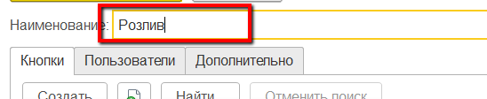
     
-   Указать список пользователей, у которых будет доступ к этой учетной
    точке (т.е. только они смогут выполнять операции, относящиеся к этой
    учетной точке):
    

    

     
-  Нажать "Записать и закрыть".
     

**Справочник "Кнопки учетных точек".**  

Данный справочник используется для того, чтобы настраивать различные операции,ивыполняемые на определенном участке производства. Например, для этапа розлива логично выделить кнопку для выпуска продукции.

-   Открыть справочник "Учетные точки". Среди списка найти нужную,
    открыть:
    

     
-   В таблице кнопок нажать "Создать":
    
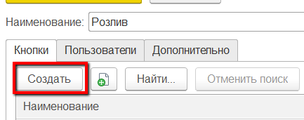
     
-   Указать наименование и выбрать обработку "Работа с заданиями" - если
    выпуск продукции идет строго по заданию на смену или
    "Оперативный учет на рабочем центре" - в противном случае:
    
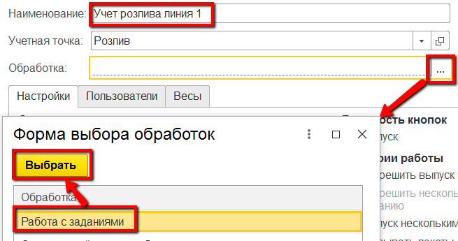
     
-   Указать в создаваемых документах "Переработка", указав, что при этом основной материал не списывается (он будет распределен в конце смены на все выпуски), а материалы списываются по норме:

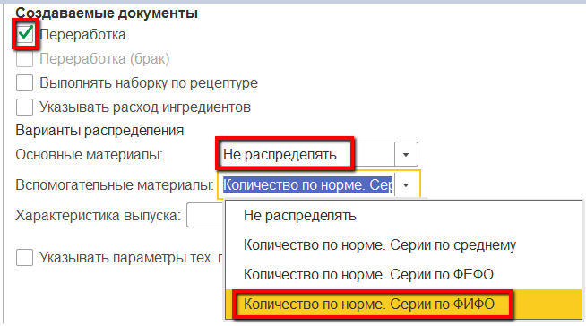

-    Указать в создаваемы документах "Упаковочный лист" - чтобы печатался паллетный лист на выпускаемую продукцию:
    
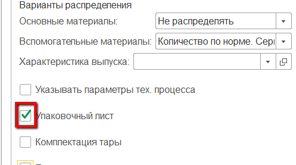
     
-   Указать, что на киоске кнопка для учета выпуска будет доступна, а в "Сценарии работы" указать, что можно учитывать выпуск упаковками и фиксировать его несколькими документами:
    
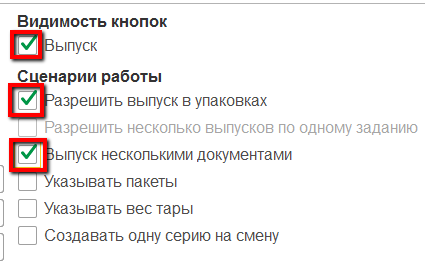
     
-   Указать участок розлива:
    
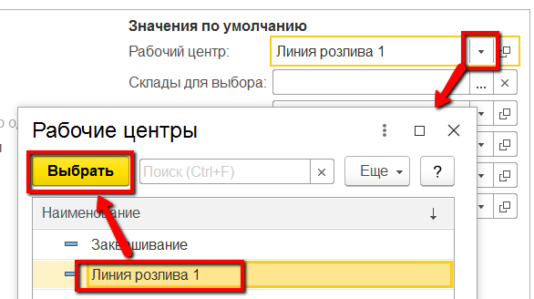
     
-   Указать склад для выпуска:
    
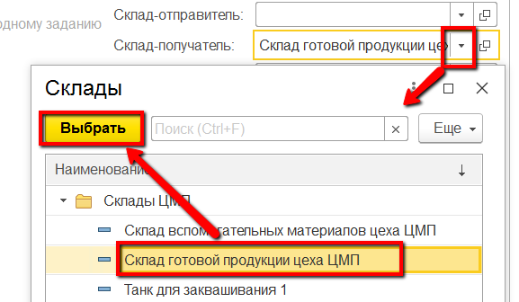
     

-   Указать, какой единице измерения соответствует упаковка, которыми предполагается делать выпуск продукции:

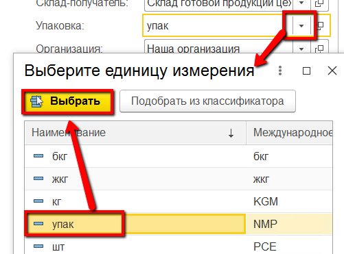

-   Указать организацию (текущее предприятие):

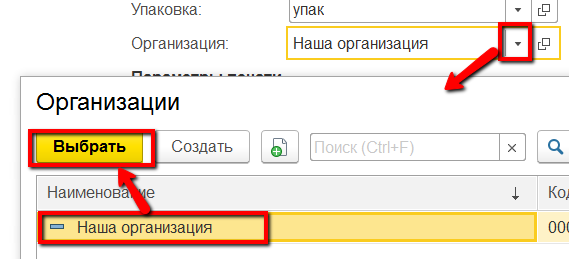

-   Выбрать макет, который будет печататься на паллет:

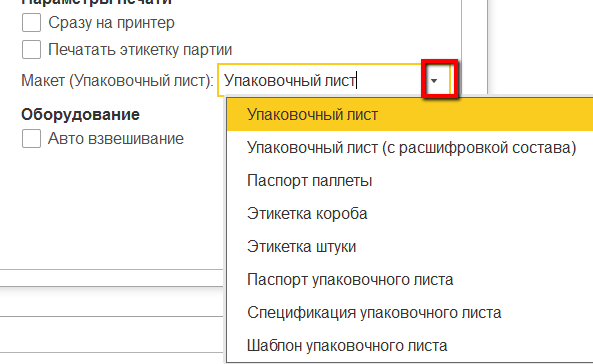

-   Нажать "Записать и закрыть".

 

Более подробная информация о параметрах кнопок учетных точек описана в
разделе ["Кнопки учетных точек"](../../../CommonInformation/Handbooks/ButtonOfAccountPoint/readme.md).
