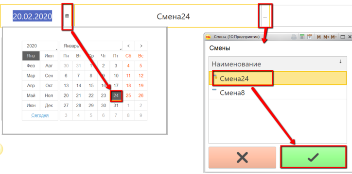
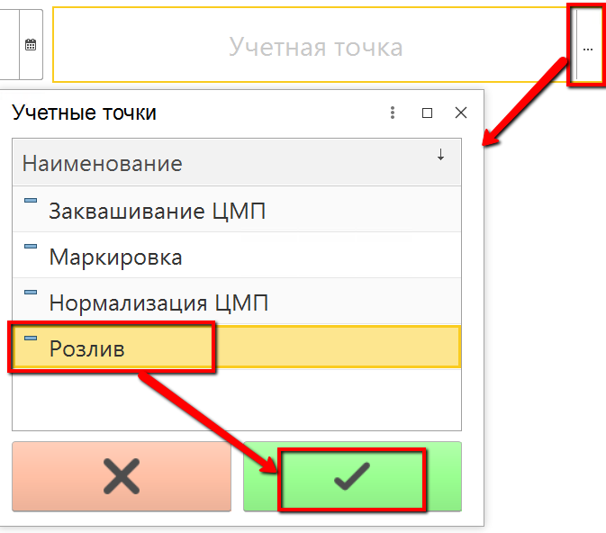
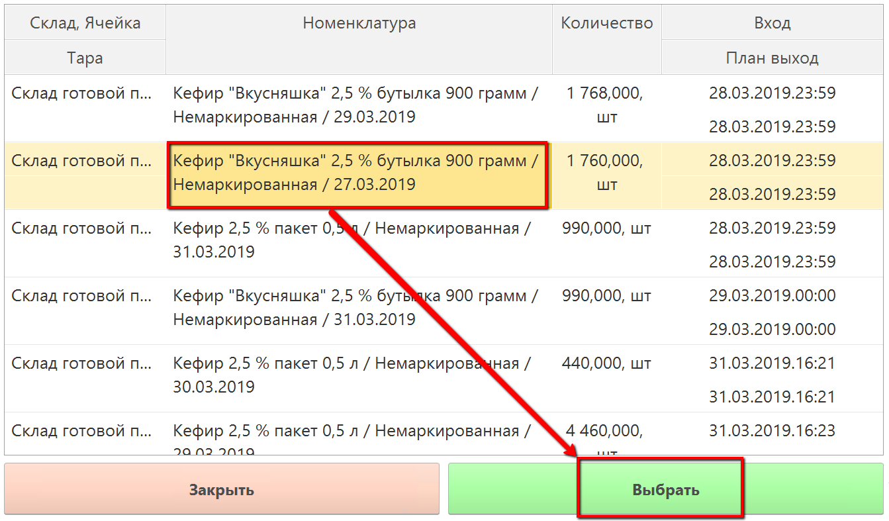
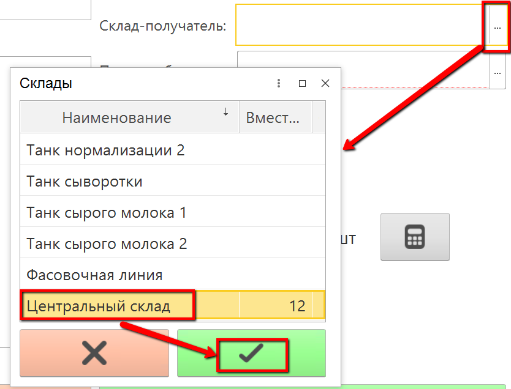
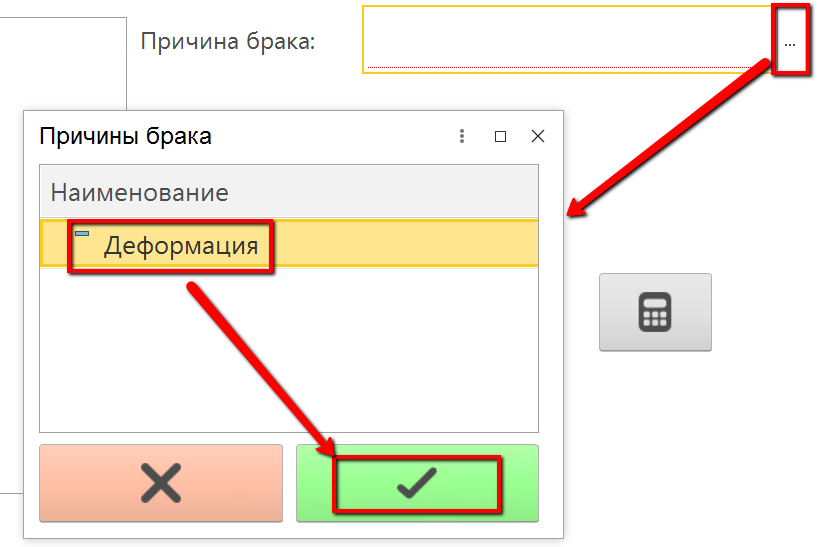
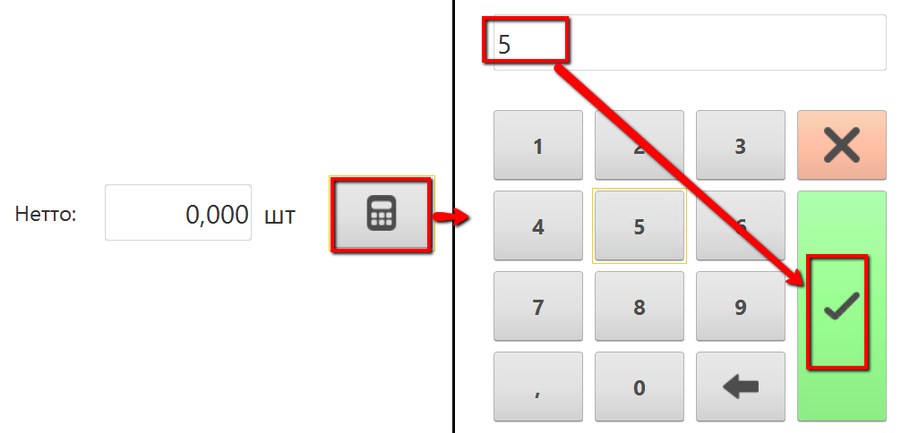

# Учет брака продукции

В процессе розлива может быть выявлен брак, который тоже нужно учитывать в системе.

-  Открыть "Меню учетных точек":  

-   Указать дату и смену, если они еще не указаны:  

-   Указать учетную точку, принадлежащую участку, где учитывается выпуск розлива:  

-   Нажать кнопку, соответствующую операции учета брака. Откроется окно с остатками продукции. Выбрать, во время розлива какой продукции была отбраковка, и нажать "Выбрать":  

-   Указать, на какой склад передается брак:  

-   Указать причину отбраковки:  

-   Указать количество штук, которые отбраковались во время розлива:   

-   Подтвердить операцию.