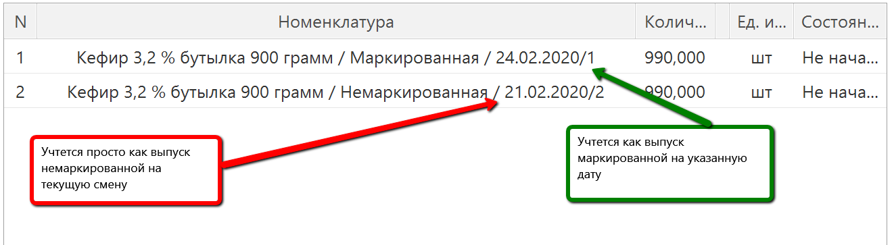
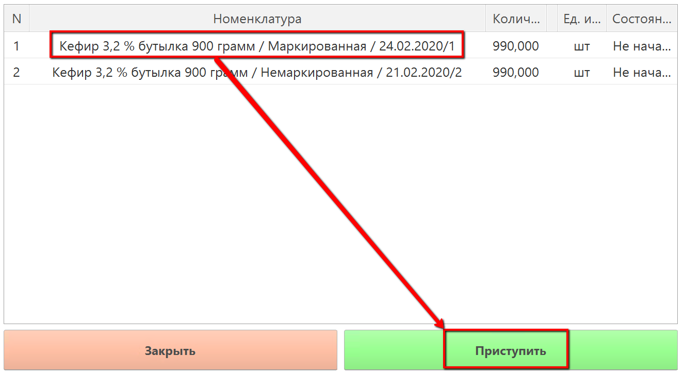
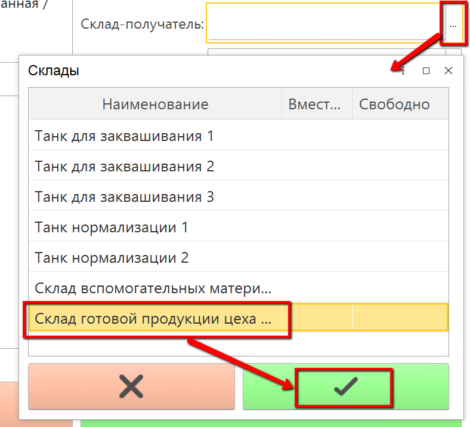
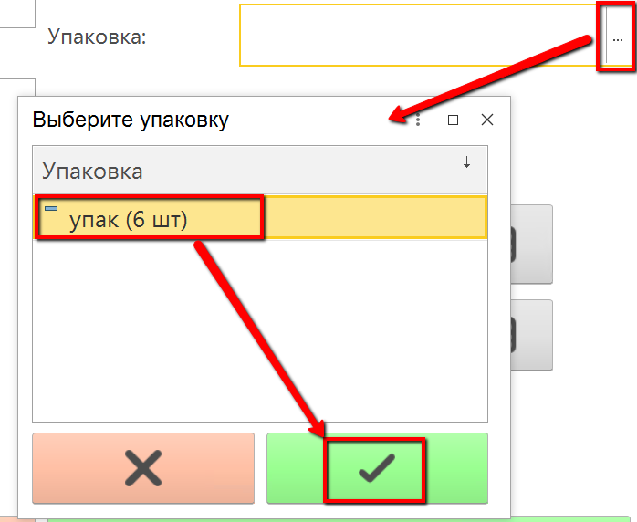
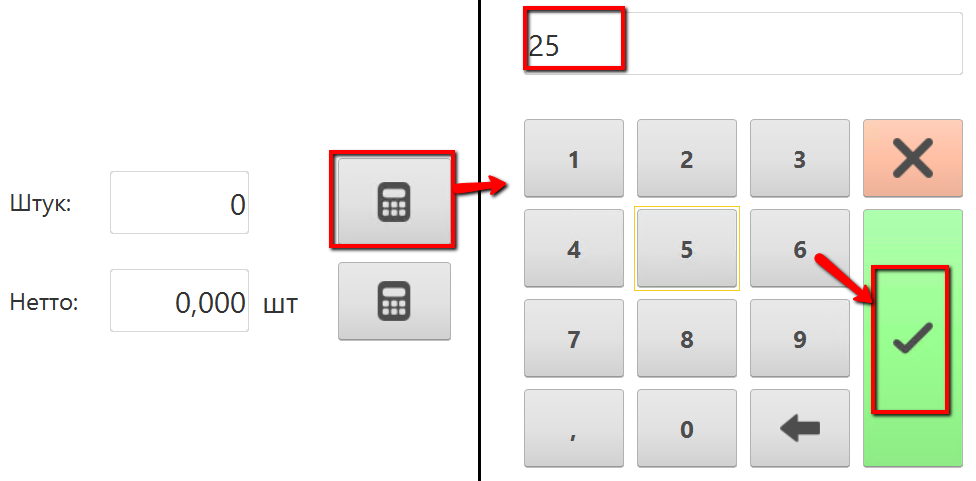
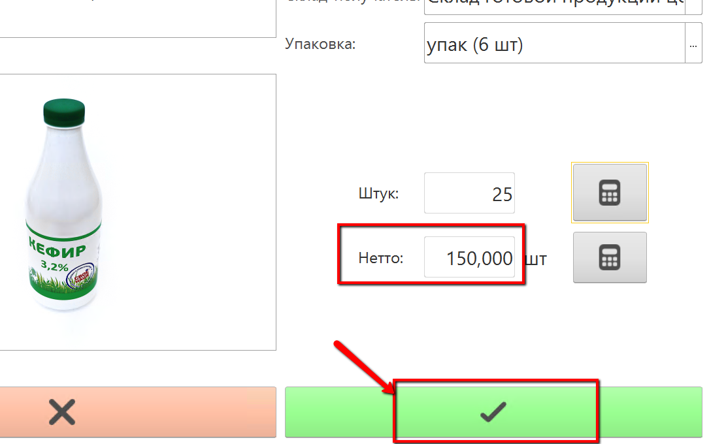
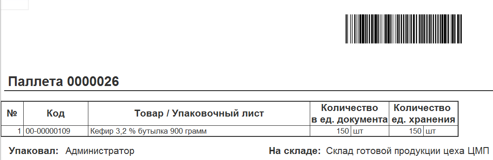

# Учет розлива продукции

Разливаемая продукция может быть выпущена маркированной или нет.

Разницы для оператора, учитывающего в системе эти выпуски, нет никакой. Единственное отличие - печатаемая дата на паллетнике и склад, куда отправляется выпуск.

-   Открыть "Меню учетных точек":  

-   Указать дату и смену, если они еще не указаны:  

-   Указать учетную точку, принадлежащую участку, где учитывается выпуск розлива:  

-   Нажать кнопку, соответствующую операции учета выпуска. Откроется окно с заданием на текущую смену:  
>Примечание. Слова "Маркированная" и "Немаркированная" соответствуют выпускам соответствующего вида продукции. Важно помнить, что маркированная передается (скорее всего) на склад готовой продукции, а немаркированная - на буферный склад, откуда её потом заберут для маркировки.  

-   Выбрать продукцию, выпуск которой будет учтен, и нажать "Приступить":  

-   Указать, на какой склад передается выпуск:  

-   Если продукция выпускается упаковками (по 10 штук, по 15 и т.п.), то указать, какими именно:  

-   Указать количество штук упаковок:  

-   Автоматически пересчитается количество штучек. Подтвердить операцию:  

-   Печатается паллетный лист на продукцию:  
