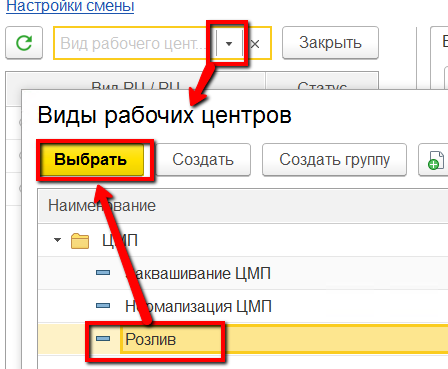
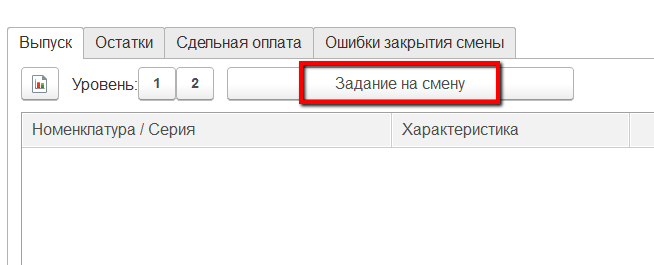
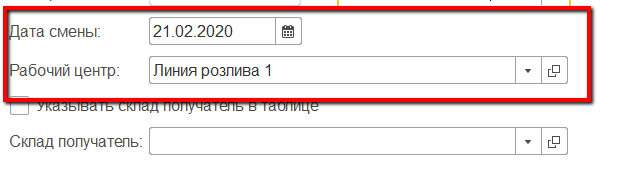
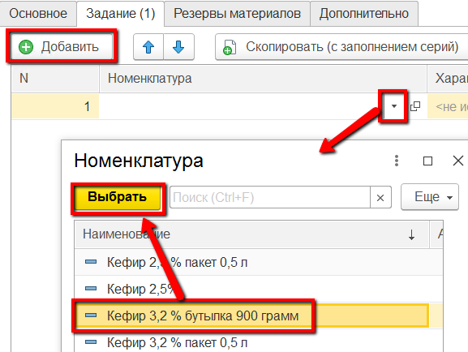
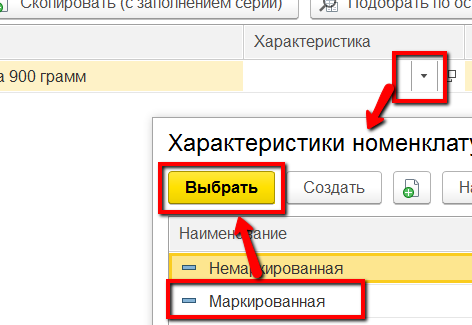
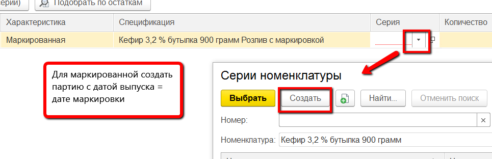
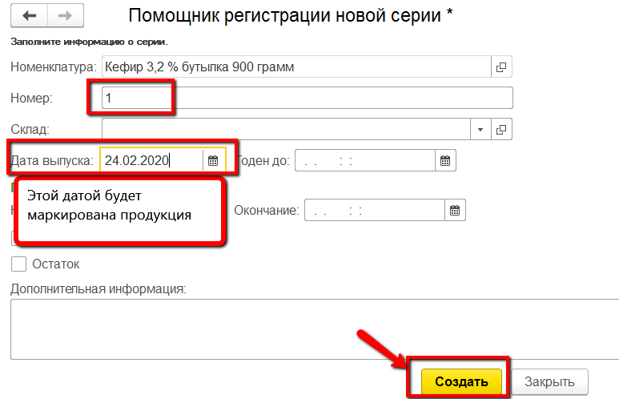
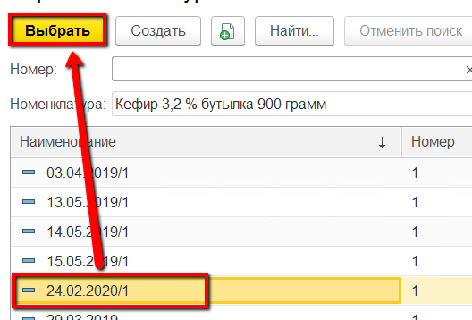
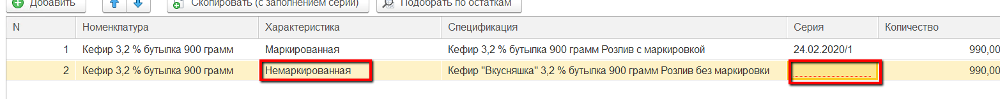

# Формирование задания на смену

В начале каждой смены мастер выдает работникам задание на розлив полуфабрикатов. В системе это отражается документом "Производственное задание".

-   Открыть "Рабочее место мастера смены":      

-   Указать смену:  

-   Указать участок, на котором производится заквашивание:  

-   В таблице ниже выбрать этот же участок:  

-   На вкладке "Выпуск" нажать кнопку "Задание на смену". Откроется окно создания задания с частично заполненной информацией:  
  

-   Перейти на вкладку «Задание». Здесь нужно указать все партии розлива,
    которые планируется выпустить за указанную смену. При этом нужно отличать партии, которые будут маркироваться и которые нет. Добавить первую продукцию для выпуска:  

-   Для партий маркированных в поле "Характеристика" указывать "Маркированная", для немаркированных - "Немаркированная":  

-   Для партий маркированных в поле "Серия" создавать новую с нужной датой маркировки:  
  
  

-   Для немаркированных - оставлять поле серии пустым:  

-   Повторить предыдущие пункты для всех остальных продуктов, которые предполагается выпустить на указанном участке розлива в указанную смену.
-   Нажать "Провести и закрыть".