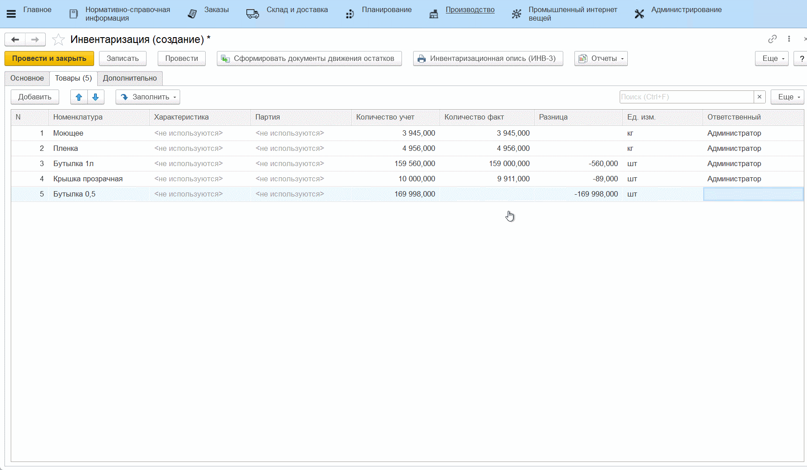

# Инвентаризация

-   Открыть документы **"Инвентаризация"** и перейти к созданию нового;
-   Указать склад, на котором была проведена инвентаризация;
-   Перейти на вкладку *"Товары"*, нажать **"Заполнить по учету"** , табличная
    часть документа автоматически заполнится материалами и их
    количествами по тому, как они есть сейчас в системе:

-   Вручную ввести данные о фактических остатках материалов в колонку
    *"Количество факт"*. Автоматически считается разница;     
-   Нажать **"Провести"**:

-   Если каких-то материалов после учета инвентаризации в системе стало
    меньше (столбец *"Разница"* имеет значение с минусом), то эти
    материалы нужно списать. Для этого нажать **"Создать на основании"** -\>
    **"Списание материалов"**;
-   Если каких-то материалов после учета инвентаризации в системе обнаружилось
    больше (столбец *"Разница"* имеет значение с плюсом), то эти
    материалы нужно оприходовать. Для этого нажать **"Создать на основании"** -\>
    **"Оприходование материалов"**;
-   На вкладке *"Товары"* можно увидеть списываемые материалы и их
    количество. Нажать **"Провести и закрыть"**:  

