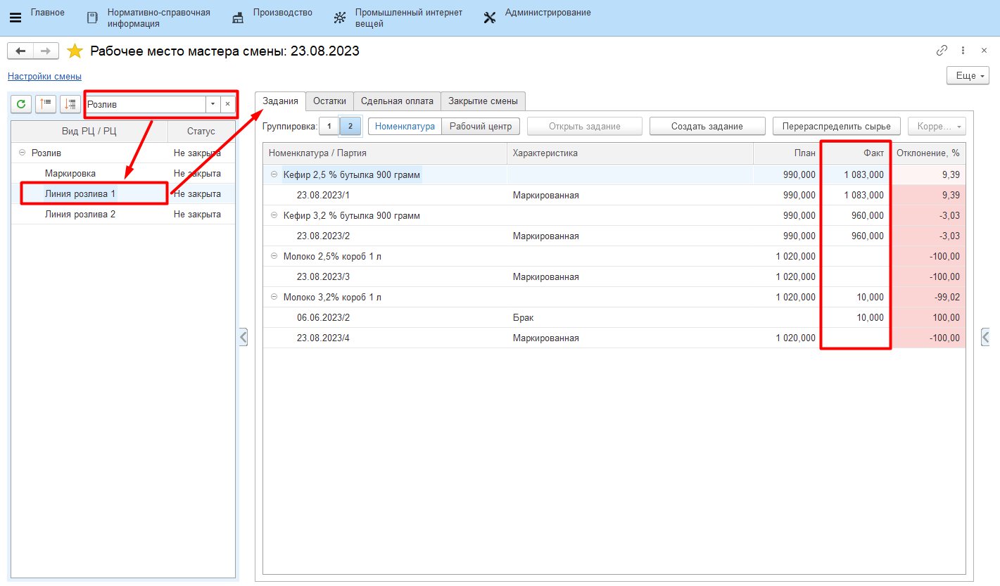
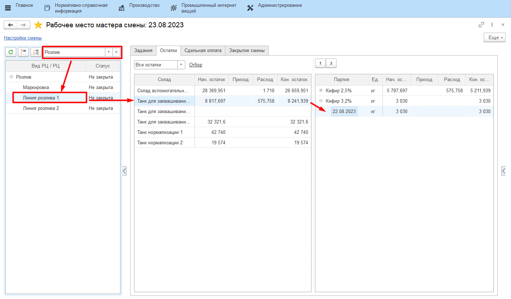
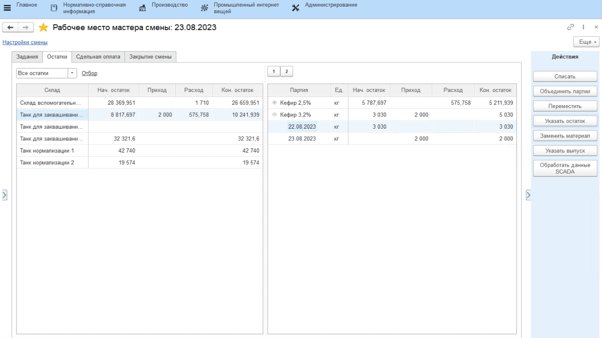
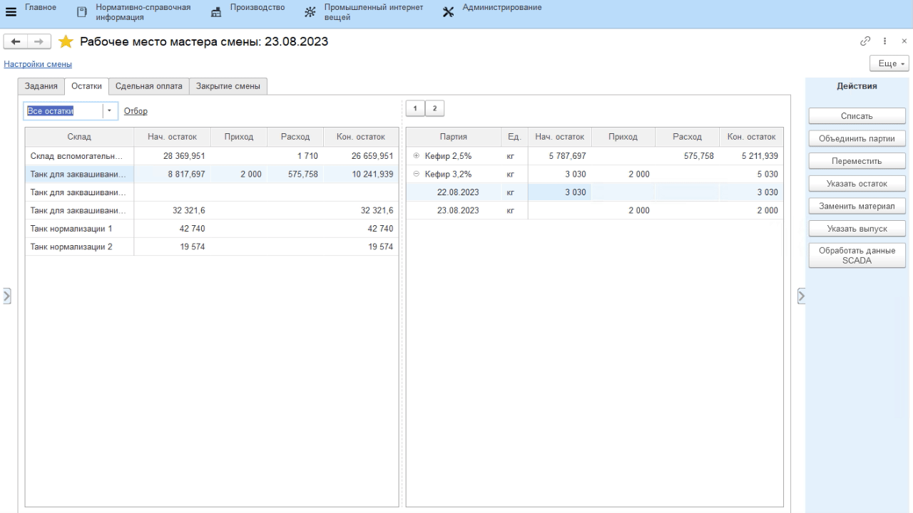
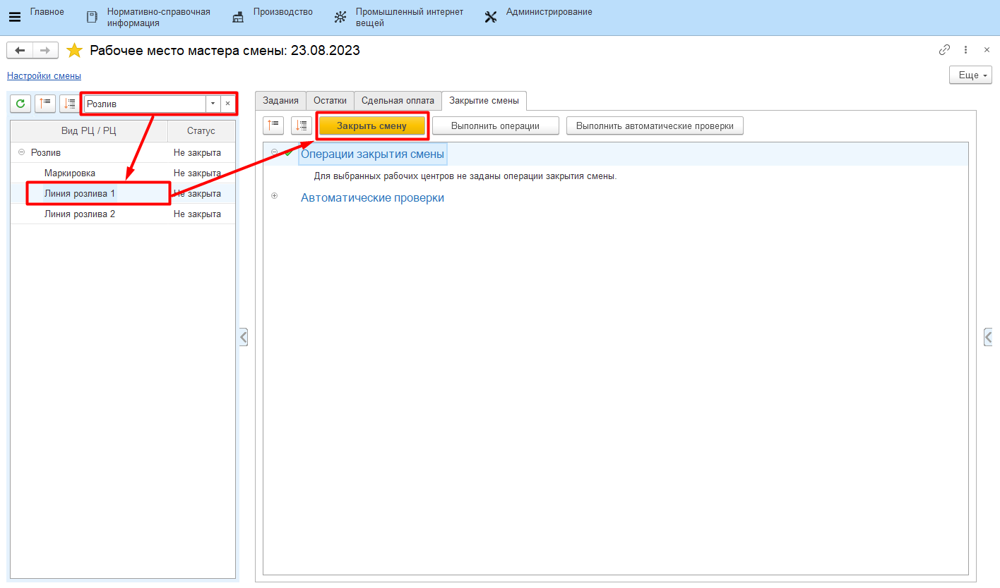

# Закрытие смены

Контроль всех введенных в систему данных за рабочую смену осуществляется
мастером смены через **"Рабочее место мастера смены"**.
 

-   Открыть **"Рабочее место мастера смены"**;
-   Указать дату и смену;
-   Указать вид рабочего центра, к которому относится участок розлива;
-   Выбрать участок розлива в таблице ниже;
-   Заполнится различная информация по вкладкам справа. Например, на
    вкладке *"Задания"* можно видеть все выпуски за указанную смену: 
 

Если выпуски готовой продукции учитывались без распределения материалов, то в конце смены нужно списать и распределить на выпуски использованные полуфабрикаты. 

-   Перейти на вкладку *"Остатки"*;
-   В таблице будут видны остатки полуфабрикатов. 

-   Сначала необходимо указать остатки на конец смены по каждому из них. Для этого выбрать полуфабрикат и нажать **"Указать остаток"**;
-   В открывшейся форме указать количество и показатели качества, которые были получены по этому остатку;
-   Повторить так для всех полуфабрикатов. 

-   Всё, кроме остатков, нужно списать. Для этого выбрать нужные партии в таблице и нажать **"Списать"**;
-   В открывшемся окне указать, что списание идет согласно спецификации;

-   После того, как все данные проверены, смену необходимо
    закрыть, чтобы не было возможности "подправить" данные за неё. Для
    этого выбрать участок в таблице слева, перейти на вкладку *"Закрытие смены"* и нажать **"Закрыть смену"**:  

