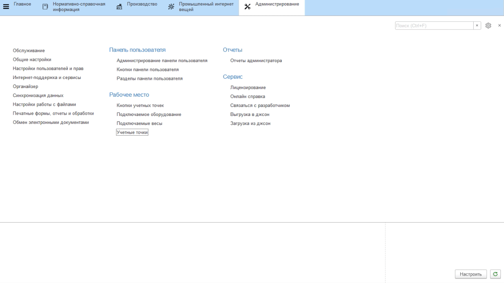
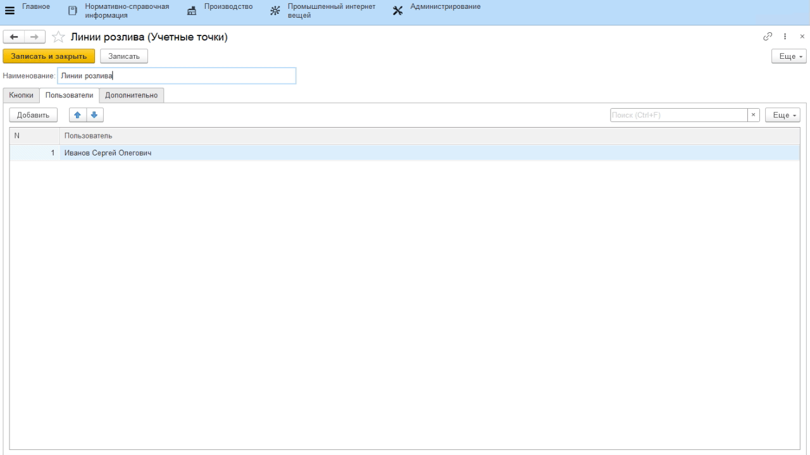
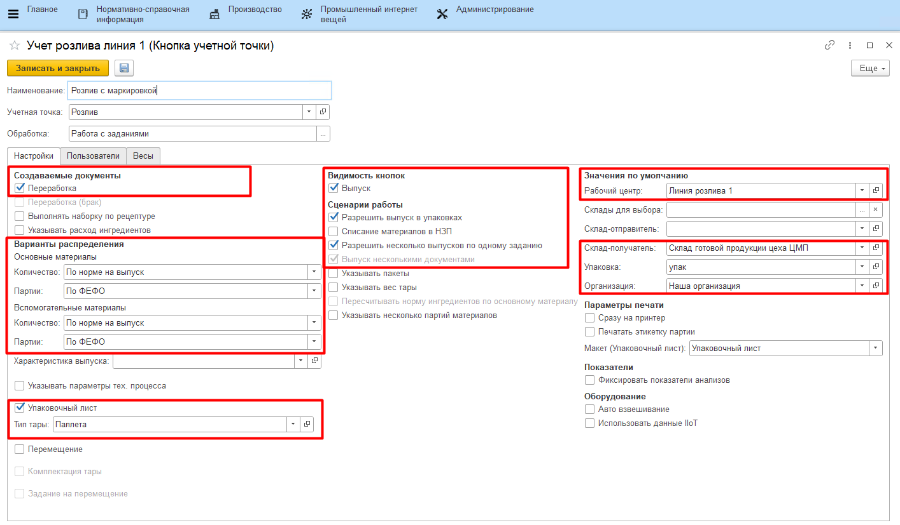

# Учетные точки

Настройка всех интерфейсов, через которые ведется оперативный учет на
участке нормализации, происходит через справочники **"Учетные точки"** и
**"Кнопки учетных точек"**.

## Справочник "Учетные точки"

Данный справочник используется для того,
чтобы отделить наборы операций, выполняемых на разных участках
производства. Например, логично отделить операции, связанные с выпусками на этапе заквашивания, от операций, связанных с выпусками на этапе нормализации. При этом, если на предприятии на один только участок нормализации ставится несколько сенсорных киосков (в ключевых точках - отдельно около счетчика выпущенной смеси, отдельно для передачи смеси на заквашивание), то разумно на каждый киоск сделать свою учетную точку, пусть и с одной операцией.
 

-   Открыть справочник **"Учетные точки"** и перейти к созданию нового элемента;
-   Указать наименование;
-   Указать список пользователей, у которых будет доступ к этой учетной
    точке (т.е. только они смогут выполнять операции, относящиеся к этой
    учетной точке);
-  Нажать **"Записать и закрыть"**.

## Справочник "Кнопки учетных точек"

Данный справочник используется для того, чтобы настраивать различные операции, выполняемые на определенном участке производства. Например, для этапа нормализации логично выделить кнопку для выпуска смеси и при необходимости кнопку для перемещения смеси на заквашивание.  

-   Открыть справочник **"Учетные точки"**. Среди списка найти нужную, открыть;  
-   В таблице кнопок нажать **"Создать"**;
-   Указать наименование и выбрать обработку **"Работа с заданиями"** - если выпуск смеси идет строго по заданию на смену или
    **"Оперативный учет на рабочем центре"** - в противном случае;

-   Указать в создаваемых документах **"Переработка"**;
-   Указать вариант списания основных и вспомогательных материалов, а также вариант подбора партий;
-   Указать в создаваемы документах *"Упаковочный лист"*, чтобы печатался паллетный лист на выпускаемую продукцию;
-   Указать, что на киоске кнопка для учета выпуска будет доступна (*"Выпуск"*), а в *"Сценарии работы"* указать, что можно учитывать выпуск упаковками и фиксировать его несколькими документами;
-   Указать участок розлива;
-   Указать склад для выпуска;
-   Указать, какой единице измерения соответствует упаковка, которыми предполагается делать выпуск продукции;
-   Указать организацию (текущее предприятие);
-   Выбрать макет, который будет печататься на паллет;
-   Ограничить склады для выпуска;
-   Нажать **"Записать и закрыть"**.

Более подробная информация о параметрах кнопок учетных точек описана в
разделе ["Кнопки учетных точек"](../../../CommonInformation/Handbooks/ButtonOfAccountPoint/readme.md).