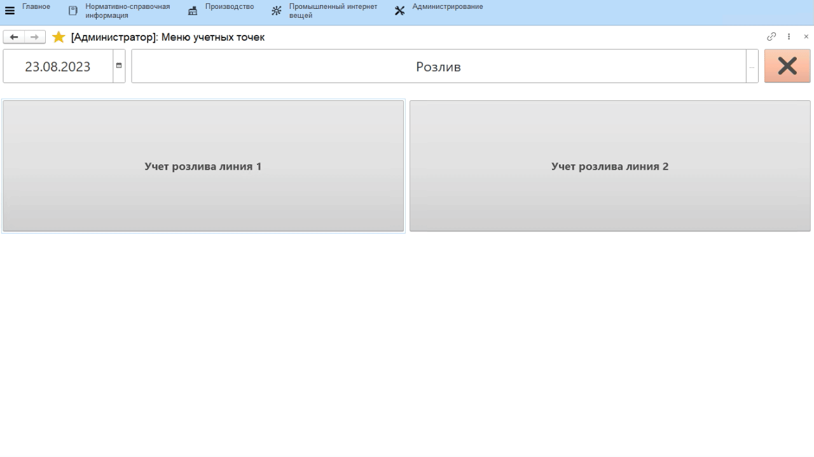

# Учет розлива маркированной продукции

-   Открыть **"Меню учетных точек"**;
-   Указать дату и смену, если они еще не указаны;
-   Указать учетную точку, принадлежащую участку, где учитывается выпуск розлива;
-   Нажать кнопку, соответствующую операции учета выпуска. Откроется окно с заданием на текущую смену;
-   Выбрать продукцию, выпуск которой будет учтен, и нажать **"Приступить"**;
-   Указать, на какой склад передается выпуск;
-   Если продукция выпускается упаковками (по 10 штук, по 15 и т.п.), то выбрать тип упаковки;
-   Указать количество штук упаковок;
-   Автоматически пересчитается количество штучек готовой продукции в упаковке. Подтвердить операцию;
-   Печатается паллетный лист на продукцию:
  
