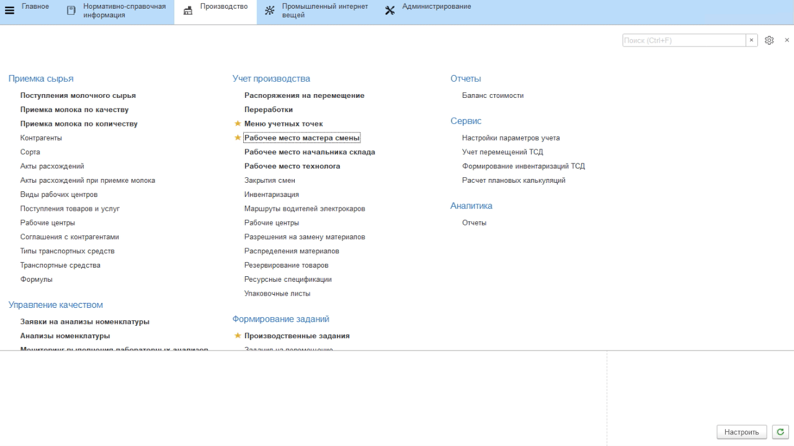
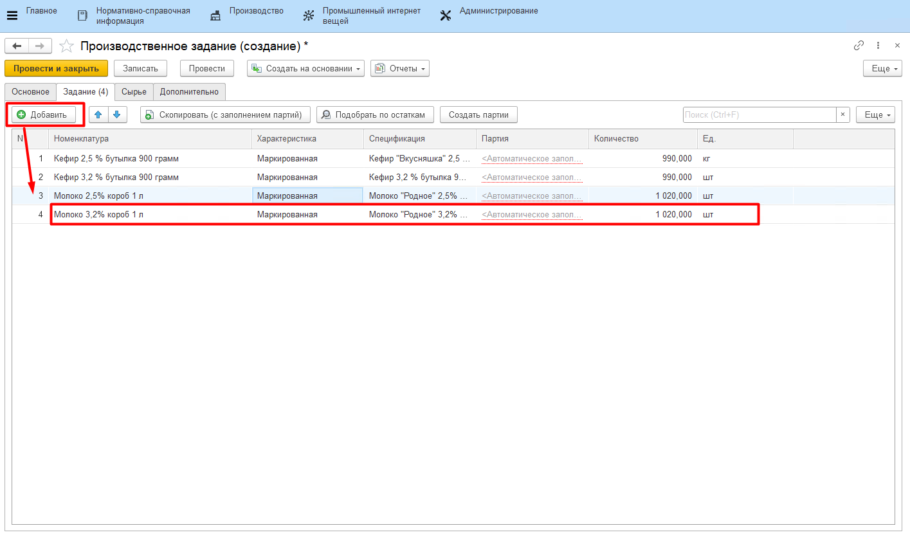

# Формирование задания на смену

В начале каждой смены мастер выдает работникам задание на розлив полуфабрикатов. В системе это отражается документом **"Производственное задание"**.

-   Открыть **"Рабочее место мастера смены"**;
-   Указать смену;
-   Указать вид рабочего центра, к которому относится участок розлива;
-   В таблице ниже выбрать участок розлива;
-   На вкладке *"Задания"* нажать кнопку **"Создать задание"**. Откроется окно создания задания с частично заполненной информацией:  

-   Перейти на вкладку *"Задание"*. Здесь нужно указать все выпуски розлива, которые планируется промаркировать за указанную смену. 
-   Зарегистрировать партию можно по кнопке **"Создать партии"**, если не настроено автоматическое заполнение партий;
 

-   Нажать **"Провести и закрыть"**.