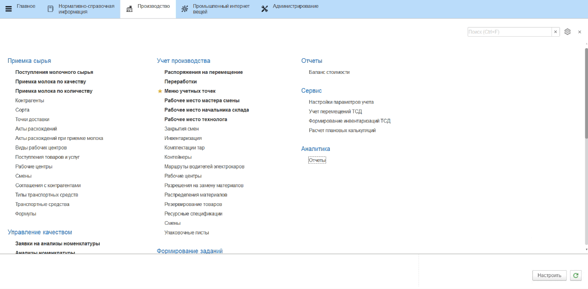
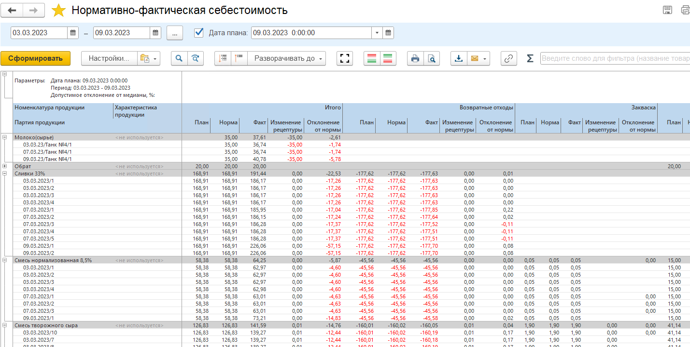
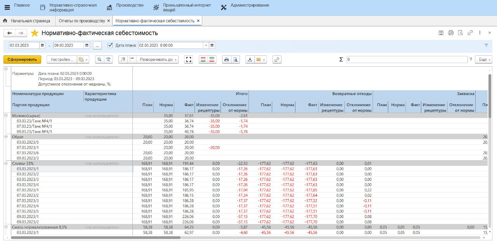
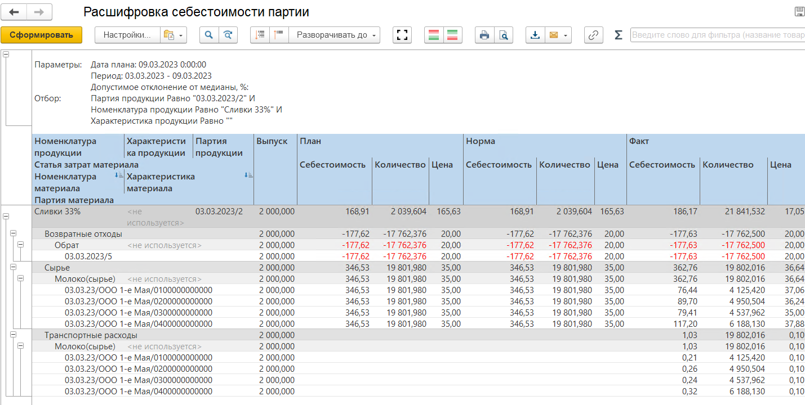

# Анализ себестоимости партий

Получившуюся фактическую себестоимость партий, а также из чего она
сложилась можно посмотреть в отчете **"Нормативно-фактическая себестоимость"**.

Для этого нужно:

- Открыть отчет;
- Указать период;
- Указать, на какую дату взять плановую себестоимость для сравнения, и нажать **"Сформировать"**:

??? info "Примечание"
    **Нормативная себестоимость** - это себестоимость партии в фактическом объеме (согласно спецификации выпуска) по плановым ценам поступления сырья на выбранную дату (период).

    **Фактическая себестоимость** - это себестоимость партии в фактическом объеме (из существующих выпусков) по фактическим ценам поступления сырья.

    **Плановая себестоимость** - это себестоимость партии в нормативном объеме (согласно спецификации выпуска) по плановым ценам.

Из отчета можно получить следующую аналитику:

  - Размер плановой себестоимости продукции (столбец **"План"**) - как общий (колонка **"Итого"**), так и в разрезе статей затрат (колонки **"Возвратные отходы"**, **"Закваска"**, **"Сырье"** и т.д.);
  - Размер нормативной себестоимости продукции (столбец **"Норма"**);
  - Размер фактической себестоимости продукции (столбец **"Факт"**);
  - Отклонение нормативной себестоимости от плановой (столбец **"Изменение рецептуры"**) - возникает из-за расхождений между плановым (по спецификации) и фактическим объемом потраченного сырья;
  - Отклонение фактической себестоимости от нормативной (столбец **"Отклонение от нормы"**) - возникает из-за расхождений между плановой и фактической ценой поступления сырья.
    
  
    
Также можно посмотреть, из чего сложилась себестоимость конкретной партии. Для этого нужно выбрать партию и нажать на неё дважды левой кнопкой мыши. В контекстном меню выбрать **"Расшифровать другим отчетом"** -\> **"Расшифровка себестоимости партии"**:  

Сформируется новый отчет, в котором будет подробнее описано, из чего сложилась себестоимость выбранной продукции, включая аналитику по потраченным объемам сырья (столбец **"Количество"**), объему выпуска выбранной партии (столбец **"Выпуск"**) и ценам сырья (столбцы **"План-Цена"**, **"Норма-Цена"**, **"Факт-Цена"**): 

 