# Расчет фактической себестоимости

Если в системе учтено, по какой стоимости какое сырье было приобретено, всегда указывалось, из каких партий полуфабрикатов изготавливалась конкретная продукция, то по итогам всей технологической цепочки можно рассчитать полученную себестоимость конкретной партии продукции.

Это можно делать как автоматически - установив специальные настройки, с помощью которых будет пресчитываться себестоимость непосчитанных родуктов, либо же запускать расчет вручную.

-   Чтобы запустить процесс вручную, открыть **Расчет сырьевой себестоимости** и нажать "Рассчитать", опционально можно определить диапазон смен и Рабочие центры, по которым проводить расчет:     
    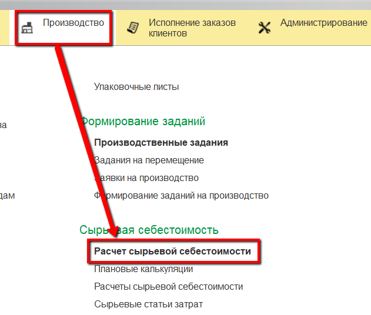  
    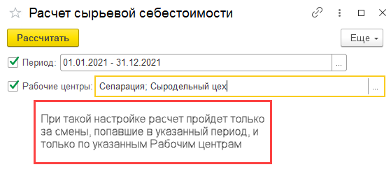  

-   Галочка *Только зарегистрированные партии* предполагает рассчет только тех партий, по которым после последнего рассчета были зарегистрированы какие-либо изменения в количестве выпуска или расходе материалов

-   Будет выведен небольшой лог об успешности операции расчета:  
    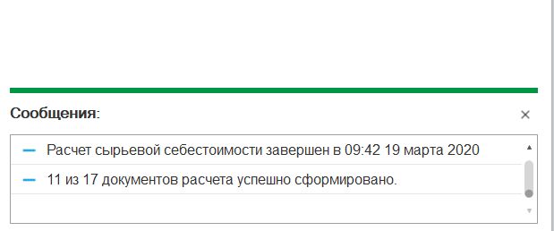

-   Авторасчет (то же самое, что и было сделано по кнопке в предыдущем пункте, только это делает система) можно настроить в соответствующем регламентном задании. Открыть рег.задания:  
    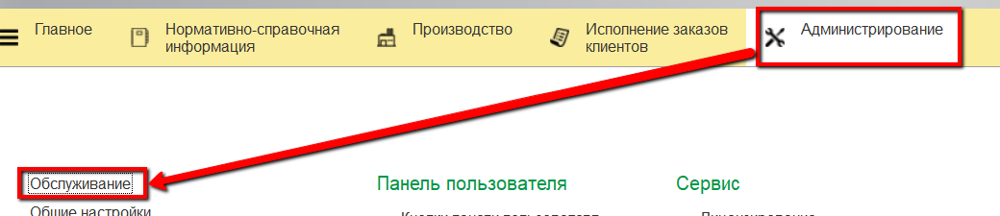  
    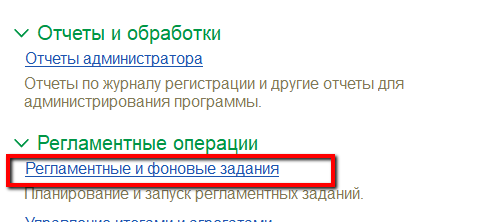

-   Найти в списке "Расчет сырьевой себестоимости", открыть его настройки двойным нажатием:  
    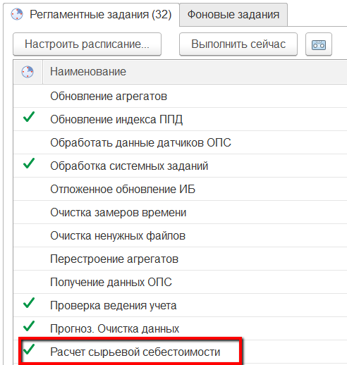

-   Перейти в настройки расписания:  
    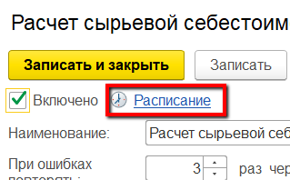

-   Установить, с какой периодичностью проводить выполнение задания - в поле подсказки будет меняться подробное описание периодичности в соответствие с установленными правилами:  
    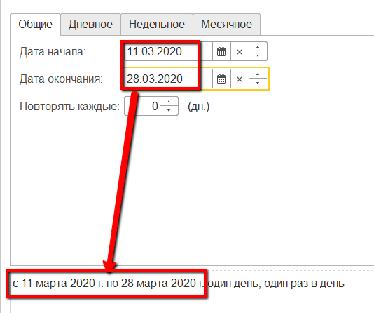  
    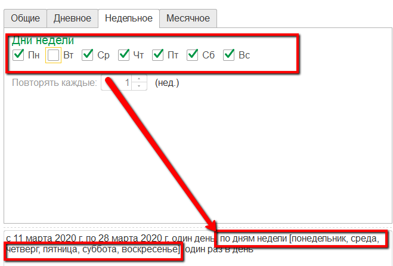
    
-   Сохранить настройки. Теперь расчеты будут происходить в
    автоматическом режиме:  
    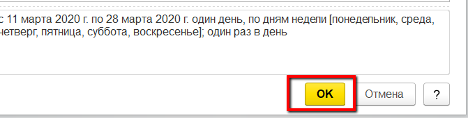  
    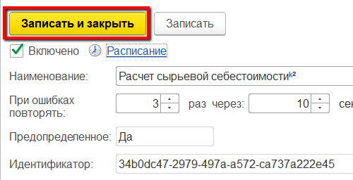