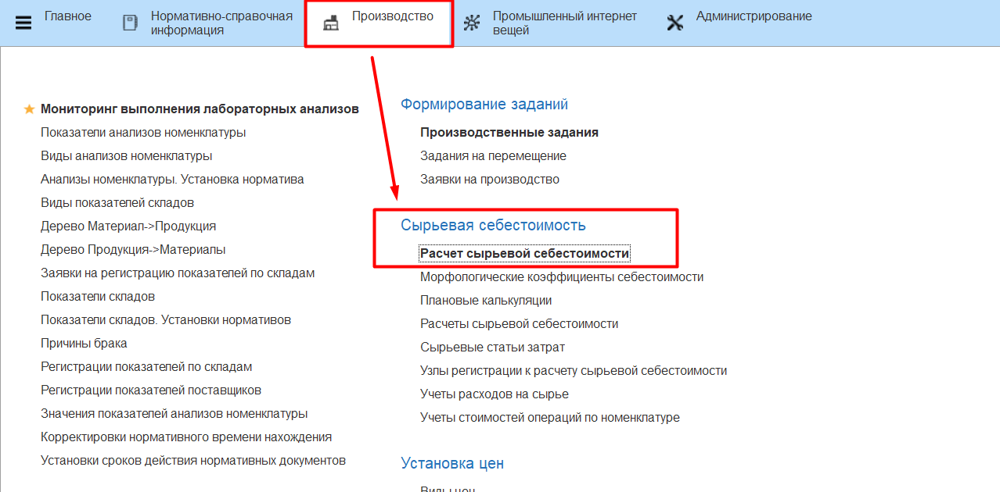
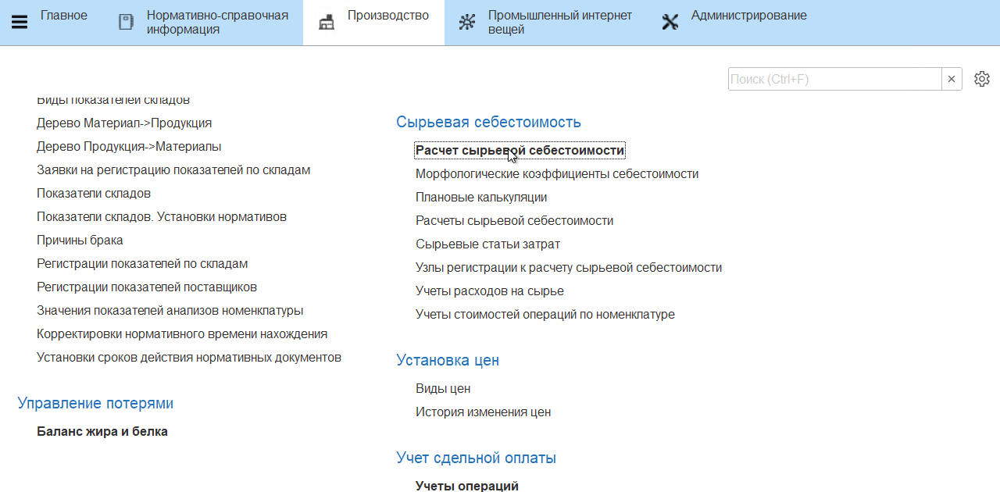
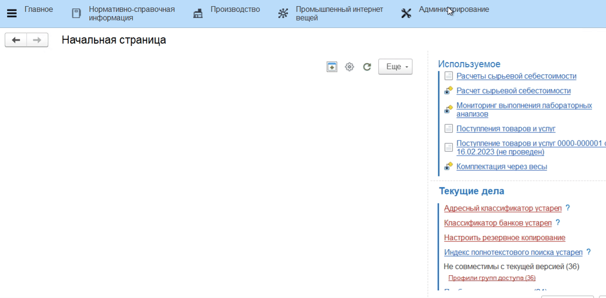
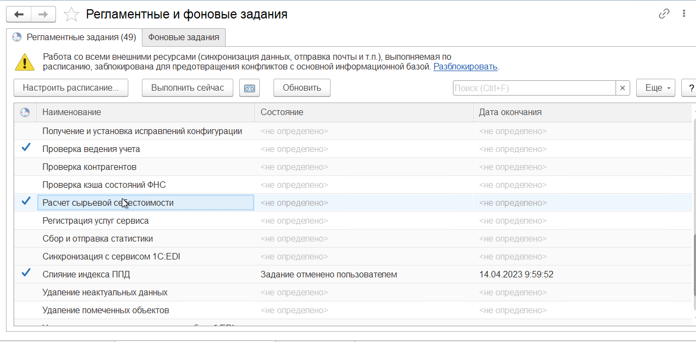

# Расчет фактической себестоимости

Если в системе учтено, по какой стоимости какое сырье было приобретено, всегда указывалось, из каких партий полуфабрикатов изготавливалась конкретная продукция, то по итогам всей технологической цепочки можно рассчитать полученную себестоимость конкретной партии продукции.

Это можно делать как автоматически, настроив регламентное задание, так и запустить расчет вручную.

### Запуск расчета вручную

Обработка **"Расчет сырьевой себестоимости"** находится в разделе **"Производство"**.

В открывшейся форме доступно несколько полей для отбора:

- **Период** - позволяет выбрать диапазон смен, за которые необходимо рассчитать себестоимость всех зарегистрированных партий.
- **Рабочие центры** - позволяет ограничить список рабочих центров, выпуски с которых должны попасть в расчет себестоимости. Например, в течение смены выпуски были сделаны на ПАЦ, Нормализации и Сепарации, но нас интересует только себестоимость выпусков с Нормализации.
- Галочка **Только рабочие центры с зарегистрированными изменениями в выпусках** предполагает расчет только тех партий, по которым после последнего расчета были зарегистрированы какие-либо изменения в количестве выпуска или расходе материалов.

??? info "Примечание"
    Поскольку на одну смену по каждому рабочему центру создается один документ, при изменении одной партии или добавлении новой - с этой галочкой документ расчета себестоимости будет перезаписан. Если документы расчета себестоимости уже существуют, изменений в партии не было, но были изменены, например, цены, то галочку следует убрать. Тогда предыдущие документы на эту смену будут помечены на удаление, создастся новый расчет.

При успешном выполнении расчета будет выведен лог информационных сообщений:  

### Автоматический запуск расчета

Авторасчет можно настроить в соответствующем регламентном задании. Для этого нужно открыть регламентные задания:  

Двойным нажатием по строке **"Расчет сырьевой себестоимости"** нужно открыть настройки задания и перейти к настройкам графика по гиперссылке **"Расписание"**. Здесь можно установить, с какой периодичностью проводить выполнение задания - в поле подсказки будет меняться подробное описание периодичности в соответствии с установленными правилами: 

Сохранить настройки. Теперь расчеты будут происходить в автоматическом режиме.