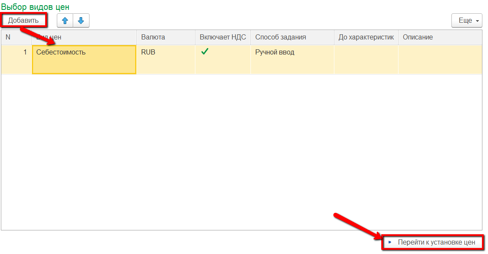
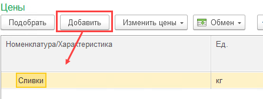
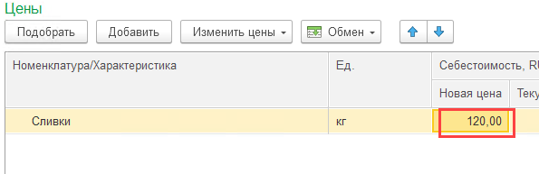

# Установка фиксированных цен на побочные (вторичные) выпуски

Стоимость второстепенных выпусков, себестоимость которой нужно считать по фиксированной цене, в системе фиксируется документами "История изменения цен".  
!!! info "Установка фикс.цены на полуфабрикат также предполагает, что на него перестает распределяться сырье"
    Только при расчете себестоимости сырье на такие выпуски будет "забираться" от основных выпусков

-   Открыть документы "История изменения цен" и перейти к созданию нового:  
    

-   В таблицу добавить вид цены себестоимость и нажать "Перейти к установке цен":  
    

-   В открывшейся форме в таблицу добавить те полуфабрикаты, для которых будет задана фикс.цена:  
    

-   Для каждого полуфабриката указать его фикс.цену. С этой ценой полуфабрикат теперь будет считаться и в плановой себестоимости, и в фактической:  
    

-   Нажать "Провести и закрыть".