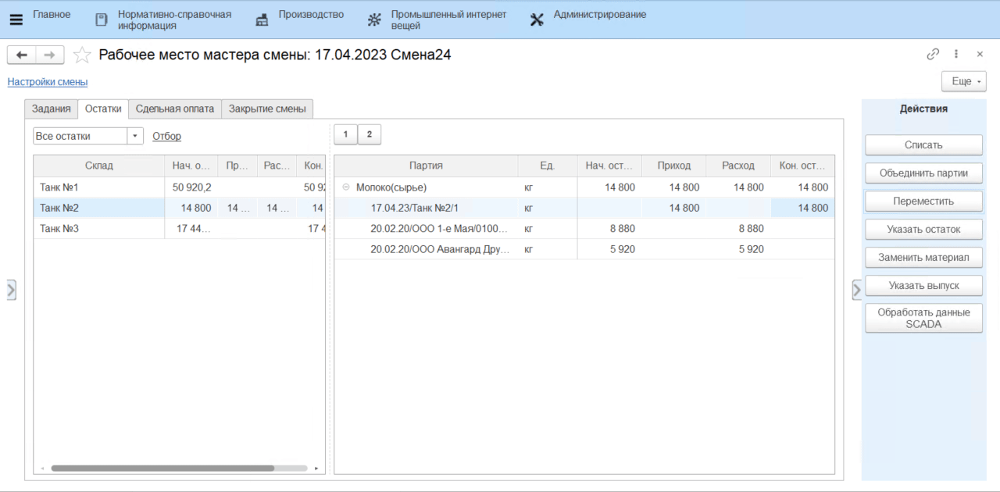

**Действия в Рабочем месте мастера смены**
==========================================

Как правило, мастер смены на производстве вовлечен во все процессы цеха, поэтому для удобства организации его работы различные производственные операции были объединены в одно рабочее место.

**"Рабочее место мастера смены"** находится в подсистеме **"Производство"**:

Перед началом работы необходимо настроить смену. Перейдя по гиперссылке **"Настройки смены"**, нужно указать текущую дату и выбрать смену.

Затем нужно выбрать рабочий участок, на котором необходимо подвести итоги смены. После нажатия на кнопку **"Обновить"** в табличной части ниже появится информация о рабочем участке и рабочих центрах, закрепленных за ним.

При этом, если для пользователя настроено соответствие, то в списке доступных для работы ВРЦ отобразятся только те, к которым пользователю назначен доступ. Задать соответствие ВРЦ и пользователя можно в справочнике ["Виды рабочих центров"](../../../../../CommonInformation/KindOfWorkCenter.md) или в справочнике ["Пользователи"](../../../../../CommonInformation/Users.md).

# Задания

На вкладке **"Задания"** фиксируется информация по всем совершенным на рабочем центре выпускам. 

Чтобы создать задание на смену, нужно нажать на кнопку **"Создать задание"** в шапке вкладки. Откроется стандартная форма документа **"Производственное задание"**.

После того, как производственное задание было создано, в табличной части на вкладке **"Задания"** появится информация о плановом выпуске.

Когда задание будет выполнено, появится информация о фактическом выпуске и об отклонении факта от плана.

## Корректировка

Если причиной отклонения факта от плана является ввод ошибочных данных сотрудником цеха, созданные документы можно скорректировать. Для этого нужно:

- выбрать партию;
- нажать на кнопку **"Корректировка"**;
- выбрать пункт выпадающего списка **"Откорректировать количество"**;
- в открывшемся окне ввести скорректированное значение количества выпущенной продукции в используемых единицах измерения (кг, шт.);
- нажать на кнопку **"ОК"**.
  
Откроется окно корректировки документов. Следует ознакомиться со списком и содержанием документов и отметить флагом те, которые необходимо изменить. По завершении проверки нужно нажать на кнопку **"ОК"**.
  
<video source src="../WorkPlaceOfShiftWizard.assets/1.mp4" width="1024" controls="controls"> </video>

## Перераспределение сырья

Функция **"Перераспределить сырье"** позволяет распределить потраченные материалы между основными и побочными выпусками. 

Когда за смену выпускается основная и побочная продукция (например, сливки и обрат), материал списывается в полном объеме на основной выпуск, а на побочный не распределяется. Чтобы отразить расход сырья на побочный выпуск, нужно нажать на кнопку **"Перераспределить сырье"**. Сформируется документ **"Распределение материалов"**, в котором часть материалов спишется с расхода на основной выпуск и ляжет на побочный.

Распределение требует учтенных в системе показателей жира и белка по каждой партии выпуска и каждой партии материалов.

<video source src="../WorkPlaceOfShiftWizard.assets/2.mp4" width="1024" controls="controls"> </video>

# Остатки

На вкладке **"Остатки"** отображаются текущие остатки материалов на складах рабочего центра и обороты сырья за смену. На панели **"Действия"** доступны следующие операции управления остатками:

При этом список операций можно настроить в зависимости от сценариев работы на рабочем центре. Например, на рабочем центре нет необходимости объединять партии, тогда кнопку этой операции можно убрать с панели действий. Подробнее см. в разделе [Общая информация - Рабочие центры](../../../../../CommonInformation/WorkCenter.md). 

## Списать

Если за текущую смену на производстве выпускалась продукция и тратился материал, но в системе этот расход не отражен, и материал все еще числится на складе, следует списать его на сделанные выпуски. Для этого нужно:
  
- встать на строку партии сырья (или выделить несколько партий одного сырья);
- нажать на кнопку **"Списать"**.

Откроется форма, которая состоит из двух таблиц: таблица выпусков и таблица материалов. В таблицу материалов попадают выбранные пользователем партии сырья. В таблицу выпусков попадают все выпуски за смену, которые по спецификации могли быть сделаны из указанного сырья. 

Пользователь может выбрать одну или несколько партий выпусков, на которые нужно списать указанное сырье. Для этого нужно:

- двойным кликом выбрать нужную партию/-ии выпуска, напротив выбранных партий появится галочка;
- выбрать вариант списания сырья (описаны ниже);
- указать или количество сырья (если списать нужно не всё), или его остаток и нажать **"ОК"**. 

!!! info "Важно"
    Если не выбрана ни одна партия выпуска, то сырье будет списано на **все** партии, подобранные в таблицу выпусков. 

По итогу сформируется документ **"Распределение материалов"**. В таблице остатков в "Рабочем месте мастера смены" автоматически скорректируется количество прихода и расхода по выбранной номенклатуре.

### Варианты списания сырья

- **Согласно спецификации** - списание выбранных материалов происходит на все существующие выпуски за смену, для которых этот материал обозначен в спецификации.  

    ??? info "Пример"
        За смену были упакованы розливы "Молоко 1,5%" (100кг) и "Молоко 2,5%" (200кг). В спецификациях на эти выпуски в материалах указана "Бутылка 1л". Если списать бутылки **Согласно спецификации** (600шт), то материал ляжет на выпуски и "Молоко 1,5%", и "Молоко 2,5%" в объемах, пропорциональных объемам выпусков (200шт и 400шт).

- **Пропорционально списанному** - списание выбранных материалов происходит только на те выпуски, на которые этот материал уже был потрачен.

    ??? info "Пример"
        Если выбранный материал был потрачен на выпуск как *вспомогательный*, то по распределению **Пропорционально списанному**, он будет *досписан* на существующие выпуски. Например, "Бутылки 1л" были потрачены при упаковке на "Молоко 1,5%" (5шт) и на "Молоко 2,5%" (15шт). Если списать по выбранной методике еще 100 бутылок, то 25шт спишутся на "Молоко 1,5%" и 75шт на "Молоко "2,5%".
    
    - Этой опцией так же можно воспользоваться для списания **усушки**. Если на выпуск продукции уже было сделано распределение сырья, то дополнительное списание *основного* материала по варианту **Пропорционально списанному** отнесет списание на статью затрат Усушка.

    - Списать остатки по этой методике можно в том числе по нескольким рабочим центрам сразу. Если выбрана опция **"Списывать по всем рабочим центрам данного вида"**, то со всех рабочих центров будут подобраны выпуски, на которые уже был потрачен списываемый материал. По итогу списания на каждый рабочий центр будет создан свой документ **"Распределения материалов"**. Такая опция отражает сценарий, когда разные рабочие центры одного вида имеют общий склад и производят продукцию с использованием одних и тех же материалов.

    

- **По отраслевой методике** - списание выбранных материалов происходит на все существующие выпуски за смену, для которых этот материал обозначен в спецификации. В отличие от списания **Согласно спецификации**, материал списывается на выпуски, пропорционально содержанию жира и белка в них. 

    ??? info "Пример" 
        Может применяться на переделе, где были сделаны выпуски сливок и обрата. Например, молоко имеет 3,5% жира, сливки имеют 20% жира, обрат - 0,5% жира. Были выпущены 200кг сливок и 800кг обрата, списано 1265кг молока. В сливках содержится 40кг жира, в обрате - 4кг. Следовательно для получения 40кг жира нужно потратить 1150кг молока жирностью 3,5%, а для 4кг обрата - 115кг молока.

    !!! info "Примечание"
        Для списания на выпуски "по отраслевой методике" должны быть заведены анализы на сырье и продукцию.

- **Брак** - предполагает списание материалов (только вида "Короб" и "Пакет") на брак. Требует уже учтенного расхода материала. Выбранный материал списывается по статье затрат Брак на уже имеющиеся выпуски пропорционально потраченному. 

    ??? info "Пример" 
        "Гофрокороба" были потрачены при упаковке на "Молоко 1,5%" (5шт) и на "Молоко "2,5%" (15шт). Если списать на брак 4 короба, то 1шт будет списана на "Молоко "1,5%" и 3шт на "Молоко "2,5%".

## Объединить партии

Данная операция применяется для выпуска производственной партии сырья. Например, если в один танк сливается поступившее молоко от разных поставщиков, то партии в танке можно объединить в одну и провести лабораторные анализы для созданной партии. 

1. Выбрать партии или склад, нажать **"Объединить партии"**,
    подтвердить количество выпуска (автоматически - сумма всех выделенных
    партий).  

2. Создается документ **"Переработка"**, где в выпуске - молоко с созданной
    партией, а в материалах - все партии, которые были выделены (или все
    партии в танке, если позиционирование было на складе).

3. Если настроен вид анализа для вида номенклатуры, также создастся документ **"Заявка на анализы"**, 
   по которому необходимо заполнить **"Анализы номенклатуры"** для объединенной партии.

## Переместить

Данная функция позволяет отразить перемещение партий продукции и материалов между складами.  

1. Выбрать в таблице партию (партии), нажать **"Переместить"**. Указать
    склад-получатель и количество перемещаемого сырья.
2. Создается документ **"Распоряжение на перемещение"**.

## Указать остаток

Если в течение смены в системе отражают выпуски, но не фиксируют расход сырья, то в конце дня можно указать фактический остаток сырья на складе, а остальное списать на выпуски (см. [Сценарии ведения учета](../readme.md)). Указание остатка необходимо выполнять на том же рабочем центре, на котором указывались выпуски.

После того, как в системе уже отражены все выпуски за смену, нужно:

1. выбрать склад;
2. нажать **"Указать остаток"**;
3. указать фактический объем, вид анализа и результаты анализа оставшегося сырья на складе (в танке).

По итогу сформируется документ **"Переработка"** на выпуск партии остатка, документ **"Заявка на анализ номеклатуры"** в статусе "Выполнена" и документ **"Анализ номенклатуры"**.

При этом, если мастер смены не может указать результаты анализов сразу при выпуске остатка, он может снять галочку *"Указать анализы"*, тогда будут сформированы только документы **"Переработка"** и **"Заявка на анализ номеклатуры"**, а документ **"Анализ номенклатуры"** позже должен будет заполнить лаборант в своем рабочем месте. 

После того, как выпущен остаток и сформирована новая партия, по кнопке **"Списать"** необходимо списать использованное за день сырье **по отраслевой методике** - таким образом оно распределится на произведенные выпуски и на указанный остаток пропорционально содержанию жира и белка в них.

<video source src="../WorkPlaceOfShiftWizard.assets/4.mp4" width="1024" controls="controls"> </video>

## Заменить материал

С помощью данной операции можно провести замену материала для существующего выпуска. Указанное количество уже использованного (заменяемого) материала приходуется обратно на склад, а материал-замена расходуется на ту продукцию, на которую тратился заменяемый.  

1. Выбрать заменяемый материал, нажать **"Заменить материал"**.
2. Указать, чем заменяется (и партию), количество для замены.  
3. Формируется документ "Распределение материалов".

## Указать выпуск

Данная функция может использоваться как для оперативного учета, так и для учета в конце смены. Предполагает отражение фактических выпусков основной продукции, побочных выпусков и возвратных отходов.

??? info "Примечание"
    **Возвратный отход** - это побочная продукция, для которой установлена фиксированная цена. Материал на возвратный отход не распределяется (вариант распределения - **"Не распределять"**).

1. Выбрать в таблице склад выпуска, нажать **"Указать выпуск"**. Указать, что и в каком количестве выпускается. Для вариантов распределения **Целиком по спецификации** и **Весь остаток** можно использовать вариант "Количество как сумма материалов", тогда количество выпуска автоматически станет равным количеству списываемого сырья.
2. Указать спецификацию, по которой производится продукция.
3. Указать вариант распределения.
4. Указать склады, с которых расходуются материалы (кроме варианта распределения - **"Не распределять"**).
5. Создается документ **"Переработка"** на выпуск указанной продукции. Количество выпуска и данные о материалах заполняются по указанному правилу.

<video source src="../WorkPlaceOfShiftWizard.assets/5.mp4" width="1024" controls="controls"> </video>

### Варианты распределения:
- **По норме** - списание материалов на данный выпуск будет выполнено в количествах с расчетом на норматив.

    ??? info "Пример"
        Заведена спецификация на выпуск сливок (норматив - м.д.ж. 20%, м.д.б. 3%) и обрата (0,05%, 3%). Молоко сырье имеет показатели 3,4% жира и 3% белка. Распределение **по норме** пересчитает, какое количество молока указанной жирности нужно потратить, чтобы получить нормативный выход сливок и обрата.

- **Целиком по спецификации** - будут списаны все остатки материалов с выбранных складов, которые по спецификации подходят для производства выпуска.
- **Весь остаток** - будут списаны все остатки материалов с выбранных складов.
- **Вспомогательные материалы** - с выбранных складов будут списаны только вспомогательные материалы, которые по спецификации подходят для производства выпуска. Списывается нормативное количество вспомогательных материалов, основной материал необходимо будет списать отдельной операцией.
- **Не распределять** - списание материалов на данный выпуск выполнено не будет. Распределение материалов на выпуск можно будет выполнить в конце смены по кнопке **"Списать"**. 