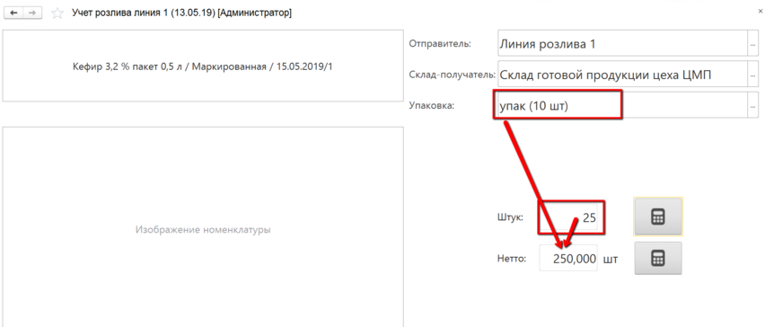

**Оперативный учет на рабочем центре**
======================================

Работа с остатками на выбранном складе (выпуск из них, перемещение)
через киоски. Пример - [выпуск сливок](../../../../Separation/CreamOutput/ByOperator/ByOperator.md).

 

**Создаваемые документы.**

 

- **Переработка** или **Переработка (брак)** - допускается выбор
    только одного значения - выпустить по кнопке можно либо бракованную
    продукцию, либо хорошую. 
    
    | Блок | Параметр | Описание | Возможные значения |
    |----------|---------|---------|-------|
    | Создаваемые документы | Выпускать брак отдельной номенклатурой | Виден, если создается документ брака. При установке в истину по кнопке всегда будет выпускаться указанная номенклатура | Да/Нет |
    |  | Номенклатура выпуска брака | Виден, если стоит признак выпуска брака отдельной номенклатурой | Элемент справочника "Номенклатура" |
    |  | Вид номенклатуры выпуска брака | Виден, если создается документ брака и нет признака выпуска брака отдельной номенклатурой | Элемент справочника "Виды номенклатуры" |
    |  | Характеристика выпуска брака | Если у номенклатуры или у вида номенклатуры включен учет по характеристикам, то здесь нужно указать, какая из них отвечает за брак | Элемент справочника "Характеристики номенклатуры" |
    | Варианты распределения | Основные материалы. Количество | Правила для списания количества основного материала | По выпуску, выбранный материал - из какого остатка выпускаем, тот и берется, в количестве = выпуску |
    |  | Основные материалы. Серии | Правила для подбора серий для списания основного материала | По выпуску = серия равна серии выпуска |
    |   | Вспомогательные материалы. Количество | Правила для списания количества вспомогательных материалов | Либо по норме, либо никак |
    | | Вспомогательные материалы. Серии | Правила для подбора серий для списания вспомогательных материалов |  |
    | Сценарии работы | Разрешить выпуск побочной продукции | Включает/отключает выпуск из выбранного материала не только основной продукции, но еще и побочки (пример - выпуск сливок, обрата из молока помимо смеси)| |
    | | Разрешить выпуск в упаковках | Позволяет указывать объем выпуска в упаковках (с автоматическим пересчетом на штуки) | |
    | | Упаковка | Задает, какой единицей измерения будет ограничен выбор упаковок в форме выпуска (см.ниже "Пример 1") ||
    | | Указывать пакеты | Применяется, когда выпускаемая продукция упаковывается еще и в пакеты ||
    | | Учет остатков по таре | Ставится, когда продукция выпускается на таре и дальше прослеживается в разрезе этой тары | В разрезе контейнеров - если у тары нет фиксированного  номера,  а каждый раз присваивается новый   В разрезе тары + указание, какой именно - если у тары есть фиксированный номер |
    | | Типы тары | Отображается, когда стоит учет в разрезе тары. Ограничивает список выбора тар в АРМе - будут доступны только с указанными типами | |
    | | Указывать вес тары | Завешивание идет на таре. чтобы получить точный вес продукции нужно из общего веса вычитать вес тары ||
    | | Выпускать на таре материала | Если включен, то выпуск всегда будет идти на таре материала без возможности изменить это ||
    | | Использовать калькулятор тары | Можно указать вес тары в виде составных частей с заданным в системе фиксированным весом (см.ниже "Пример 2") ||
    | | Типы тары для калькулятора | Отображается, когда включено использование калькулятора тары. Ограничивает список типов тар в калькуляторе | |
    | | Создавать одну серию на смену | Включает/отключает создание только одной выпускаемой серии для любой продукции в указанную смену.  Каждый следующий выпуск той же номенклатуры будет либо с новой серией, либо с одной и той же ||
    | Значения по умолчанию | Рабочий центр | Участок, на котором учитываются выпуски ||
    | | Склады для выбора | Ограничивает список складов для выпуска ||
    | | Склад-отправитель\|Ячейка-отправитель | Откуда берется основной материал ||
    | | Склад-получатель\|Ячейка-получатель | Куда выпускается продукция ||
    | Параметры печати | Печать сразу на принтер | Включает/отключает печать сразу на принтер, без вывода на экран ||

Примеры:

Пример 1.

Пример 2.

- **Упаковочный лист** - для учета выпуска на паллету с необходимостью
    на нее печатать информацию, идентифицирующую продукцию на ней;

    | Блок | Параметр | Описание |
    |----------|---------|---------|
    | Создаваемые документы | Тип тары | С каким типом тары будет создаваться документ УЛ |
    | Значения по умолчанию | Организация | Текущая организация |
    | Параметры печати | Макет (Упаковочный лист) | Что именно будет печататься на паллету |
    | | Печать сразу на принтер | Включает/отключает печать сразу на принтер, без вывода на экран |

- **Комплектация тары** - для формирования соответствующего документа, куда попадает указанные тара, её состав (например, полки, рамы) и продукция, которая кладется в эту тару.

    | Блок | Параметр | Описание | Возможные значения |
    |----------|---------|---------|------|
    | Создаваемые документы | Переупаковка | Сценарий переупаковки продукции. Если будет включена опция указания пакетов, то по кнопке: - остаток, лежавший на таре, с неё снимается - указанный остаток той же Н/Х/С кладется на новую тару, если включена опция учета по таре  - указанные пакеты списываются документом распределения |  |
    | Сценарии работы | Разрешить выпуск в упаковках | Позволяет указывать объем комплектуемой продукции в упаковках (с автоматическим пересчетом на штуки)| |
    | | Упаковка | Задает, какой единицей измерения будет ограничен выбор упаковок в форме комплектации (Приемка и передача) ||
    | | Указывать пакеты | Применяется, когда комплектуемая продукция упаковывается еще и в пакеты ||
    | | Учет остатков по таре | Ставится, когда продукция комплектуется на тару и дальше прослеживается в разрезе этой тары | В разрезе контейнеров - если у тары нет фиксированного номера, а каждый раз присваивается новый;   В разрезе тары + указание, какой именно - если у тары есть фиксированный номер |
    | | Типы тары | Отображается, когда стоит учет в разрезе тары. Ограничивает список выбора тар в АРМе - будут доступны только с указанными типами | |
    | | Указывать вес тары | Завешивание идет на таре. Чтобы получить точный вес продукции нужно из общего веса вычитать вес тары | |
    | | Использовать калькулятор тары | Можно указать вес тары в виде составных частей с заданным в системе фиксированным весом | |
    | | Типы тары для калькулятора | Отображается, когда включено использование калькулятора тары. Ограничивает список типов тар в калькуляторе | |
    | Значения по умолчанию | Склады для выбора | Ограничивает список складов для комплектации | |
    | | Склад-отправитель | Откуда берется комплектуемая продукция| |
    | | Склад-получатель | Где комплектуется продукция | |
    | Параметры печати | Печать сразу на принтер | Включает/отключает печать сразу на принтер, без вывода на экран | |

- **Перемещение** - позволяет через киоск указывать факт   перемещения той или иной продукции.

    | Блок | Параметр | Описание |
    |----------|---------|---------|
    | Создаваемые документы | Со взвешиванием               | Позволяет через киоск отразить перемещение тары/партии, изменяя перемещаемое количество. |
    | Сценарии работы | Указывать вес тары | Завешивание идет на таре. Чтобы получить точный вес продукции нужно из общего веса вычитать вес тары |
    | | Использовать калькулятор тары | Можно указать вес тары в виде составных частей с заданным в системе фиксированным весом |
    | | Типы тары для калькулятора | Отображается, когда включено использование калькулятора тары. Ограничивает список типов тар в калькуляторе |
    | Значения по умолчанию | Склады для выбора | Ограничивает список складов для комплектации |
    | | Склад-отправитель | Откуда берется комплектуемая продукция |
    | | Склад-получатель | Где комплектуется продукция |
    | Параметры печати | Печать сразу на принтер | Включает/отключает печать сразу на принтер, без вывода на экран |

- **Задание на перемещение**

- **Перемещение/Задание на перемещение + Переработка** -
    Создает оба документа, при этом выпуск идет на "Склад-отправитель", а перемещение на "Склад-получатель".
- **Перемещение/Задание на перемещение + Переработка + Комплектация тары** -
    Создает три документа, при этом выпуск идет на "Склад-отправитель", на "Складе-отправителе" выпуск комплектуется на указанную тару, а затем укомплектованная тара перемещается на "Склад-получатель".
