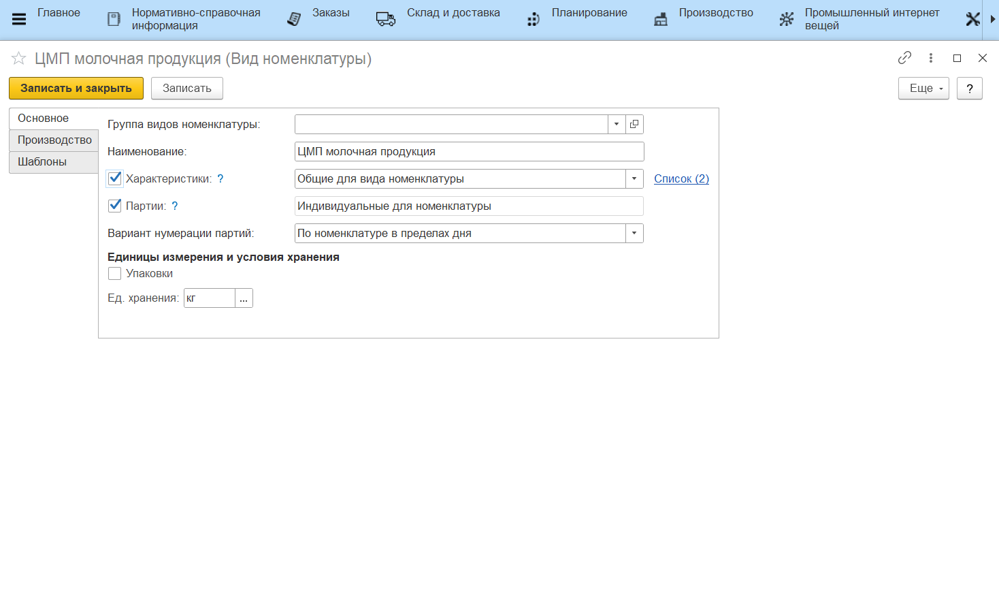
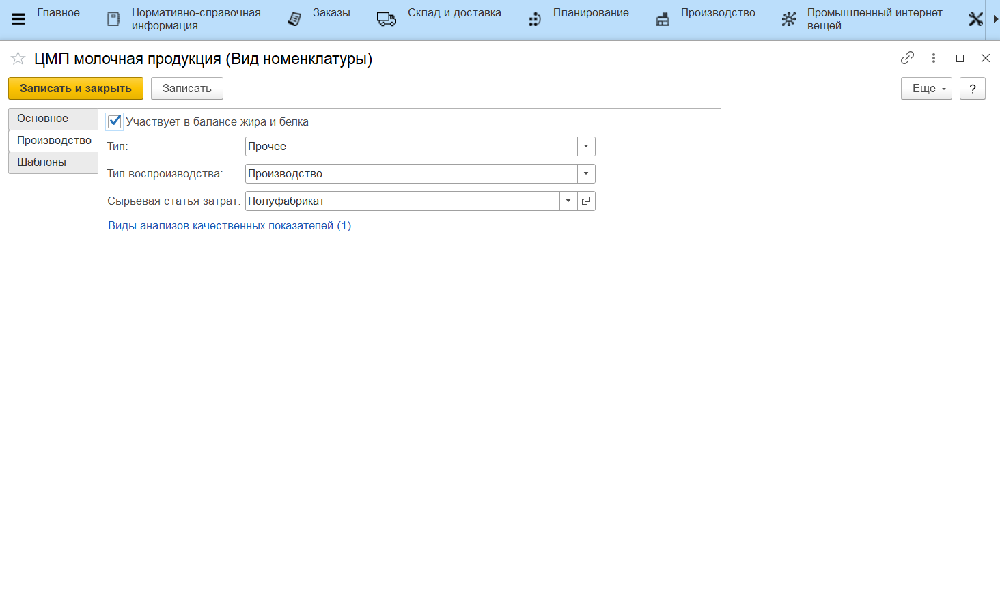
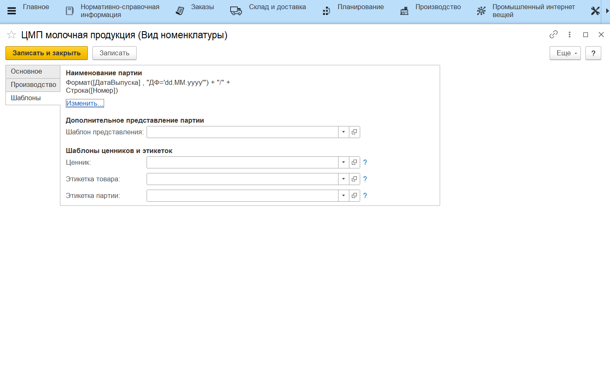

# Виды номенклатуры

Справочник "Виды номенклатуры" предназначен для объединения в группы
материалов, полуфабрикатов и прочих номенклатур, у которых общие правила
учета.

### Вкладка "Основное"

-   *Характеристики* - включение/отключение учета по характеристикам (когда партия одной и той же продукции переходит по разным этапам, меняя характеристику);

-   *Список (0)* - доступен после записи элемента. Определяет список характеристик, общий для данного вида номенклатуры;
-   *Партии* - включени/отключение учета по партиям - партиям;
-   *Вариант нумерации партий* - определяет, как будет заполняться "Номер" в партии продукции (при создании партий в "[Производственном задании](../../../Fermentation/TaskForShift/TaskForShift.md)", если в [виде рабочего центра](../WorkCentresAndWarehouses/WorkCentresAndWarehouses.md) стоит параметр, завязанный на этот):
    -   По виду номенклатуры в течение года - даже для разных номенклатур,
    но с одним этим общим видом, будет вестись сквозная нумерация партий
    (1, 2, 3, ..) до конца года;
    -   По номенклатуре в пределах дня - нумерация для номенклатур этого
    вида идет независимо друг от друга;
-   *Упаковки* - включает/отключает использование указания, по сколько
    каких единиц "укладывается" номенклатура в различные упаковки:
    - Индивидуальный набор - задается уже в номенклатуре;
    - Общий набор - общий для всех номенклатур данного вида
-   *Единица хранения* - основная единица учета номенклатур данного вида (может быть изменена в номенклатуре).

### Вкладка "Производство"

-   *Участвует в балансе жира и белка* - включает/отключает "участие" продукции данного вида в балансе жира и белка.  
    Если да, то в системе нужно будет учитывать эти показатели для продукции данного вида;

-   *Тип* - определяет тип номенклатуры:

    - Пакет - для пакетов, использующихся при упаковке продукции;  
    - Короб - для коробов, в которые укладывается сыр при
    [перевзвешивании](../../../../../CommonInformation/ButtonOfAccountPoint/PackagingWithScales.md);  
    - Сырье и материалы - для принимаемого сырья (молоко);  
    - Прочее - все остальное;

-   *Тип воспроизводства* - определяет, каким образом "появляется" номенклатура данного вида:

    - Производство - производится текущим предприятием;  
    - Покупка - закупается из других мест;

-   *Сырьевая статья затрат* - статья, по которой будет списываться номенклатура данного вида (может быть изменена в номенклатуре);
-   *Виды анализов качественных показателей (0)* - доступен, если включен учет по партиям - определяет набор видов анализов, выполняемых по данному виду номенклатуры.

### Вкладка "Шаблоны"

Видна, если включен учет по партиям.

