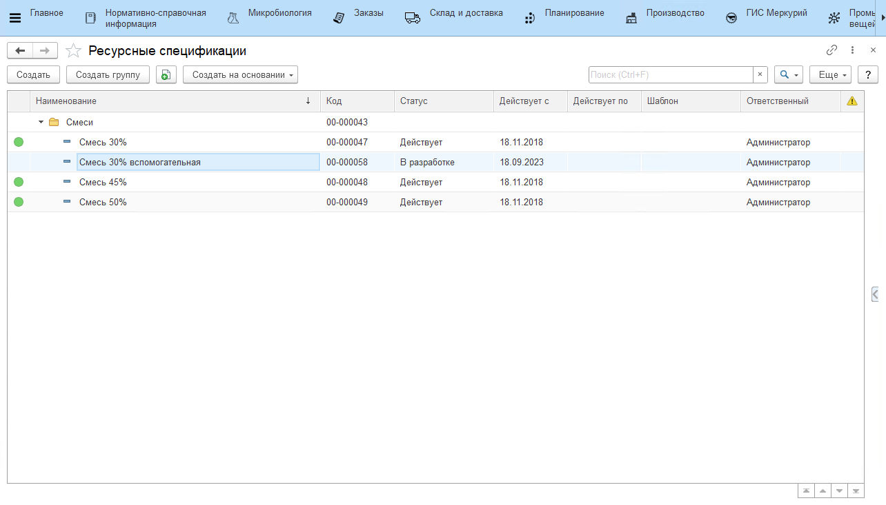
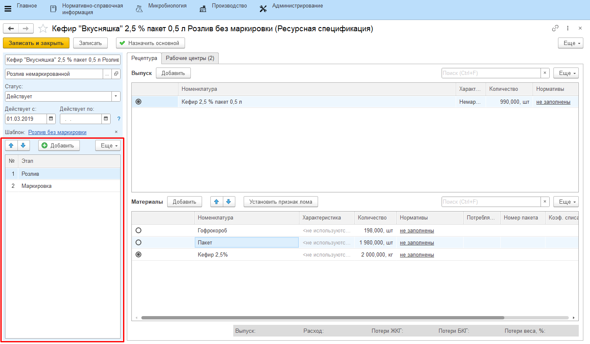
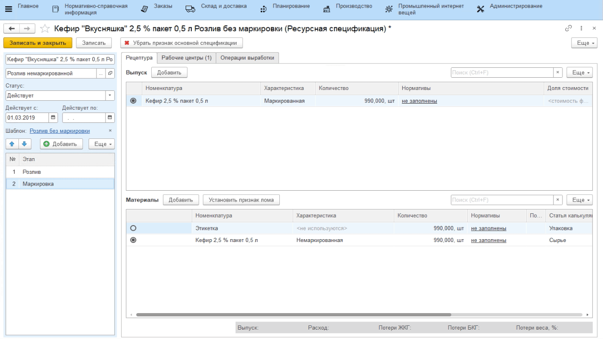

# Ресурсные спецификации

Справочник **"Ресурсные спецификации"** находится в подсистеме **"Производство"**, раздел **"Учет производства"**.

Зеленый кружок рядом с наименованием спецификации сообщает, что спецификация является основной:

Спецификации в системе могут заводиться двумя путями:

- Создание спецификации с нуля;
- Создание спецификации по шаблону, в котором заранее определен набор переделов, которые проходит продукция, а основное изделие одного этапа является основным материалом для следующего.

!!! success "Если спецификация создана по шаблону, её можно скопировать"

Указать, для какой номенклатуры (только того же вида номенклатуры) скопировать, все материалы также будут скопированы.

!!! fail "Нельзя создавать спецификацию с пустой датой начала действия"

!!! success "Можно создавать спецификацию с будущей датой начала действия" 

При этом она не станет основной, по ней создастся документ плановой калькуляции с датой = дате начала действия.

## Табличная часть "Этапы"

Содержит информацию об этапах (переделах), которые проходит продукция. Для каждого выбранного этапа табличные части выпуска и материалов отличаются, согласно тому, что производится на этапе. 

## Вкладка "Рецептура"
### Табличная часть "Выходные изделия"

Содержит перечень выходных изделий этапа (**одно** основное изделие, сколько угодно побочных изделий и возвратных отходов) и их количество. Нормативное содержание жира и белка выходного изделия заполняется по необходимости. Доля стоимости рассчитывается автоматически; если выпуск на этапе один, то можно указать "1" (единицу).
### Табличная часть "Материалы"

-   *Номенклатура*/*Характеристика*/*Количество* - на каждом этапе может быть только один основной материал. Например, на этапе варки сыра - это смесь;
-   *БКГ*, *ЖКГ* - определяются в рамках каждой номенклатуры по ссылке *"Нормативы"*. Затем, соответственно, подтягиваются в спецификацию, по ним считается нормативное количество потерь в ЖКГ и БКГ для данного этапа:

-   *Потребляется при выпуске* - если выпусков может быть несколько на этапе, и при этом на эти выпуски по норме тратятся разные материалы, то можно указать все материалы, разделив их потребление с использованием данного столбца.
-   *Стытья затрат* - сырьевая статья затрат, по которой материал будет посчитан при расчете сырьевой себестоимости.
-   *Номер пакета пакета* - если в системе ведется наборка по рецептуре, то этим реквизитом можно указать, какой ингредиент в какой пакет идет (например, когда несколько сыпучих ингредиентов смешивают вместе, чтобы вносить их в один момент);
-   *Время внесения (мин)* - определяет нормативное время внесения ингредиента, считается от начала этапа. Чтобы сравнивать фактическое с нормативным, у партии продукции должно быть заполнено время начала. Заполнение происходит через АРМ "Работа с заданиями" при работе с ТСД (пользователь с ролью "Работа с ТСД").
-   *Коэф. списания* - определяет, в каком соотношении списывать вторую единицу измерения материала на вторую единицу измерения выпуска. По умолчанию всегда равен 1. Изменить его можно только в случае, если и у материала, и у выпуска есть доп.единицы измерения. 
-   *% отклонения* - возможный процент отклонения от указанного количества материала при выпуске указанного объема продукции этапа.

## Вкладка "Рабочие центры"

Для каждого из созданных этапов на вкладке указывается перечень рабочих центров, на которых выпускается продукция из списка выпусков этапа.

- *Контролировать время нахождения* - становится обязательным указание нормы времени нахождения продукции на переделе. 

## Вкладка "Операции выработки"

Содержит перечень операций, которые проводятся в рамках создаваемой спецификации. Подробнее в разделе [Сдельная заработная плата](../../../PieceworkAccounting/DataFilling/readme.md).