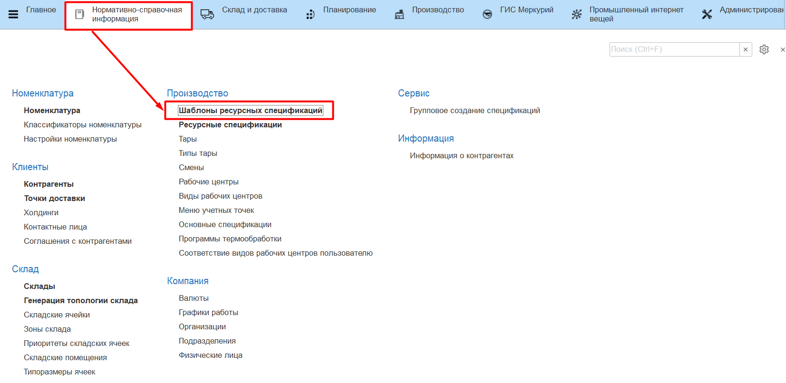
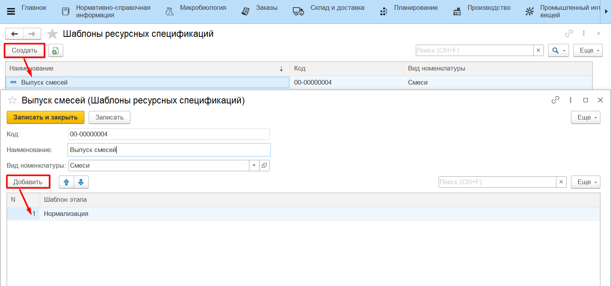
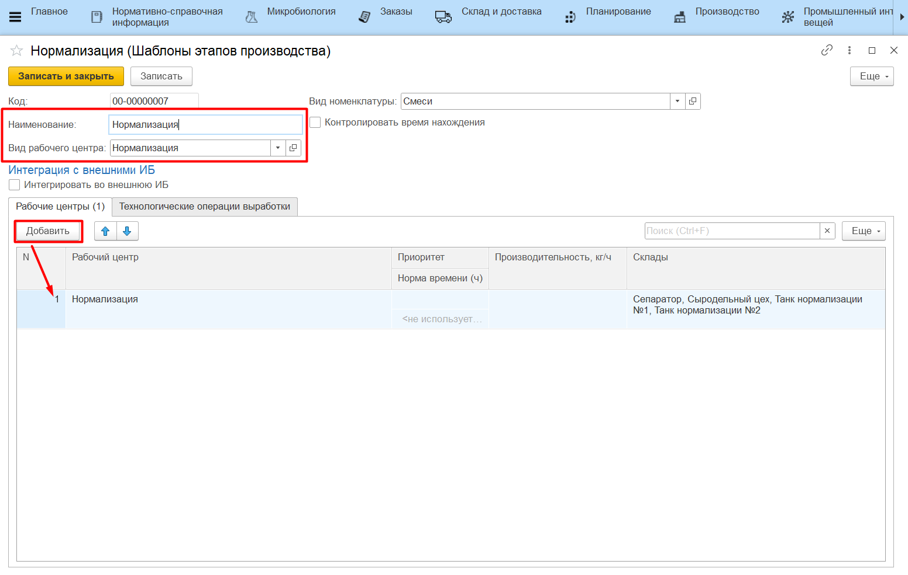

# Шаблоны ресурсных спецификаций

Для создания большого количество однотипных, особенно многоэтапных спецификаций удобно использовать шаблоны ресурсных спецификаций. (Многоэтапные спецификации используют с качестве основных выпусков и материалов одну и ту же номенклатуру с изменением характеристик).
Справочник **"Шаблоны ресурсных спецификаций"** находится в подсистеме **"Нормативно-справочная информация"** в разделе *"Производство"*.

Необходимо перейти к созданию нового элемента и заполнить:

- наименование - наименование шаблона спецификации;
- вид номенклатуры - тот вид номенклатуры, на который распространяется действие шаблона;
- шаблон этапа - перечень стандартных шаблонов производственных этапов. Для каждой создаваемой по этому шаблону спецификации набор этапов формируется строго в порядке, указанном в этом списке.

Для создания шаблона этапа указываются:

- наименование - наименование шаблона этапа;
- вид рабочего центра - для какого вида рабочего центра настраивается этап производства;
- контроль времени нахождения - если включен, то необходимо указывать норму времени нахождения на соответствующем рабочем центре;
- интеграция во внешнюю ИБ - устанавливается, если фактические выпуски, сформированные по этому этапу, необходимо передавать во внешнюю ИБ. Выпуски передаются с помощью документа "Акт переработки". Подробнее о сопоставлении реквизитов документов в разделе ["Объекты выгружаемые из MES4FOOD"](../../../../../Integration/ObjectsUnloadedFromMES4FOOD.md)
- табличная часть "Рабочие центры":
    - рабочий центр - список рабочих центров, на которых выполняется производство на данном этапе;
    - норма времени - норма времени нахождения на соответствующем рабочем центре, если включен контроль нахождения;

