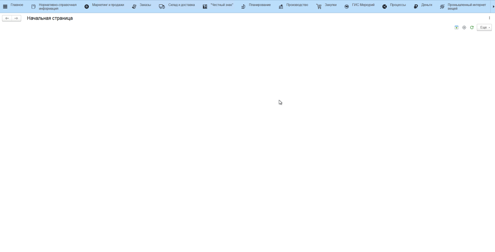

# Настройки карантина

Для начала работы с функционалом **"Карантин"** необходимо включить настройку **"Блокировать сырье на карантине"**, которая находится в разделе **"Производство"** в подсистеме **"Сервис"** - **"Настройки параметров учета"**.

В открывшемся окне нужно установить опцию **"Блокировать сырье на карантине"**

