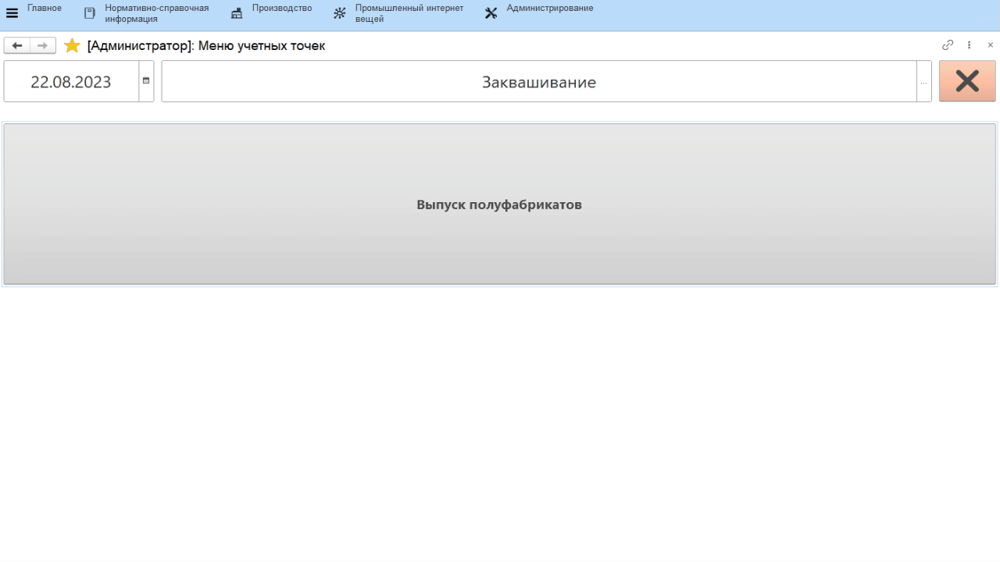
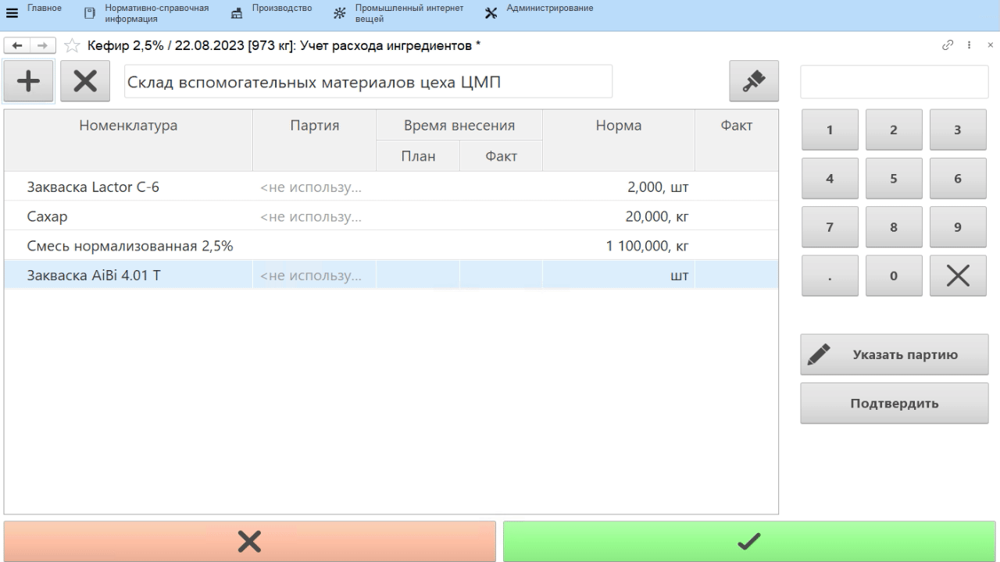
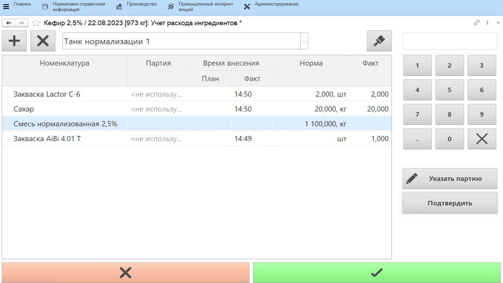

# Учет расхода оператором через сенсорный киоск

Оператор указывает, сколько какого ингредиента он положил в котел для
конкретного заквашиваемого полуфабриката.

-   Открыть **"Меню учетных точек"**;
-   Указать текущую дату и смену, если они еще не указаны;
-   Указать учетную точку, отвечающую за участок, где выпускаются полуфабрикаты;
-   Нажать кнопку, соответствующую указанию ингредиентов. Откроется
    задание на текущую смену. Выбрать нужный полуфабрикат и нажать
    **"Ингредиенты"**;
-   По умолчанию таблица заполняется ингредиентами по основной
    спецификации выбранного ПФ:

-   Если какого-то ингредиента нет в списке, добавить его по кнопке **"+"**:
 
  

-   Выбрать первый использованный ингредиент, указать его партию, если по ним ведется учет;
-   Указать количество ингредиента, добавляемого в котел, и нажать **"Подтвердить"**;
-   Аналогично заполнить остальные ингредиенты:

-   Указать, из какого танка была получена смесь для полуфабриката;
-   Указать ее партию;
-   Указать использованное количество смеси;
-   Нажать **"Подтвердить"**:  

