# Учет расхода мастером смены

Мастер смены может указать расход ингредиентов по всем выпущенным полуфабрикатам за смену.

-   Открыть документы "Переработки":  

-   Настроить отбор по дате - навести курсор на нужную дату смены,
    нажать левой кнопкой мыши на ячейку с ней и выбрать "Найти: Дата
    смены - \<нужная дата\>":  
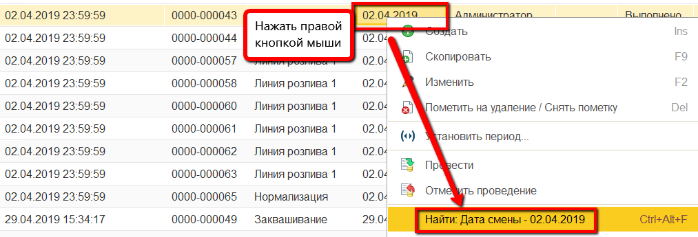
-   Настроить отбор по участку заквашивания -  навести курсор на рабочий
    центр "Заквашивание", нажать левой кнопкой мыши на ячейку с ним и
    выбрать "Найти: Рабочий центр - Заквашивание":  
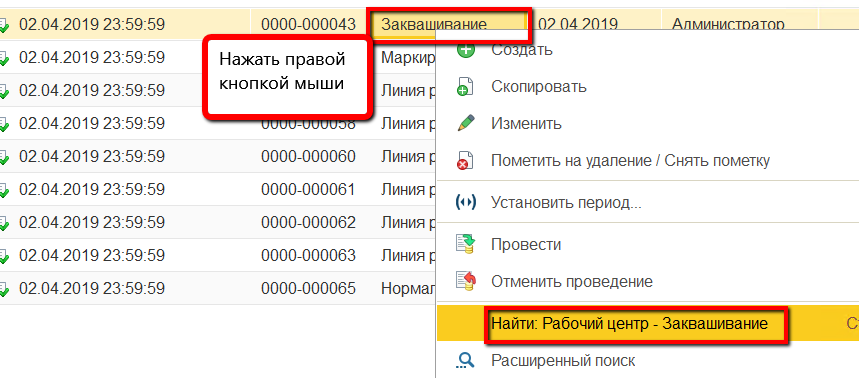
-   Во всех отобранных документах заполнить таблицу "Распределение
    материалов" следующим образом:  
    - Открыть первый документ из списка двойным нажатием по
    строке:  
    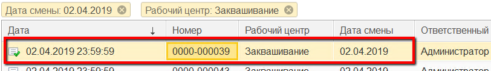
    - Перейти на вкладку "Распределение материалов", нажать кнопку
    "Заполнить":  
    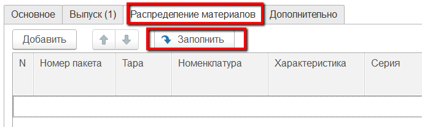 
    - Указать для основного материала, что его партия подбирается
    по выпуску, а количество по норме:  
    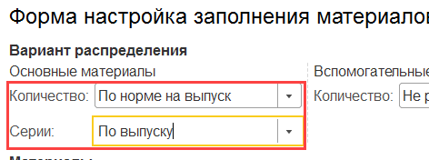 
    - Указать для остальных материалов правило использования
    партий на предприятии (самые первые - по ФИФО, с самым ранним сроком
    годности - по ФЕФО):  
    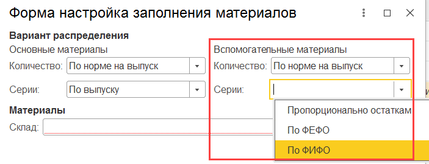
    - Указать склад материалов и подтвердить:  
    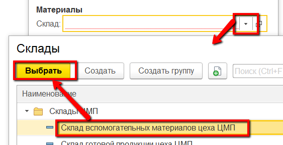
-   При необходимости добавить или заменить материалы (если
    использовались аналоги) или их партии:  
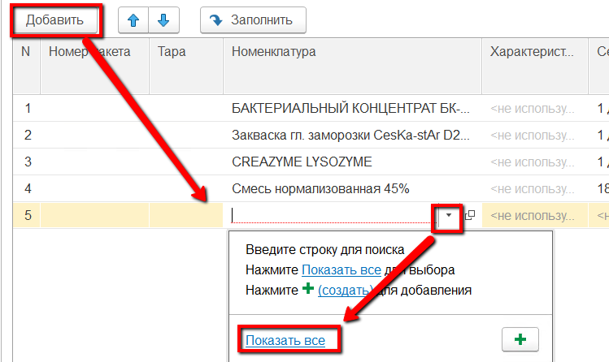        
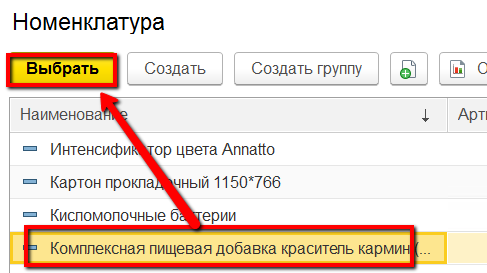  
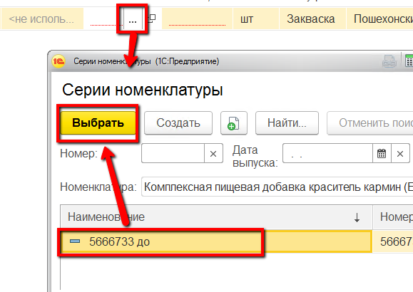
- При необходимости изменить количества потраченных материалов:  
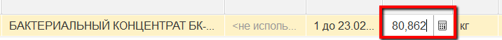
-   Нажать "Провести и закрыть". Повторить со всеми остальными
    документами из п.3.